# Execution Kernel adoption and migration guide

This guide is the implementation entry point for the Cohesive Execution Kernel. It explains how to
adopt the kernel a block at a time, which package owns each contract, how authored semantics become
durable execution evidence, and how to migrate from the execution models that have been retired.

The guide is explanatory. Canonical persisted IR and its validators are executable semantic
authority. The [Execution Kernel specification and compatibility inventory](EXECUTION_KERNEL_COMPATIBILITY.md)
define the normative scenarios and current implementation boundary. Package READMEs describe the
retained public surface beside its source.

## Choose the smallest useful adoption boundary

Cohesive does not require one runtime or an all-at-once application rewrite.

| Need | Start with | Add when required |
| --- | --- | --- |
| Decide one bounded entity-state change | `Cohesive.Transitions` | Storage commit and interaction publication bindings |
| Coordinate several semantic operations | `Cohesive.Processes` | `Cohesive.Storage.Processes` for durable attempts and recovery |
| Expose lifecycle control and diagnostics | `Cohesive.Api` | HTTP, CLI, generated-client, or presentation adapters |
| Synchronize a relation-derived index | `Cohesive.Relations` and `Cohesive.Storage.Materialization` | Cosmos/Postgres sources, Elastic targets, Control, and durable Processes |
| Model a long-running business workflow | Transitions plus Processes | Durable Requests, waits, signals, external adapters, and human-task projections |

Starting smaller does not create a second semantic model. Each later block refers to the canonical
definitions and evidence produced by the earlier block.

## One authority, several interpretations

```mermaid
flowchart LR
    PRODUCER["C# authoring, importer, agent, or tooling"]
    DOCUMENT["ExecutionDefinitionDocument\ncanonical persisted IR"]
    COMPILER["validator and static compiler"]
    PLAN["fingerprint-affine compiled plan"]
    INTERPRETER["reference or target interpreter"]
    DECISION["decision, continuation, interactions"]
    DURABLE["durable checkpoint and operation evidence"]
    OBSERVE["status, trace, explain, telemetry"]
    SURFACES["API, CLI, tests, monitoring, documentation"]

    PRODUCER --> DOCUMENT --> COMPILER --> PLAN --> INTERPRETER --> DECISION
    DECISION --> DURABLE --> OBSERVE --> SURFACES
    DECISION --> OBSERVE
```



The producer is replaceable. Once materialized, the `ExecutionDefinitionDocument` is the semantic
source of truth. A compiler may reject it, create a plan, or explain a missing capability; it must
not silently weaken the document. Runtime decisions and observations retain the exact definition,
revision, fingerprint, node, activation, attempt, and interpretation evidence appropriate to their
stage.

Generated code, API descriptions, CLI JSON, diagrams, and monitoring views are projections. They
must retain provenance and must not grow independent identifiers, lifecycle enums, or capability
catalogs.

## Package and namespace ownership

| Owner | Semantic responsibility | Does not own |
| --- | --- | --- |
| [`Cohesive`](../src/Cohesive/README.md) | Portable values and expressions, execution identity, definition documents, interaction envelopes, Control protocol values, status, trace, explain, telemetry, provenance, and compatibility primitives shared across blocks | Transition or Process topology; provider SDK behavior |
| [`Cohesive.Transitions`](../src/Cohesive.Transitions/README.md) | Entity observation shapes, canonical Transition IR, typed authoring, validation, compilation, decisions, patches, interaction intents, and reference interpretation | Durable workflow progress, HTTP routes, database transactions, or CLR callback dispatch |
| [`Cohesive.Processes`](../src/Cohesive.Processes/README.md) | Canonical Process IR, typed authoring, finite control flow, waits, requests, signals, retries, compensation requirements, continuation semantics, compilation, and reference interpretation | The internal meaning of invoked Transitions or Relations; physical checkpoint storage |
| [`Cohesive.Storage`](../src/Cohesive.Storage/README.md) | Durable Process aggregate contracts, atomic store ports, materialization definitions and plans, generation lifecycle, source/target ports, progress, routing, and execution evidence | A parallel query language, Transition model, or Process model |
| `Cohesive.Control` in `Cohesive.Storage` | Typed feedback-loop compilation and materialization operating-point state under workload and adapter limits | Process lifecycle authority or an adapter-specific throttle API |
| [`Cohesive.Api`](../src/Cohesive.Api/README.md) | Route-neutral operation catalogs and exact bindings to canonical definitions, commands, status, and explain artifacts | Execution behavior or a second diagnostics schema |
| `Cohesive.Host` | Application and CLI hosting mechanics that bind typed operations and render canonical projections | Semantic execution definitions or lifecycle policy |
| `Cohesive.Adapters.*` | Attributable target capabilities, constraints, concrete bindings, physical I/O, and target-specific evidence | Portable semantics or silent guarantee weakening |

Important adapter placements include:

- `Cohesive.Adapters.Cosmos` and `Cohesive.Adapters.Postgres` as materialization and Relations
  acquisition sources;
- `Cohesive.Adapters.Elastic` as a generation-isolated materialization target and read-alias
  activation boundary;
- `Cohesive.Adapters.AspNet`, OpenAPI, GraphQL, and TypeScript as API interpretations; and
- `Cohesive.Adapters.DurableTask` currently as a historical monitoring projection. The accepted future
  [parallel interpreter](decisions/durable-task-process-interpreter.md) will execute exact compiled canonical plans
  through Durable Task Scheduler without becoming another Process definition authority.

## Canonical lifecycle

### 1. Author or import

Typed C# builders are producers of canonical documents. They are useful for compile-time types and
source attribution, but no authored delegate or expression callback remains execution authority.
Direct IR construction and imported documents are equally valid producers when they normalize to
the same semantic document.

### 2. Persist and restore

Persist the complete document using `ExecutionDefinitionJsonSerializer` or a definition-kind
loader such as `TransitionDefinitionDocuments` or `ProcessDefinitionDocuments`. Strict restoration
checks the schema, closed unions, canonical order, fingerprint, and definition-kind invariants.
Do not persist a CLR builder, compiled plan, or runtime callback as the source of truth.

### 3. Validate and compile

Use `TransitionStaticCompiler` or `ProcessStaticCompiler`. Compilation returns diagnostics even when
no plan can be produced. A usable plan is bound to the exact definition reference and interpreter
profile; restoring runtime state against changed semantics must fail compatibility validation.

### 4. Interpret

`TransitionReferenceInterpreter` produces a finite `TransitionDecision`. It does not commit entity
state or publish an interaction. `ProcessReferenceInterpreter` advances an immutable continuation
and returns exact host-operation and interaction evidence. Infrastructure interpreters may realize
the same plan differently only when their declared profile preserves its semantics.

### 5. Commit durable evidence

For long-running work, `ProcessDurableRuntime` composes a compiled Process plan with
`IProcessDurableStore`. `ProcessDurableCheckpoint` is the aggregate authority for the continuation,
Control state, inbox dispositions, outbox emissions, durable operations, attempt affinity, and
activation receipts. One store mutation commits a legal successor; replay returns retained evidence
instead of repeating logical work.

### 6. Observe without creating another model

Use the common projections:

- `ExecutionStatus` for bounded current state;
- `NormalizedExecutionTrace` for payload-safe lineage;
- `ExecutionExplainArtifact` for definition, compilation, realization, runtime evidence, and
  actionable diagnostics; and
- `ExecutionTelemetry` plus Storage telemetry bridges for low-cardinality operational signals.

Use `IProcessExecutionTraceRepository` when a runtime must retrieve retained Process traces separately from status.
Its explicit read state distinguishes an active execution from a missing execution or a terminal execution without
a canonical artifact. Available records expose a missing-prefix count; only zero proves complete activation coverage.

Use `IProcessExecutionExplainRepository` to compose retained runtime observations into the existing canonical
`ExecutionExplainArtifact`. The repository may return a partial artifact for pending or active execution, but it must
not invent unavailable trace or realization evidence. Exact definition identity remains available independently on
`ProcessExecutionRecord.Definition` when runtime status has not yet been published.

API, CLI, tests, and documentation serialize the same artifacts through
`ExecutionExplainJsonSerializer` and `ExecutionTraceJsonSerializer`. A transport may format or
redact according to the declared disclosure contract; it must not translate the artifact into an
independent diagnostics type.

## Executable examples

The examples are real conformance tests over production contracts. There is no tutorial runtime or
example-only semantic wrapper. Run the complete example suite with:

```bash
dotnet test src/Cohesive.Tests/Cohesive.Tests.csproj \
  --filter 'Category=ExecutionKernelExample'
```

The category currently executes six cases: one direct Transition, one focused durable Process, one
complete Motion DQ workflow, the same index-sync vertical against Cosmos and Postgres source
bindings, and one common API/CLI explain projection.

### Direct Transition

Semantic source:
[`CanonicalTransitionAuthoringTests`](../src/Cohesive.Tests/ExecutionKernel/CanonicalTransitionAuthoringTests.cs),
method `AuthoredDocument_StrictRoundTripCompilesAndReferenceInterprets`.

The example performs the complete finite path:

1. authors typed C# into an `ExecutionDefinitionDocument`;
2. obtains canonical bytes and restores through `TransitionDefinitionDocuments`;
3. compiles with `TransitionStaticCompiler`;
4. interprets sparse observations with `TransitionReferenceInterpreter`;
5. inspects the canonical patch and interaction emission intent; and
6. proves the restored document retains the same fingerprint and bytes.

Related explain and trace evidence is exercised in
[`TransitionReferenceInterpreterTests`](../src/Cohesive.Tests/ExecutionKernel/TransitionReferenceInterpreterTests.cs).
The application commit boundary remains explicit: the decision describes required atomicity and
concurrency observations; a Storage or application adapter performs and records the commit.

### Focused durable Process

Semantic source:
[`ProcessDurableRuntimeTests`](../src/Cohesive.Tests/ExecutionKernel/ProcessDurableRuntimeTests.cs),
method `InitializeThenActivate_CommitsOneCoherentAggregate`.

The example initializes a compiled canonical Process, activates it through `ProcessDurableRuntime`,
invokes an exact semantic host operation, and atomically retains the activation, operation receipt,
interaction outbox record, durable Request state, and successor continuation in
`InMemoryProcessDurableStore`. The in-memory store is a reference adapter for tests; the aggregate
contract and successor rules are the reusable semantics.

### Motion DQ onboarding and monitoring

Semantic sources:

- [`MotionDqTransitions`](../src/Cohesive.ExecutionKernel.TestFixtures/MotionDq/MotionDqTransitions.cs)
  for independently authoritative case, requirement, and subject Transitions;
- [`MotionDqProcess`](../src/Cohesive.ExecutionKernel.TestFixtures/MotionDq/MotionDqProcess.cs)
  for multi-entity coordination, durable Requests, caseworker signals, timers, forks, joins, and
  outcomes; and
- [`MotionDqInteractionContracts`](../src/Cohesive.ExecutionKernel.TestFixtures/MotionDq/MotionDqInteractionContracts.cs)
  for typed external boundaries.

Executable path:
[`MotionDqDurableProcessConformanceTests`](../src/Cohesive.Tests/ExecutionKernel/MotionDqDurableProcessConformanceTests.cs),
method `HappyPath_RestoresInsidePostTermsFork_AndRemainsReferenceEquivalent`.

The scenario restores midway through a seven-branch post-terms fork, proves completed host
operations are not repeated, advances durable external Requests, joins deterministically, invokes
independent entity Transitions, and reaches the same authoritative state as reference
interpretation. The `OperationalExplain_IdentifiesExactReviewWaitAndResolvingEvidenceWithoutBusinessPayloads`
test projects the exact blocked wait and acceptable resolving interactions without disclosing case
or application payloads.

### Relation-derived index synchronization

Executable path:
[`IndexSyncVerticalSliceTests`](../src/Cohesive.Tests/Storage/IndexSyncVerticalSliceTests.cs),
method `SharedRelation_RebuildsResumesConvergesAndPromotesThroughRealAdapters`.

The same canonical Relation and materialization semantics run against Cosmos and Postgres source
bindings and an Elastic generation target. The example:

1. compiles and links exact materialization, impact, placement, and rebuild authorities;
2. starts an isolated candidate generation;
3. proves Pause and Continue retain the current Process attempt and generation;
4. resumes after an injected checkpoint interruption without resubmitting applied writes;
5. applies incremental update and delete evidence through the baseline/change cut;
6. reconciles an ambiguous Elastic alias exchange and promotes exactly once;
7. swaps the backend-pool routing authority explicitly; and
8. proves RestartAttempt abandons the candidate, creates a new generation, and preserves the active
   read generation.

The `Ek08_CosmosAndPostgresCapabilitiesDoNotChangeCanonicalProcessMeaning` test shows that provider
capabilities alter physical plans and evidence, not canonical Process meaning. Operational
procedures and failure boundaries are in the
[index synchronization runbook](INDEX_SYNC_RUNBOOK.md).

### One explain artifact across API, CLI, tests, and documentation

[`InMemoryExecutionControlApiAdapterTests`](../src/Cohesive.Tests/Api/InMemoryExecutionControlApiAdapterTests.cs),
method `Explain_ReturnsCanonicalArtifactThroughApiAndCliWithoutAnotherProjection`, dispatches the
typed `ExecutionControlApiCatalog.Explain` operation and renders that exact returned
`ExecutionExplainArtifact` through a `CliApplication`. Both surfaces use the JSON emitted by
`ExecutionExplainJsonSerializer`; the test asserts byte-for-text equality of the CLI output and the
canonical formatted projection.

Documentation should link this source or show the same serializer call. It should not copy the
artifact into a documentation-only DTO.

## Migration from retired execution models

Breaking changes are intentional. Git history is the recovery path for retired source; no implicit
reader for the former flat Transition or delegate-bearing Process models is shipped.

| Retired surface or practice | Canonical replacement | Changed guarantee |
| --- | --- | --- |
| Flat `Cohesive.Transitions.Model.TransitionDefinition` parallel collections | `Cohesive.Transitions.IR.TransitionDefinition` inside `ExecutionDefinitionDocument` | Structured branches and nodes have stable identity, validation paths, source attribution, and exact effect analysis |
| `EntityDefinition.Transitions` catalog | Independently persisted Transition documents linked by exact references | Entity shape cannot become a competing transition registry |
| Two-parameter `Transition<TEntity,TInput>` and public expression builder/compiler | `TransitionAuthoring.Create<TEntity,TInput,TOutcome>` as a producer of a canonical typed handle | The handle retains no executable callback or second definition authority |
| `DeclarativeEntityRuntime.Apply` | `TransitionStaticCompiler` followed by a declared interpreter such as `TransitionReferenceInterpreter` | Decision and commit are separate; an interpreter declares its supported profile and guarantees |
| `TransitionResult` and dictionary patch | `TransitionDecision`, typed patch operations, actual-read evidence, guarantee demands, and interaction intents | Conflict validation and atomicity are explicit and attributable |
| CLR `EffectRequest`, handler-by-name, telemetry wrapper, and continuation snapshot | Canonical interaction contracts, envelopes, Process Request/Reply, durable outbox and operation evidence | External work is fenced, typed, idempotent, and replayable; arbitrary callbacks are not durable authority |
| Delegate-bearing Process nodes and registry-by-name definitions | `GenerateProcessDefinition` for human-written C#, or direct canonical Process IR/advanced `ProcessAuthoring` lowering in `ExecutionDefinitionDocument` | Persisted semantics contain finite inspectable control flow and no retained delegate; restored execution has no dependency on C# authoring source |
| Local single-cursor Process executor and checkpoint | `ProcessReferenceInterpreter`, `ProcessContinuationState`, `ProcessDurableCheckpoint`, and `ProcessDurableRuntime` | Multiple tokens, waits, inbox/outbox, attempts, operations, compatibility, and replay are one coherent authority |
| Adapter-specific lifecycle commands | Canonical Process Control commands and typed Storage/Control projections | Pause/Continue/Restart/Cancel/Terminate have shared idempotency, fencing, and safe-point semantics |
| Adapter- or UI-specific status and diagnostics models | `ExecutionStatus`, `NormalizedExecutionTrace`, and `ExecutionExplainArtifact` | Every surface projects the same authority and disclosure semantics |

### Migration procedure

1. Identify the old semantic authority and every persisted, generated, API, or adapter consumer.
2. Author or import the equivalent canonical document with stable definition and node identities.
3. Persist and strictly restore it; compare the normalized semantic fingerprint across producers.
4. Compile it under the intended interpreter profile and resolve every capability diagnostic.
5. Bind physical commit, interaction, and durable-store ports without duplicating semantic cases.
6. Run the reference interpreter and target interpreter over representative and failure scenarios.
7. Move operational surfaces to the common status, trace, explain, and telemetry projections.
8. Delete the retired producer, reader, registry, serializer, and tests once no concrete boundary
   requires them.

If a concrete external or persisted legacy boundary is later discovered, implement an explicit
offline importer or one-way adapter. It must identify the legacy schema, emit provenance, validate
the canonical result, and fail closed when a guarantee cannot be recovered. Do not reintroduce an
ambient compatibility reader into normal execution.

## Adapter implementation checklist

An execution adapter should make the following reviewable:

- exact canonical definition kinds and schema versions it supports;
- its interpreter profile, capability evidence, limits, and semantic guarantees;
- which operations are native, composed, reconciled, or unavailable;
- stable physical identities and their relationship to canonical definition, attempt, activation,
  operation, generation, or placement identities;
- atomicity, ordering, consistency, settlement, retry, cancellation, and ambiguity behavior;
- structured diagnostics for capability mismatch or drift;
- provenance from generated or physical artifacts back to canonical nodes and compiler decisions;
- status, trace, explain, and telemetry projection without payload disclosure by default; and
- conformance or differential tests against the reference interpretation.

Provider convenience is not evidence. For example, a callback batch-size hint is not a hard source
bound, a successful dispatch is not a target acknowledgement, and an alias update without
reconciliation evidence is not proof of exactly-once promotion.

## Review path

For a focused implementation review, follow this order:

1. the canonical document and its definition-kind IR;
2. validator and static compiler diagnostics;
3. compiled plan and capability evidence;
4. reference or target interpreter decision;
5. durable aggregate mutation and exact replay behavior;
6. status, trace, explain, and telemetry projection; and
7. API, CLI, monitoring, or generated presentation bindings.

This order keeps semantic decisions visible before physical mechanics and prevents a convenient
adapter or presentation model from becoming the accidental source of truth.
