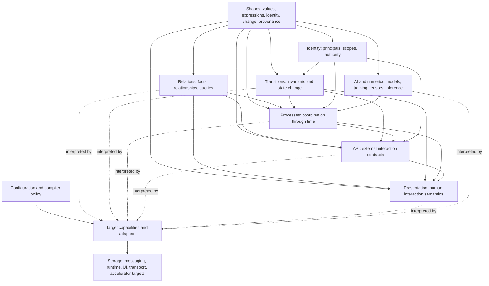

# Cohesive Language Family

## Purpose

Cohesive is a family of related semantic languages rather than one universal IR. This document
defines the responsibility of each language, the concepts they share, and the rules by which they
compose without duplicating semantic authority.

The languages are human-oriented: their concepts should let people express and calibrate intent and
understand a system at useful levels of abstraction. Their canonical IRs are nevertheless expected
to be produced and transformed primarily by agents and other tools. Human readability is a review
and comprehension requirement, not an expectation that developers hand-craft normalized IR.

Each language owns a distinct kind of meaning. Package boundaries should follow that ownership, but
a package or compiler phase does not by itself justify another semantic model.

## Architectural map

The arrows express semantic reference or interpretation, not mandatory package dependencies in
every implementation. Lower-level packages must not depend on product applications or concrete
adapters.

## Shared foundation

The `Cohesive` core owns concepts and primitives with stable meaning across several languages:

- shapes, fields, paths, cardinality, presence, and nullability;
- semantic scalar and structured value kinds;
- portable expressions and their analysis;
- identifiers, revisions, fingerprints, and references;
- semantic changes, comparison, and compatibility where meaning is shared;
- diagnostic structure and attributable locations;
- provenance and source relationships;
- execution evidence and operation context where meaning is shared; and
- small prelude primitives used to avoid parallel closed case sets.

The core must remain independent of concrete databases, transports, UI frameworks, orchestration
engines, model providers, and clouds. A concept belongs in core only when it has stable shared
meaning; incidental reuse is not sufficient.

NB: shared mechanisms should be distilled when recurrence demonstrates a stable contract. Traversal,
canonicalization, diagnostic normalization, provenance checking, deterministic ordering, and result
invariants are likely shared mechanisms. Target construction, physical serialization, capability
evidence, and lowering strategy remain interpretation policy.

## Human-oriented languages and agent production

A human-oriented language should expose domain concepts, choices, guarantees, and consequences in a
form people can judge. It need not make every storage-normalized field or compiler detail pleasant
to type manually. Different producers and consumers may use different attributable projections of
the same canonical model:

- people may work through scenarios, diagrams, focused forms, natural-language views, or semantic
  diffs;
- coding agents may use schemas, stable node identities, context manifests, machine-readable
  diagnostics, and patch operations;
- host-language producers may use typed builders and expressions;
- inference systems may use drafts, candidates, confidence, and review evidence; and
- compilers and interpreters may consume normalized IR directly.

The language design must support validation, verification, and comprehension across these
projections. If a projection omits information, it must make the omission clear and preserve links
to the source authority. No projection becomes a second model merely because it is more convenient
for one audience.

The language family must also describe systems through change, not only at rest. Revisions,
proposals, semantic diffs, affected consumers, migrations, rollout policy, runtime observations, and
feedback should compose with the languages that own the changed meaning.

## Language responsibilities

### Shapes and expressions

Shapes define the structure and semantic kinds of values that other languages consume. Expressions
define portable computation over declared inputs and scopes.

Shapes own:

- field identity and structure;
- scalar and collection kinds;
- cardinality, presence, and nullability;
- references to other semantic shapes;
- compatible conversions and value semantics; and
- source and generated-contract provenance.

Expressions own operators, functions, input scopes, type analysis, determinism requirements, and
capability demands for computation. They do not own query topology, entity lifecycle, process
control flow, API transport, or UI layout.

Host-language reflection and generated types are projections into or from these semantics, not
parallel shape authorities.

### Relations

Relations describe facts, logical relationships, observation requirements, projection, filtering,
aggregation, temporal matching, and query semantics independently of physical data placement.

Relations own:

- relationship and relation identity;
- logical source and traversal topology;
- query and aggregation semantics;
- projected fields and field-demand analysis;
- completeness, multiplicity, temporal, and null behavior;
- lineage and dependency manifests;
- portable relation drafts and acceptance; and
- query capability requirements.

Relations do not own database connections, provider SDK expressions, index lifecycle, cache
invalidation policy, or inference confidence. Storage and query adapters interpret relation
requirements. Ari and other producers may propose relation drafts while retaining producer evidence
outside portable relation semantics.

### Transitions

Transitions describe authoritative policy for changing entity state. A transition makes required
observations, preconditions, branches, patches, outcomes, effects, and guarantees inspectable.

Transitions own:

- entity state requirements and invariants;
- typed inputs and outcomes;
- conditional decisions and rejection reasons;
- sparse state changes;
- declared effects and interactions;
- concurrency, atomicity, and commit requirements; and
- semantic execution decisions.

Transitions do not own HTTP routes, UI controls, database transaction APIs, workflow-engine state,
or consumer-specific event handlers. Those are interpretations or bindings of transition identity
and evidence.

Entity references should project into canonical relationship semantics rather than create a second
join catalog. Relation/query reads used by a transition should refer to the Relations authority.

### Processes

Processes describe coordination across time and across semantic operations. A process may compose
reads, relation queries, transitions, requests, signals, waits, effects, retries, parallelism,
compensation, and control operations.

Processes own:

- logical control flow and node identity;
- durable progress and continuation semantics;
- interaction, wait, signal, retry, and timeout rules;
- idempotency and effect coordination requirements;
- compensation and recovery semantics;
- process outcomes and lifecycle operations; and
- deterministic replay requirements.

Processes do not own the internal meaning of a referenced relation or transition, the wire protocol
of an interaction, or a vendor orchestrator's checkpoint format. They refer to other semantic
definitions and require a runtime adapter to preserve process guarantees.

An AI agent is not initially a privileged process primitive. A process may issue a work request with
input, output, capability, budget, policy, and evidence requirements. A human, deterministic
function, compiler, AI agent, or external service may interpret that request.

### API

API semantics describe externally addressable operations and contracts independently of a transport
implementation.

API owns:

- operation and route identity;
- input, output, error, pagination, and interaction contracts;
- external naming and versioning policy;
- scope and exposure requirements;
- operation-to-semantic-definition bindings; and
- transport-neutral metadata needed by generators and hosts.

API does not reimplement relation, transition, or process behavior. An API operation binds to those
definitions or exposes a separately declared operation. ASP.NET endpoints, OpenAPI, GraphQL, gRPC,
and generated clients are interpretations.

### Presentation

Presentation describes human interaction intent and application-visible structure. Backend-owned
presentation IR is authoritative for stable view, action, form, flow, navigation, selector, and role
identity.

Presentation owns:

- navigation and workspace structure;
- views, collections, fields, forms, actions, and flows;
- design intent and component roles;
- data-source and operation bindings;
- accessibility contracts;
- residency and interaction requirements; and
- semantic automation selectors.

Presentation does not own business state transitions, query semantics, endpoint routes, CSS, DOM
implementation, or framework component instances. React, Blazor, Angular, design systems, styling
libraries, and test drivers interpret the presentation model.

When backend IR owns identifiers or roles, frontend packages should consume generated contracts
rather than handwritten strings or duplicated TypeScript models.

### Identity

Identity describes who or what acts, within which scope, and with which attributable authority.

Identity owns:

- principal and actor identity;
- tenant, application, and resource scopes;
- claims-to-semantic-identity resolution;
- delegation and operation context identity; and
- authorization requirements where they are domain-independent.

Identity does not own provider authentication protocols, framework principals, or transport tokens.
Adapters translate those representations into the semantic identity context. Domain-specific
authorization policy may attach to transitions, processes, APIs, or presentations while using the
shared identity authority.

### AI, inference, and numerical computation

AI semantics describe model-independent inference, training, vector, text, ontology, tensor, and
numerical intent where stable meaning can be separated from a provider or accelerator.

AI owns:

- model, dataset, feature, objective, and evaluation identities;
- inference and training input/output shapes;
- tensor shape, type, and computational requirements;
- ontology and vector semantics;
- reproducibility, differentiation, and optimization requirements where applicable; and
- model-registry and promotion contracts that are reusable across products.

AI does not own PyTorch, ONNX Runtime, Azure ML, ILGPU, or provider request types. Those are target
adapters. Product-specific inference features, training examples, review workflow, and confidence
policy belong to the product, such as Ari, unless they become stable reusable semantics.

### Configuration and compiler policy

Configuration selects among valid realizations and supplies scoped operational values. It owns:

- profiles and precedence;
- target and dependency selection;
- convention registration;
- explicit tradeoff and override policy;
- explainable effective configuration; and
- configuration provenance.

Configuration must not invent undeclared domain semantics or become an ambient service locator.
Defaults and conventions must be deterministic, attributable, composable, replaceable, and
independently testable.

### Storage, execution, and infrastructure contracts

Storage and execution contracts describe provider-neutral capabilities needed to realize semantic
definitions. Infrastructure semantics may describe desired resources and operational guarantees.

These contracts own:

- capability and constraint declarations;
- source acquisition and persistence boundaries;
- atomic commit, outbox, consistency, durability, and recovery contracts;
- materialization and index lifecycle semantics;
- operation control and runtime lifecycle contracts; and
- target binding evidence.

They must not introduce alternative query, transition, or process semantics. Concrete systems such
as PostgreSQL, Cosmos DB, Elasticsearch, Durable Task, ASP.NET, Azure, or ONNX belong in adapter
packages under `src/adapters/Cohesive.Adapters.*`.

## Composition rules

### Reference; do not reproduce

When one language consumes another language's meaning, it should reference the owning definition or
project from it. It should not copy the owned fields, cases, routes, actions, selectors, roles,
states, permissions, or workflows into a second catalog.

Examples:

- an API operation references a Transition input and outcome rather than redefining them;
- a Presentation action references an API operation or Transition identity rather than copying its
  route;
- a Process node references a Relation query rather than embedding a provider query;
- a frontend consumes generated Presentation and API identifiers rather than handwritten strings;
- an entity reference contributes to the relationship catalog rather than defining another
  navigation model; and
- Ari maps proposals into Cohesive relation drafts rather than defining an Ari-only executable
  relation.

### Project the minimum required surface

A consumer should receive the narrowest projection that preserves required meaning. A frontend may
receive a TypeScript contract rather than the complete backend IR. A target adapter may receive
compiled requirements rather than product authoring metadata. The projection must retain enough
identity and provenance to trace back to the semantic authority.

### Keep policy separate from meaning

Semantic definitions state required behavior and guarantees. Configuration and adapters decide how
to realize them. A local declaration may intentionally constrain placement or target behavior, but
that choice must be explicit semantic or compiler policy rather than an accidental consequence of
which service was registered first.

### Preserve boundaries through effects

Cross-language behavior should communicate through semantic inputs, outcomes, effects, requests,
and evidence. A Process may coordinate a Transition without reaching into its internal patch model.
Presentation may respond to a Transition outcome without duplicating the transition decision tree.
Operational tooling may observe a Process through stable lifecycle evidence without depending on a
runtime engine's private state.

## Producers, interpreters, and adapters

The language family supports many producers and interpretations:

| Role | Examples | Owns |
| --- | --- | --- |
| Producer | Coding agent, C# DSL, TypeScript authoring, Ari, importer, graphical editor | Source experience and producer evidence |
| Validator | Shape validator, draft accepter, process analyzer | Invariant checks and structured findings |
| Realizer | Compiler, coding agent, query planner, API generator, learned or search-based synthesizer | Attributed realization decisions and artifacts |
| Reference interpreter | In-memory relation or process runtime | Executable semantic reference within declared closure |
| Target adapter | PostgreSQL, Cosmos, Elasticsearch, Durable Task, React, ONNX | Target capabilities and target construction |
| Non-execution interpreter | Documentation, visualization, migration, cost, security | A derived view or analysis of the same IR |
| Observer | Tracing, audit, drift analyzer, dependency manifest | Runtime or derivation evidence tied to semantic identity |

An adapter is not a uniform facade. It declares what its target can do and implements the selected
realization. A compiler or agent may compose adapters only when their combined evidence preserves
all requirements. Current compilers are concrete reference realizations, not a restriction on how
future agents or learned systems may implement the languages.

## Package dependency principles

- Core semantic packages must not depend on concrete adapters.
- Adapters may depend on the semantic packages whose contracts they interpret.
- Product applications may depend on semantic packages and adapters but may not move reusable
  portable semantics into a product namespace merely for convenience.
- Product-specific adapters may remain with the product while their contract is being learned.
  Promote them into `Cohesive.Adapters.*` only when ownership, reuse, and extension behavior are
  stable.
- Frontend packages consume generated or serialized backend semantic projections and should not
  independently redefine backend-owned closed sets.
- Shared extraction belongs in the lowest layer that owns the meaning without causing core packages
  to depend upward on products or infrastructure.

## Architectural review questions

When adding a language construct, compiler, or adapter, ask:

1. Which language owns this meaning?
2. Does an existing type or catalog already describe the same closed set?
3. Is the new distinction semantic, or only a phase or package boundary?
4. Can the consumer reference or project from the existing authority?
5. Which requirements does the construct declare?
6. Which target capabilities provide evidence for realization?
7. How will people validate the intended meaning?
8. How will interpreters verify that realizations preserve it?
9. How will people and agents comprehend the definition, change, and evidence?
10. What provenance connects derived results to the source node?
11. How will a future change be compared, migrated, deployed, and observed?
12. What is the explicit escape hatch when a target has additional capability?
13. Which golden vertical demonstrates that the construct composes with adjacent languages?

## Implementation status

This map includes both implemented and intended language relationships. It does not assert complete
closure for every block. Package READMEs, tests, and compatibility inventories describe current
coverage. Architectural gaps should remain visible rather than being resolved by duplicating
meaning in a more convenient layer.
