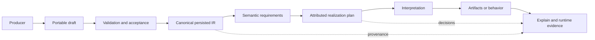

# Cohesive Semantic Model

## Purpose

This document defines the common conceptual contract for Cohesive semantic intermediate
representations. It explains what owns meaning, how semantic definitions are produced and accepted,
how they become target realizations, and what evidence must survive across that lifecycle.

Individual languages define their own nodes and invariants. This document owns the terms and rules
shared across those languages.

## Core model

Cohesive separates a system's meaning from the mechanisms that author, realize, or observe it:

Not every language needs an explicit draft or executable interpretation, but every materialized
model has one canonical semantic authority and every derived result should be attributable to it.

## Terms

### Semantic definition

A semantic definition is a durable description of intended meaning in one Cohesive language. It may
describe a shape, relationship, query, transition, process, API, view, identity rule, infrastructure
requirement, computational graph, or another first-class construct.

A definition describes what must be preserved. It does not prescribe a physical realization unless
placement or a target-specific behavior is itself part of the declared meaning.

### Intermediate representation

An intermediate representation, or IR, is the portable data model that carries a semantic
definition. Cohesive IRs are product artifacts rather than temporary compiler data structures. They
are designed to be persisted, versioned, inspected, compared, exchanged, and interpreted after the
authoring process has ended.

Canonical IR is primarily a tool-produced representation. Coding agents, inference systems,
importers, migrations, and language frontends are expected to create and revise it. People must be
able to read and navigate the IR—or an attributable, lossless-enough projection—to calibrate intent,
review changes, and understand results, but they are not expected to hand-author normalized IR as
the ordinary development workflow.

An in-memory type may represent an IR without every persistence feature being implemented yet. The
architectural contract remains that durable meaning belongs to an explicitly materializable model,
not to a callback, reflection context, ambient service, or compiler-local object graph.

### Producer

A producer creates or revises semantic IR. Producers include:

- coding and transformation agents;
- host-language DSLs and builders;
- source generators and compilers;
- inference systems such as Ari;
- importers from schemas, code, models, or external specifications;
- graphical and textual authoring tools; and
- migration or transformation tooling.

A producer may retain its own source locations, alternatives, confidence, workflow, and generation
metadata. Producer state does not become canonical semantics unless it is explicitly represented in
the accepted IR.

### Draft

A draft is a portable semantic model that intentionally permits authoring-time states that are not
valid for execution or publication. A draft may contain holes, alternatives, unresolved references,
or explicit omissions.

A draft is not a looser copy of the accepted model. It exists only where incomplete information is
useful and should make each incomplete state explicit. Draft identities and candidate identities
should remain stable enough for review, evidence, and revision comparison.

### Accepted definition

An accepted definition satisfies the structural and semantic invariants required by its language.
Acceptance is an explicit boundary. It resolves or rejects draft-only states and produces canonical
IR with provenance to the exact draft revision and other authorities it consumed.

Accepted does not mean executable on every target. Target feasibility is evaluated separately
against semantic requirements and capabilities.

### Requirement

A requirement is an explicit property that an interpretation or target must preserve. Requirements
may concern supported operations, input evidence, precision, atomicity, ordering, consistency,
isolation, durability, recovery, placement, accessibility, resource bounds, or another semantic
guarantee.

Requirements belong to semantics or declared policy. An adapter must not infer away a requirement
because its target cannot satisfy it.

### Capability

A capability is evidence about what a target, interpreter, adapter, or composition strategy can
realize, under which constraints, and with which guarantees. A capability declaration should be
specific enough for planning, validation, documentation, and conformance testing to use the same
source of truth.

### Realization

A realization is an attributed plan for satisfying semantic requirements with selected targets,
strategies, configuration, conventions, and overrides. It may be native, composed, bounded,
overridden, or unavailable.

The realization is distinct from the semantic definition. Two realizations may have different
physical topology and performance while preserving the same declared semantics.

### Interpretation

An interpretation consumes semantic IR for a purpose. Execution is one interpretation, but an
interpretation may instead validate, optimize, simulate, visualize, document, migrate, generate,
test, monitor, estimate, or explain.

An interpreter should declare the IR versions, capabilities, constraints, and guarantees it
supports. It must reject unsupported demanded semantics instead of substituting a weaker behavior.

### Evidence

Evidence is structured information used to justify or understand a proposal, acceptance,
realization, artifact, or runtime result. Evidence includes source locations, inference scores,
validation findings, capability matches, compiler decisions, test results, traces, audit records,
and counterexamples.

Evidence is not necessarily semantic authority. It must remain linked to the definition or decision
it supports without changing that definition's fingerprint unless the meaning itself changes.

## Semantic authority

For a materialized model, canonical persisted IR is the source of semantic truth. The following are
derived or supporting authorities:

- an authoring expression is source evidence for the IR it produced;
- a draft is authority for an in-progress proposal, not for executable behavior;
- a generated client or schema is authority only for the generated artifact's exact contract and
  must retain provenance to the source IR;
- a physical plan is authority for one realization, not for the logical definition;
- a runtime trace reports an observation, not the set of all permitted behaviors;
- a test provides evidence about semantics but does not silently add semantics absent from the
  definition or its normative contract; and
- an issue, plan, or private design discussion records intent and provenance but does not replace a
  stabilized semantic contract.

When a test reveals an intended invariant missing from the IR, the remedy is to add the invariant to
the owning semantic model or normative contract and then retain the test as verification evidence.

## Identity, revision, and fingerprint

Identity and content must remain distinct:

- **Definition identity** names the semantic concept across compatible revisions.
- **Revision identity** names a particular evolutionary revision when durable references require it.
- **Node identity** names a meaningful location within a definition for references and provenance.
- **Content fingerprint** identifies canonical semantic content independent of incidental ordering,
  process identity, storage location, or producer evidence.
- **Artifact identity or fingerprint** identifies a derived result and includes its source and
  interpreter context where appropriate.

Changing inference confidence, review comments, source formatting, or compiler diagnostics must not
change a semantic fingerprint unless the accepted meaning changes. Changing a field, expression,
transition branch, guarantee, or other semantic content must change the relevant fingerprint.

Canonicalization must be deterministic. Collection ordering must be either semantically meaningful
or normalized by a documented ordering rule. Serializers and fingerprinters must share the same
semantic authority rather than maintain parallel case lists.

## IR design rules

Canonical IRs should:

- represent semantic constructs and guarantees directly;
- remain readable or faithfully projectable for human calibration and review;
- make invalid accepted states unrepresentable where practical;
- preserve stable identities for meaningful nodes;
- use target-neutral types for portable semantics;
- retain explicit extension points for non-portable capability;
- distinguish absent, unknown, unresolved, omitted, and invalid states where they have different
  consequences;
- preserve ordering only when order is part of the meaning;
- support deterministic validation, serialization, and fingerprinting;
- carry or reference version and provenance information;
- support comparison and first-class change proposals across revisions; and
- remain usable by execution and non-execution interpreters.

IRs should not:

- capture delegates, closures, ambient services, or reflection objects as durable meaning;
- expose a vendor SDK type through a core semantic contract;
- duplicate a closed semantic case set solely for another compiler phase;
- encode current target limitations as universal semantics;
- use issue identifiers as concept names;
- store producer confidence or workflow state inside portable semantics unless the semantic language
  explicitly models those concepts; or
- depend on generated artifacts being manually synchronized.

Separate IR types are justified when they enforce different valid states, ownership, lifecycle,
versioning, units, serialization, or capability guarantees. A phase or target boundary alone is not
sufficient justification.

## Production, authoring, and lowering

Producer APIs optimize for their producer: an agent may need structured schemas, context manifests,
incremental edits, and machine-readable diagnostics; a host-language API may optimize for type
safety and discovery; a graphical tool may optimize for direct manipulation and review. Canonical IR
optimizes for persistence, portability, inspection, comparison, and interpretation. These surfaces
may differ, but lowering and transformation must be deterministic or explicitly bounded and
attributable.

Human-oriented languages do not require people to write their canonical representation. A useful
human review surface may be a focused projection, diagram, scenario, semantic diff, or explanation
derived from IR. Any such projection must identify omissions and retain links to the exact source
nodes so that readability does not create another authority.

A producer surface should:

- produce canonical IR rather than retain executable callbacks as authority;
- preserve source identity and useful source locations;
- diagnose unsupported or ambiguous host-language constructs;
- avoid silently capturing ambient runtime behavior;
- expose the lowered result for inspection; and
- permit other producers to create semantically equivalent IR without using that host language.

Host-language types may project into canonical shapes, but reflection metadata access should be
centralized and cached. If generated artifacts are the appropriate projection, extend the code
generation path rather than maintaining handwritten copies of identifiers, routes, actions, roles,
states, or selectors.

## Drafts, inference, and acceptance

Draft state, inference uncertainty, and runtime uncertainty are different concepts:

- A **definition hole** is unresolved, ambiguous, omitted without permission, unsafe, or otherwise
  incomplete semantic content. It prevents acceptance.
- **Inference uncertainty** is producer-owned evidence about a proposed meaning. Policy may use it
  to resolve, reject, or preserve a draft alternative, but the score is not the meaning itself.
- A **runtime evidence gap** occurs after acceptance when an interpreter lacks an observation or
  capability needed for one execution. It does not retroactively make the definition a draft.

Acceptance must validate the semantic structure rather than trust a producer's confidence. It
should report stable diagnostic codes and attributable locations for every rejected or unresolved
condition. Successful acceptance records the exact draft, catalog, schema, policy, or producer
artifact revisions it consumed.

Ari may retain features, model versions, scores, alternatives, explanations, and review state. An
Ari adapter may lower a proposal into portable Cohesive draft nodes and associate Ari evidence with
stable draft identifiers. Editing Ari evidence alone must not change the Cohesive semantic
fingerprint.

## Validation, verification, and comprehension

Cohesive optimizes around three top-level questions:

- **Validation:** is the accepted meaning what people actually want and intend? Validation uses
  examples, scenarios, simulation, review projections, domain judgment, and runtime feedback to
  expose ambiguity, omissions, and unintended consequences.
- **Verification:** does an implementation or realization preserve the accepted meaning?
  Verification uses semantic validators, reference interpreters, static analysis, capability
  evidence, conformance suites, differential tests, proofs where practical, and runtime checks.
- **Comprehension:** can people and agents understand the definition, proposed change, realization,
  behavior, and evidence at a suitable level of abstraction? Comprehension is supported by semantic
  diffs, explain projections, visualizations, diagnostics, provenance, and traceable observations.

Within those objectives, Cohesive distinguishes several check boundaries:

- **Intent validation:** stakeholders and domain experts decide whether a model expresses the needed
  behavior and guarantees.
- **Semantic validation:** language validators establish that an accepted IR satisfies its local
  invariants.
- **Realization validation:** a compiler proves or justifies that selected capabilities satisfy the
  requirements under declared constraints.
- **Artifact verification:** tests and validators check that generated or executed artifacts conform
  to the accepted definition and realization.
- **Runtime validation:** observations are checked against declared behavior, policy, and operating
  boundaries.

No single check is sufficient. Examples, static analysis, property tests, model exploration,
reference interpreters, adapter conformance, differential tests, and runtime evidence provide
different coverage. A result should include enough attributable evidence for people and agents to
understand what was checked and what remains uncertain. The repository-wide strategy is defined in
[Conformance](../quality/conformance.md).

## Capability-driven compilation

Compilation begins with semantic requirements and target capability evidence. Compiler
configuration acts as policy for selecting among valid realizations.

The effective policy precedence is:

1. explicit local declarations and overrides;
2. scoped application or subsystem profiles;
3. adapter and compiler conventions; and
4. framework-wide defaults.

Each decision should record:

- the semantic requirement and source node;
- candidate targets or strategies considered;
- capability evidence used;
- constraints and operating boundary;
- the policy or convention that selected the result;
- rejected alternatives when they aid diagnosis;
- explicit overrides and their scope; and
- the interpreter and version responsible for the decision.

A composed realization must preserve the complete requested semantics. Introducing auxiliary
infrastructure is valid when policy permits it and provenance exposes it. If no valid realization
exists, compilation returns a structured diagnostic rather than a partially functioning plan.

The current Cohesive compilers are concrete reference mechanisms for making semantic requirements
executable and falsifiable. They are not the only permitted future realization architecture. An
agent may synthesize a direct implementation, and a learned or search-based compiler may replace a
fixed lowering phase, provided the result publishes equivalent capability, provenance,
verification, and comprehension evidence. An opaque generator result does not become correct merely
because it was produced from canonical IR.

## Extensions and escape hatches

Portable semantics should be stable while targets evolve. Backend-specific capability may enter
through:

- attributed IR extensions;
- target capability declarations;
- compiler or adapter configuration;
- target intrinsics with explicit portability boundaries; or
- narrowly scoped direct-access overrides.

An extension must declare ownership, versioning, serialization behavior, supported interpreters,
fallback or rejection behavior, and how it affects fingerprints. A portable interpreter encountering
an unknown required extension must reject it precisely. Optional annotations may be ignored only
when the semantic contract explicitly permits that behavior.

Direct backend access is legitimate when Cohesive does not model the needed capability or when the
modeling cost is not justified. It must remain local and attributable and must not introduce a
second hidden model that other Cohesive interpretations are expected to reproduce.

## Provenance

Provenance connects meaning, decisions, artifacts, and observations. At minimum, derived artifacts
should be able to identify:

- source definition identity, revision, and fingerprint;
- source node identities relevant to the result;
- producer or authoring origin when useful;
- interpreter, compiler, or generator identity and version;
- effective configuration and convention profile;
- target capability profile and selected strategy;
- explicit overrides;
- generation or execution time where operationally meaningful; and
- parent artifacts or observations in a derivation chain.

Provenance should be structured and stable enough for tooling to answer:

- What was intended?
- Which definition and revision produced this result?
- How was it realized and why was that realization valid?
- Which guarantees and operating boundaries applied?
- Which consumers and artifacts depend on a changed node?
- What changed, why was it proposed, and which evidence validates the intended outcome?
- What happened at runtime, and does it conform to the plan?

Sensitive producer evidence, training data, prompts, or runtime values need not be copied into
portable provenance. Provenance may use access-controlled references, hashes, redacted summaries,
or retention-bound records as long as identity and audit requirements remain explicit.

## Change, evolution, and compatibility

Persisted IR makes evolution a semantic operation. A system is expected to change throughout its
full lifecycle; a definition is not complete merely because it compiled once. A proposed change
should be representable as a durable relation between a known base revision and a candidate
revision, with intent, provenance, validation evidence, impact, and unresolved decisions kept
explicit where the owning language can express them.

Revision comparison should classify changes by their effect on:

- accepted inputs and produced outputs;
- invariants and permitted behaviors;
- required capabilities and guarantees;
- persisted state and in-flight execution;
- generated APIs, schemas, clients, and UI contracts;
- physical plans, indexes, materializations, and deployments;
- tests, simulations, and monitoring projections; and
- downstream definitions that reference changed nodes.

Change interpretations may produce semantic diffs, affected scenarios, migrations, regenerated
artifacts, compatibility reports, rollout and rollback plans, updated agent context, verification
work, and runtime success criteria. Production observations, incidents, human corrections, and
evaluation results may in turn become evidence for a new proposal. No single forward compilation
step owns this lifecycle.

An interpreter must declare the IR versions it accepts and the semantic guarantees it provides.
Migration tools must retain provenance from the source revision through the migrated result. A
compatibility shim is an interpretation of old semantics, not permission to redefine them silently.

Backward compatibility is not mandatory during early R&D, but every intentional break should still
be deterministic, diagnosable, and attributable. Learning quickly is compatible with maintaining a
single semantic authority.

## Determinism and ownership

Given the same canonical IR, interpreter version, target capability evidence, compiler policy, and
declared environmental inputs, compilation and generated artifacts should be deterministic. Runtime
interpretations may depend on time, messages, models, or external effects only when those inputs and
their semantics are explicit.

Agent-produced realizations may use search or nondeterministic generation, but the selected artifact,
inputs, tool and model identities, decisions, and verification evidence must be captured well enough
to reproduce the claim being reviewed even when the generation trajectory cannot be reproduced
exactly.

IR and derived collection ownership must be documented. Accepted definitions should not expose
caller-owned mutable state. Internally produced immutable storage may transfer through trusted
ownership paths after validation rather than being repeatedly copied. Performance optimizations may
change representation, allocation, batching, or dispatch, but not observable semantics.

## Relationship to implementation status

This document defines the intended common model. It does not claim that every package currently
persists every IR, emits complete provenance, or supports every interpretation. Package READMEs,
tests, benchmarks, and compatibility inventories describe implemented closure. Missing behavior
should be recorded as a gap rather than removed from this model merely to match the current code.
