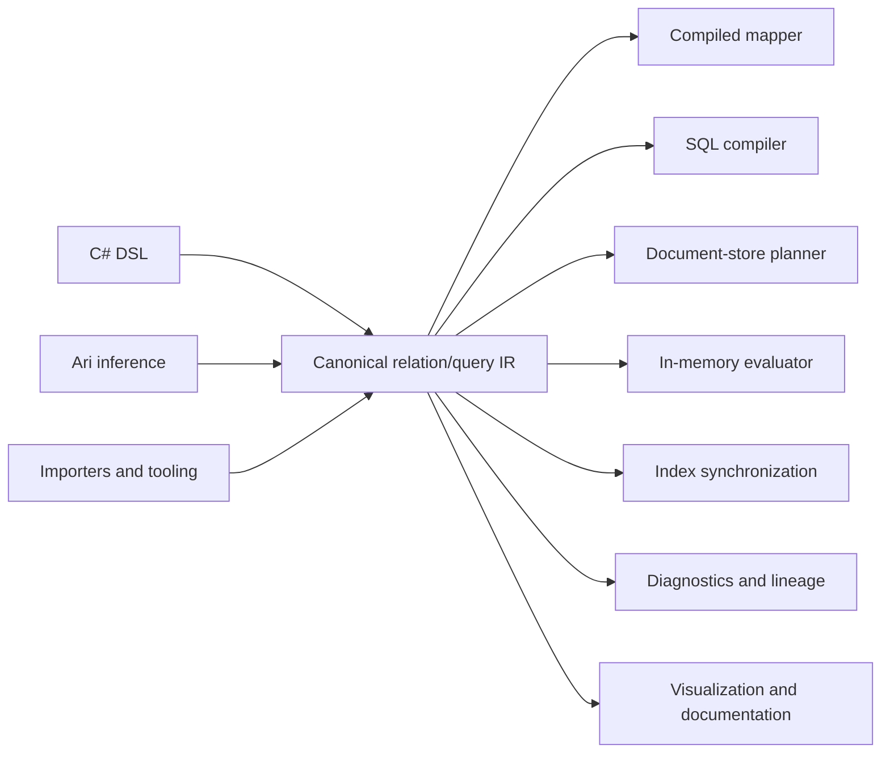

# Cohesive.Relations

Portable relational programming for .NET and heterogeneous data systems.

`Cohesive.Relations` brings the declarative character of database-oriented relational programming into a general-purpose programming environment.

SQL makes it possible to describe facts, relationships, projections, filters, and aggregations without prescribing an execution algorithm. Its usual limitation is that the program is scoped to a particular database catalog, server, dialect, and execution boundary.

Cohesive separates those relational semantics from their physical realization. Facts may come from PostgreSQL, Cosmos DB, a search index, an API, supplied CLR objects, observations, caches, or several sources together. The same semantic definition may be interpreted as SQL, a compiled mapper, a batch hydration plan, an in-memory computation, an index-maintenance plan, a lineage report, or a diagnostic explanation.

The canonical relationship catalog and relation/query IR are the sources of semantic truth. Authoring DSLs, importers, and inference systems such as Ari produce these IRs; compilers and interpreters decide how to realize them.

## Mental Model

Cohesive relational programs are built from several related concepts.

### Facts

Facts are shaped values available to a relational program.

Examples include:

- A `Load` supplied as a CLR object.
- A customer observation read from Cosmos DB.
- Rows from a PostgreSQL table.
- Equipment data returned by an API.
- Previously materialized search documents.

A logical source declares that values of a particular shape are available. It does not prescribe where they live or how they must be acquired.

### Relationships

Relationships describe semantic connections between facts.

For example:

```text
Load.CustomerId → Customer observation identity
```

A relationship may be traversed during querying, DTO enrichment, hydration, dependency analysis, or incremental materialization. Its physical realization might be a SQL join, a Cosmos point read, a batched lookup, a cache lookup, or an in-memory hash join.

The canonical `RelationshipDefinition` is an oriented edge from the graph-qualified shape that
holds a reference to the graph-qualified shape it addresses. It stores the source field path,
target-key semantics, and any global uniqueness guarantee. It does not duplicate the source
field's presence, nullability, or cardinality; those remain authoritative on the source
`ShapeGraph`.

For example, a single `Load.CustomerId` yields at most one customer when traversed forward. The
inverse traversal yields many loads by default. Declaring the reference globally unique reduces
the inverse result to at most one load. A required `CustomerId` means the reference key must be
present; it does not claim that the customer observation exists.

Relationships can be authored directly or through the typed producer:

```csharp
var loadCustomer = Relationship
    .From<Load>(loadShape)
    .Reference(static load => load.CustomerId)
    .To(customerShape);
```

Typed selectors are immediately lowered to canonical field paths. CLR reflection and expression
objects are not retained in persisted relationship IR. `Cohesive.Transitions` can compile
`EntityReferenceTypeRef` fields into the same definitions and deterministic IDs.

### Derivations

A derivation declares how new facts can be established from available facts.

A DTO mapping is one form of relational derivation:

```text
LoadSearchDto(loadId, status, customerName) :-
    Load(loadId, customerId, status),
    Customer(customerId, customerName)
```

The output DTO is a derived fact. Its fields retain provenance to the source facts and expressions that establish them.

### Relations

A relation is a reusable, rooted derivation.

It answers a question such as:

> Given a load and the facts related to it, what `LoadSearchDto` values can be derived?

A relation declares:

- The root input binding.
- The logical derivation graph.
- The output shape.
- Output cardinality relative to each root.
- Required and optional related inputs.
- Semantic invariants.

Relations are useful for DTO mapping, enrichment, hydration, denormalization, lineage analysis, and incremental dependency tracking.

### Queries

A query is an independently invoked request over a logical relational graph.

It may declare:

- Runtime parameters.
- Filters.
- Requested projections.
- Ordering and paging.
- Row results.
- Aggregation results.
- Multiple named result branches over shared predicates.

Queries are useful for retrieval, search, reporting, exploration, and aggregation across one or more sources.

## Relations and Queries

Relations and queries use the same logical operators because both describe relational computation:

- Sources
- Filters
- Relationship traversal
- Explicit joins
- Valid-time joins
- Unnesting
- Projection
- Distinctness
- Aggregation
- Ordering
- Paging

They differ in their semantic contract:

| Relation | Query |
|---|---|
| Describes a reusable correspondence or derivation | Describes an invoked request for results |
| Rooted in an input value | Rooted in one or more named result branches |
| Declares output cardinality per root | Declares rows, aggregations, ordering, and paging |
| Supports hydration and dependency analysis | Supports retrieval and reporting |
| Can be evaluated incrementally as facts change | Is normally evaluated in response to an invocation |

The distinction is semantic rather than physical. Neither construct chooses a database, join algorithm, batching strategy, or execution runtime.

A Cohesive relation is also not synonymous with a table in the relational-database sense. A compiler may realize a relation as a SQL expression, view, materialized view, or application-side plan, but the relation itself remains portable.

## Valid-Time Joins

A `TemporalJoinQueryNode` correlates two independently produced rowsets using both an ordinary
Boolean key predicate and an explicit valid-time condition. It models when row-valued facts were
valid; it does not select a database snapshot, read system-versioned history, or consult an ambient
clock.

For example, an event can be enriched with the customer version that was valid when the event
occurred:

```csharp
var temporalJoin = new TemporalJoinQueryNode(
    id: new("event-customer-version"),
    left: eventSource,
    right: customerVersionSource,
    kind: JoinKind.Left,
    correlation: Expr.Eq(
        Expr.Field(eventBinding, FieldPath.FromField("CustomerId")),
        Expr.Field(versionBinding, FieldPath.FromField("CustomerId"))),
    match: new TemporalPointInIntervalMatch(
        Expr.Field(eventBinding, FieldPath.FromField("OccurredAt")),
        TemporalInterval.HalfOpen(
            Expr.Field(versionBinding, FieldPath.FromField("ValidFrom")),
            Expr.Field(versionBinding, FieldPath.FromField("ValidTo")),
            upperNullBehavior: TemporalNullBoundBehavior.Unbounded)));
```

Point containment reads its point from the left rowset and its interval from the right. Interval
overlap reads its first interval from the left and its second from the right. Only the ordinary
correlation expression sees the combined pre-null-extension binding scope. Swapping the inputs
expresses the inverse point/interval orientation.

The persisted interval records every finite endpoint as inclusive or exclusive. `HalfOpen`
conventionally produces `[lower, upper)`, but canonical semantics never depend on that convention.
Endpoint states remain distinct:

| Endpoint or interval state | Meaning |
|---|---|
| `UnboundedTemporalIntervalBound` | Structural negative or positive infinity |
| Expression evaluates to null with `Invalid` | Invalid operand and incomplete result |
| Expression evaluates to null with `Unbounded` | Explicit source convention for an open end |
| Expression is missing or unavailable | Indeterminate evidence, never an unbounded endpoint |
| Lower follows upper | Invalid interval with an attributable diagnostic |
| Equal inclusive endpoints | A valid singleton interval |
| Equal endpoints with either endpoint exclusive | A valid empty interval |

`Date`, `DateTime`, and `Instant` are exact, non-coercing domains. `DateTime` uses civil or
wall-clock ordering; `Instant` uses absolute ordering, so equivalent instants with different
offsets compare equally. Interval emptiness and overlap use the domain's representable precision:
civil days for `Date`, civil ticks for `DateTime`, and UTC ticks for `Instant`. Every pair satisfying
both correlation and temporal membership is emitted. Overlapping versions therefore produce
multiple rows; the operator never chooses a "latest" winner.

Missing fields, partial source results, and partial traversals make affected candidates
indeterminate. An outer join emits an unmatched row only when the opposite candidate set is
complete and every applicable candidate is a conclusive non-match. Matched rows may still be
returned from incomplete evidence, but the result remains explicitly incomplete.

Backend interpreters may preserve these semantics with SQL range predicates, native range types,
interval indexes, or batched acquisition followed by in-memory evaluation. The temporal execution
capability profile declares which match, boundary, domain, join, and inconclusive-evidence semantics
a target preserves. The compiled input contract lists the exact demand-scoped temporal capabilities
with stable requirement IDs and node/site provenance. A target missing one must reject the plan with
an attributable diagnostic rather than weakening it. System-time acquisition, nearest-predecessor
`ASOF` joins, temporal relationship traversal, and physical interval-index planning are separate
future semantics.

Temporal operands are retained as correlation, membership, cardinality, and validation influences
in the requirement graph, output-oriented lineage, and dependency manifest. Lineage keeps these in
its `Influences` channel while `Contributions` remains intentionally narrow to value, identity, and
aggregation provenance. Consumers performing invalidation or materialization analysis can therefore
walk output-oriented influences or the inverse input-oriented dependency manifest without treating
a membership predicate as a projected value.

## Portable Relation Drafts

A relation draft is a portable, persistable relation under construction. It carries the canonical
logical graph up to the projection boundary, stable output-assignment slots, semantic expression
candidates for those slots, and an explicit resolution for each slot. The draft is separate from
the accepted `RelationDefinition`: unresolved and ambiguous assignments are useful states for
authoring, inference, review, and diagnostics, but they are not executable relation semantics.

Draft producers can be simple conventions, host-language authoring tools, importers, or inference
systems such as Ari. Producer-specific evidence remains outside the semantic draft. For example,
Ari may associate model scores, explanations, review decisions, and run metadata with stable draft
slot and candidate identifiers without placing those concerns in `Cohesive.Relations`.

This is an integration boundary rather than a competing proposal model. Ari's
`MappingInferenceResult` remains its inference and workflow artifact. An Ari adapter can lower its
source/target paths into draft slots and canonical expression candidates, retain confidence,
alternatives, features, model versions, and review state in Ari, and associate that evidence with
the content-derived draft candidate identifiers. A draft document can point back to the Ari
artifact through an opaque producer-artifact reference. Changing Ari evidence does not change the
draft fingerprint; changing a slot, candidate expression, or resolution does.

Acceptance is a shape-aware semantic boundary. It verifies that every output field is explicitly
resolved or, when optional, explicitly omitted; that selected source fields exist; and that type,
cardinality, presence, and nullability are safe. Successful acceptance appends the canonical
projection node and produces a normal `RelationDefinition`. The draft identity remains stable
across revisions, while its content fingerprint changes as candidates and resolutions change.
The result retains the consumed draft fingerprint and relationship-catalog fingerprint as
provenance, separately from the accepted relation's canonical fingerprint.

Three kinds of incomplete information remain distinct:

- A **definition hole** is an unresolved, ambiguous, or unsafe draft assignment and prevents
  acceptance.
- **Inference uncertainty** is producer-owned evidence such as an Ari confidence score; policy may
  turn it into a selected, ambiguous, or unresolved draft state.
- A **runtime requirement gap** occurs after acceptance when required observations are unavailable, such
  as a load whose referenced customer cannot be resolved. Runtime hydration diagnostics are a
  later interpretation and do not make an otherwise complete draft unresolved.

The draft graph may already contain relationship traversals, so a flat DTO projection can select
fields from several visible bindings:

```text
Source(Load as load)
→ TraverseRelationship(load.CustomerId → Customer as customer)
→ Project(
    LoadSearchDto.Id           = load.Id,
    LoadSearchDto.CustomerId   = load.CustomerId,
    LoadSearchDto.CustomerName = customer.Name,
    LoadSearchDto.CustomerType = customer.Type)
```

The built-in convention matcher intentionally handles only direct, top-level field matches in its
first version. It applies explicit aliases first, then exact ordinal names, then a unique
ordinal-ignore-case name. An unsafe higher-precedence match remains a diagnosed hole rather than
falling through to a lower-precedence guess. Exact whole-value copies of arrays and inline objects
are allowed when their portable types and field guarantees match; inferring navigation or
restructuring inside those values is not.

More sophisticated producers can propose relationship traversals and cross-binding assignments
using the same draft contract, so flattening `Customer.Name` into `LoadSearchDto.CustomerName` does
not require a second relation model. Automatic traversal discovery, automatic nested structural
mapping, compiled mappers, runtime requirement-gap reporting, backend lowering, and proof that a declared
relation output mode matches row-multiplying or row-dropping graph behavior remain follow-on
interpretations or analyses.

## Relationship to GraphQL

GraphQL and `Cohesive.Relations` both support querying heterogeneous data sources through a
uniform interface, but they operate at different levels of abstraction.

GraphQL defines a remote API contract through which remote clients submit queries and receive
results. `Cohesive.Relations` defines a node-level semantic protocol through which application
components describe relationships, queries, projections, aggregations, and data requirements.
Node-level does not mean that the data or execution must be local: a Relations interpreter may
read from local memory, databases, remote services, or several heterogeneous sources. It describes
the level at which the semantic contract is consumed rather than the placement of its data.

The Relations IR is independent of the remote API used to expose it, but it is itself a protocol
between authoring tools, compilers, planners, repositories, and interpreters. It may also be
persisted, transferred between nodes, and projected into other host languages.

### Resolvers and read repositories

A GraphQL implementation binds field resolvers to fields in its remote API schema. The current
Relations query runtime similarly resolves `QuerySource` values through `IReadRepository`
implementations registered with an `IReadRepositoryRegistry`. Either mechanism can acquire data
from heterogeneous backends.

The contracts are different. A GraphQL resolver satisfies a field in a particular client-facing
schema. A Relations read repository supplies semantic data independently of whether or how that
data is exposed remotely. Relations definitions also preserve enough meaning for an interpreter
to analyze and optimize the complete query, potentially replacing a sequence of individual reads
with a native backend query, batched lookup, or in-memory join.

### Remote API exposure

`Cohesive.Relations` does not itself establish a remote client/server interface or define a remote
invocation protocol. `Cohesive.Api` can expose Relations semantics through GraphQL, REST, gRPC, or
another remote API technology. A GraphQL interpretation could lower a client selection set into
relation/query IR, execute it through the selected repositories and adapters, and project the
result into the GraphQL response shape.

```text
Remote client
→ Cohesive.Api GraphQL operation
→ Cohesive.Relations query
→ read repositories and backend adapters
→ heterogeneous data sources
```

### Mutations and workflows

`Cohesive.Relations` models data acquisition and computation rather than state mutation. A GraphQL
mutation defines a remote API operation, but not the underlying state-change semantics.
`Cohesive.Api` may expose an operation as a GraphQL mutation, REST action, or gRPC method;
`Cohesive.Transitions` defines its entity state changes and invariants; and `Cohesive.Processes`
coordinates multistep workflows involving transitions, queries, waits, external effects, and
recovery or compensation behavior.

```text
Remote client
→ Cohesive.Api operation
→ Cohesive.Transitions transition or Cohesive.Processes process
→ state changes and external effects
→ Cohesive.Relations result projection
→ remote API response
```

## DTO Mapping as Relational Programming

Consider a search document containing data from a load and its customer:

```csharp
using Cohesive.Relations.Authoring;

var relation = Relation<LoadSearchDto>
    .From<Load>()
    .Join<Customer>(
        static (load, customer) => load.CustomerId == customer.Id)
    .Select(static (load, customer) => new LoadSearchDto
    {
        LoadId = load.Id,
        Status = load.Status,
        CustomerName = customer.Name
    });
```

This declaration can support several interpretations.

### Compiled mapper

When all inputs are already available, Cohesive can compile the relation into a fast delegate that constructs `LoadSearchDto` values.

### PostgreSQL projection

When both facts live in PostgreSQL, the relation may lower to:

```sql
SELECT
    l.id AS load_id,
    l.status,
    c.name AS customer_name
FROM loads AS l
LEFT JOIN customers AS c
    ON c.id = l.customer_id;
```

### Non-relational hydration plan

When loads and customers live in a document store, a planner may:

```text
Read loads
→ collect distinct CustomerIds
→ batch-read customers
→ hash join in memory
→ project LoadSearchDto
```

### Index maintenance

When the relation defines a search document, it also describes dependencies:

```text
LoadSearchDto
├── depends on Load
└── depends on Customer through Load.CustomerId
```

A load change directly identifies an affected search document. A customer change can be propagated through the reverse relationship to determine which root loads must be re-indexed.

## Diagnostics and Derivability

Because mappings are represented as derivations, missing inputs can be explained rather than reduced to mapper failures.

For example:

```text
Cannot derive LoadSearchDto.CustomerName.

Required premises:
  Load.CustomerId = "customer-123"
  Customer.Id = "customer-123"

Available:
  Load.CustomerId

Missing:
  Customer with Id "customer-123"
```

Cohesive distinguishes conditions that conventional mapping systems often conflate:

- A field is known and non-null.
- A field is known to be null.
- A relationship is known to be absent.
- A required fact has not been supplied or fetched.
- A lookup completed without finding a match.
- A lookup failed.
- A fact was not requested because the output did not require it.

Diagnostics are structured product output. They should be usable by applications, tests, deployment gates, index-management tools, and developer tooling.

### Runtime evidence and relation requirement gaps

Runtime availability analysis consumes the static plan rather than walking the relation/query
expressions again:

```text
Compiled input contract
+ occurrence-scoped runtime evidence
→ causal relation requirement gaps
+ explicit missing-data policy
→ decisions and diagnostics
```

These stages remain separate. The input contract says what the demanded semantics require.
Evidence says what one invocation knows. A requirement gap identifies the causal boundary and retains every
affected output, effect, and requirement trace. Policy decides whether an impact remains
unresolved, is suppressed, receives null, or receives an explicit semantic default. Reporting
policy independently decides whether that impact becomes a diagnostic.

Evidence is scoped by both an evaluation ID and a binding-occurrence ID. An occurrence is not an
entity ID: the same observation may participate more than once through different routes or
bindings. This distinction lets one load have a missing customer without making the customer input
appear globally unavailable for every load in a batch.

Every evidence snapshot is also attributed to the compiler profile, definition and relationship
catalog fingerprints, a versioned semantic fingerprint of the shape snapshots, the effective
output-demand fingerprint, and the ordered compiled input identities. Equivalent plans rebuilt
from rehydrated semantic documents match; document metadata and object identity do not participate.
Evidence produced for a different semantic shape, demand, or input contract is rejected with a
structured plan-mismatch diagnostic before requirement-gap analysis.

The evidence model preserves distinctions required for useful diagnostics:

- a source was not provided versus was provided successfully with zero rows;
- a source result was complete versus partial, failed, or explicitly inconclusive;
- a field was not loaded versus was loaded and semantically absent;
- an explicit null versus an absent value;
- a parameter that was not supplied versus one supplied as missing, explicit null, or a concrete value;
- relationship resolution was inapplicable, not attempted, failed, rejected, inconclusive, or completed;
- a completed result is partial versus authoritative and complete;
- an authoritative lookup found no row versus no lookup evidence being available.

For example, a caller can describe a load whose reference is available but whose customer lookup
has not run:

```csharp
using Cohesive.Model;
using Cohesive.Relations.Compilation;
using Cohesive.Relations.Diagnostics;

var root = plan.InputContract.Sources.Single(
    source => source.Role == RelationQuerySourceInputRole.RelationRoot);
var traversal = plan.InputContract.Traversals.Single();
var loadId = root.Fields.Single(field => field.Input.Field.Path == FieldPath.FromField("Id"));
var customerId = root.Fields.Single(
    field => field.Input.Field.Path == traversal.Definition.SourceReference);
var load = new RelationQueryObservationOccurrence(
    new("load/L1"), root.Binding, root.Shape, observationIdentity: "L1");

var evidence = new RelationQueryRuntimeEvidence(
    evaluation: new("index-load/L1"),
    plan: plan,
    sources:
    [
        new(root.Input.Id, RelationQuerySourceEvidenceState.Provided, [load])
    ],
    fields:
    [
        new(loadId.Input.Id, load.Id, RelationQueryFieldEvidenceState.Value,
            ObservationValue.FromString("L1")),
        new(customerId.Input.Id, load.Id, RelationQueryFieldEvidenceState.Value,
            ObservationValue.FromString("C7"))
    ],
    traversals:
    [
        new(traversal.Input.Id, load.Id, RelationQueryTraversalEvidenceState.NotAttempted)
    ]);

var analysis = RelationRequirementGapAnalyzer.Analyze(plan, evidence);
```

The result contains one causal `ResolutionNotAttempted` requirement gap anchored to the traversal. It carries
the customer-derived output impacts and original compiler traces; it does not also emit noisy
Customer identity and Customer.Name gaps. The conventional policy reports required impacts and
retains optional impacts without reporting them. Suppression, null substitution, and default
substitution are explicit alternatives, and invalid substitution is diagnosed against the output
shape contract. A semantic default must be a concrete non-null, non-missing value; explicit null
uses the distinct null-substitution disposition so persisted policy decisions retain their meaning.

A complete evidence snapshot gives omission closed-world meaning inside its declared boundary.
Partial evidence does not: it may establish an explicit requirement gap, but an omitted entry cannot prove
not-loaded or not-found. If a source occurrence did not reach a traversal because of filtering or
another logical operation, evidence marks that traversal occurrence `NotApplicable` rather than
allowing omission to be mistaken for `NotAttempted`.

`RelationRequirementGapAnalyzer` is analysis only. It does not read sources, resolve relationships, execute
expressions, construct output rows, or apply suppression/substitution decisions. Those are later
execution and hydration interpretations of the same compiled contract.

### Canonical in-memory reference execution

`RelationQueryInMemoryInterpreter` executes a successful static plan over materialized runtime evidence.
It consumes the plan's explicit demand-scoped `ExecutionSlice`; it does not rediscover assignments or
expression sites by scanning the persisted definition, acquire external data, or choose a physical join
or batching strategy.

The reference interpreter currently executes every canonical logical node: source, filter, relationship
traversal, explicit join, valid-time join, collection expansion, projection, distinct, aggregation, ordering,
and offset or keyset paging. Relation terminals enforce per-root cardinality, keys, and invariants. Query terminals retain
their named row or aggregation branches. Results carry exact root attribution, contributing occurrence
provenance, requirement gaps, policy effects, and deterministic diagnostics. Partial evidence remains
explicitly incomplete; it is never converted into semantic null or absence. Expression input availability
is checked when a field, parameter, or capability is actually read, preserving short-circuit and conditional
evaluation semantics. Causal structural gaps are enforced through their compiled `BlockedInputs`, so nominal
source or traversal evidence is never consumed after an upstream conversion or relationship boundary failed.

The evaluator intentionally has a bounded first-version surface. It supports canonical unary and binary
operators plus the pure collection, object, string, and aggregate functions covered by the reference tests.
Ambient functions (`entityId`, `key`, `sourceRows`, and `relatedField`) and the pure `groupBy`, `groupByRows`,
and expression-level `join` functions are not yet interpreted. Collection-element field evidence also cannot
yet be reconstructed losslessly from one occurrence-scoped scalar evidence record. The interpreter publishes
this narrower expression surface through `RelationQueryInMemoryInterpreter.ExpressionCapabilities`, publishes
valid-time semantics through `DefaultTemporalCapabilities`, and rejects
unsupported demanded semantics during preflight with an attributable `REL3209` diagnostic rather than falling
back to a different or weakened meaning.

Valid-time join support is declared independently through
`RelationQueryInMemoryInterpreter.DefaultTemporalCapabilities`. The conventional interpreter supports the
complete canonical temporal surface, including both match forms, explicit boundary and null policies, exact
temporal domains, outer-join absence semantics, all-match multiplicity, interval validation, and inconclusive
evidence propagation. An interpreter instance may instead receive a narrower
`RelationQueryTemporalExecutionCapabilityProfile`; preflight rejects each unsupported demanded temporal semantic
with `REL3209` attributed to the temporal node and exact expression or structural match site.

Runtime value semantics are likewise explicit. Equality is structural and ordinal, distinguishes null from
undefined, and compares integers with floating-point values only when they represent the same exact integer.
Ordering accepts only a shared comparable domain and applies the query's declared null placement; arithmetic
uses finite values in a checked decimal execution domain and reports divide-by-zero, overflow, and unsupported
numeric representations as structured expression failures.

## One Semantic Model, Multiple Interpretations



An interpretation does not have to execute the definition. Validation, optimization, visualization, lineage analysis, documentation generation, migration planning, and dependency analysis are interpretations of the same IR.

Derived artifacts should retain provenance to the IR nodes and compiler decisions that produced them.

## Use Cases

### Simple and enriched DTO mapping

Map domain values to DTOs using direct assignments, conversions, nested projections, conventions, and related facts. An enriched DTO can combine a root value with customer, equipment, or other referenced information without requiring all inputs to share one storage engine.

### Relationship hydration

Start with a root entity and resolve required or optional related facts similarly to an ORM query. The same relation can operate over supplied objects, observations, database reads, caches, or composed acquisition plans.

### Portable and federated querying

Declare filters, joins, selected fields, ordering, paging, row results, and aggregations once, then compile them to PostgreSQL, Cosmos SQL, Gremlin, in-memory evaluation, or a composed cross-source plan.

For example:

```text
Loads from Cosmos
+ Customers from PostgreSQL
+ tracking state from an API
→ delayed premium-customer loads
```

A planner can push compatible work into each source, batch intermediate keys, join locally, and diagnose semantics that cannot be preserved.

### Search-index synchronization

Use a relation to define a denormalized index document, rebuild the complete index, process real-time changes, and determine which root documents are affected when related entities change.

Full rebuild and incremental maintenance are interpretations of the same derivation and should converge on equivalent indexed values.

### Application read models

CQRS-style read models are materialized relations:

```text
Order + Customer + Shipments + Payments
    → OrderDetailsView
```

The definition can support synchronous reads, projection rebuilding, incremental event handling, cache population, and dependency analysis.

### API composition

API responses often combine facts from several entities, databases, or services:

```text
Load + Customer + Equipment + CurrentLocation
    → LoadDetailsResponse
```

Interpreters may produce SQL, resolver plans, batched service calls, or mixed-source execution plans while preserving one response derivation.

### EDI and external-schema transformation

Relations can express transformations from complex external schemas into domain models:

```text
EDI 204 document + partner configuration
    → LoadTender
```

This includes structural matching, nested collection mapping, code translation, conditional derivation, conversions, and required-input diagnostics. Ari can propose relations while Cohesive validates, persists, analyzes, and evaluates them.

### Event enrichment

Enrich events with related facts before publishing or processing them:

```text
LoadChanged + Load + Customer
    → EnrichedLoadChanged
```

The relation identifies the additional facts required and allows the runtime to select cached, batched, local, or remote acquisition strategies.

### Data migration and backfills

Express migration as a derivation from old shapes to new shapes:

```text
CustomerV1 + AddressV1
    → CustomerV2
```

Interpretations can include migration SQL, application-side conversion, dry-run validation, missing-data reports, backfills, and before/after reconciliation. Persisted relation versions provide an auditable account of how values were transformed.

### Reconciliation and repair

Declare what should correspond across operational, billing, cache, and search systems:

```text
OperationalLoad
    ↔ BillingLoad
    ↔ LoadSearchDocument
```

An interpreter can identify missing records, stale projections, conflicting fields, duplicate identities, and cardinality violations. The same analysis can drive targeted repair.

### Cache population and invalidation

A cached value is often a materialized derived relation:

```text
Customer + ActiveLoads + AccountBalance
    → CustomerDashboardCacheEntry
```

Dependency analysis determines which entries are affected when an input fact changes. Initial population, targeted invalidation, and recomputation share one semantic definition.

### Reactive and incremental computation

Relations can be interpreted as continuously maintained views:

```text
LoadStatusChanged
    → affected CustomerSummary
    → affected RegionalDashboard
```

This supports subscriptions, live dashboards, reactive UI data, and incremental aggregates without requiring every change to trigger complete recomputation.

### Authorization-aware projection

Resource and caller facts can participate in an explicit derivation:

```text
Load + User + Roles + CustomerAccess
    → AuthorizedLoadDto
```

Interpreters can apply row and field policies while retaining provenance for why information was included or excluded. Authorization should not become an invisible adapter-side mutation of query meaning.

### Privacy, governance, and lineage

Field-level lineage makes it possible to ask:

- Which DTOs expose a customer email address?
- Which indexes contain personal data?
- What derived artifacts depend on a protected field?
- Which relations are affected by a retention-policy change?
- Can a field be removed without breaking downstream derivations?

These are non-execution interpretations of the same relational program.

### Data quality and anomaly detection

A relation can derive expected values and compare them with recorded facts:

```text
Shipment stops
    → expected total distance

expected total distance + recorded distance
    → distance discrepancy
```

This supports completeness checks, invariant validation, discrepancy reports, and explanations of violated expectations.

### Schema-evolution impact analysis

Persisted relation graphs can identify the DTOs, queries, predicates, indexes, API contracts, migrations, and backend plans affected by a field or relationship change. Stable semantic identities make this analysis more reliable than source-text searches.

### Feature engineering

Machine-learning features are derived facts:

```text
Customer + Loads + PaymentHistory
    → CustomerRiskFeatures
```

The same relation can support offline training-set generation, online feature lookup, backfills, drift analysis, feature lineage, and training/serving equivalence checks.

### Report and document generation

Reports are projections and aggregations over facts:

```text
Loads + Customers + Charges
    → CustomerSettlementReport
```

One logical definition can support interactive queries, scheduled exports, spreadsheets, PDFs, and report-completeness validation.

### Offline and edge synchronization

Relations can define the subset and shape of data projected onto a device:

```text
Driver + AssignedLoads + Stops + Instructions
    → DriverOfflineDataset
```

Dependency analysis identifies incremental updates, while another interpretation can assist with reconciliation when the device reconnects.

### Test fixture and scenario generation

Testing tools can inspect a relation's required premises to:

- Generate the minimum facts needed to derive an output.
- Deliberately omit required facts.
- Exercise cardinality and missing-data cases.
- Generate relation requirement gaps.
- Compare backend interpreters.
- Shrink failures to the smallest relevant fact set.

### Query explanation and cost analysis

A non-executing planner can explain why a field or source is required and how a target-specific plan was selected:

```text
Requested CustomerName
→ requires Customer binding
→ requires Load.CustomerId
→ requires customer batch lookup
→ estimated 3 batches and 1 in-memory hash join
```

This makes capability decisions, physical plans, projected costs, and fallback strategies inspectable before execution.

## Architectural Principles

### Semantics before infrastructure

Canonical nodes describe relational meaning. Table names, partition keys, SQL dialects, batch sizes, SDK types, and connection details belong to compiler configuration and adapters.

### Source acquisition is an interpretation

A logical source does not require a database scan. Values may be supplied directly, loaded from storage, produced by another relation, or resolved through a composed execution plan.

### Capability-driven compilation

Adapters describe what their targets can do. Compilers compare semantic requirements with those capabilities and produce native, composed, constrained, overridden, or unavailable realizations.

Compilers must not silently weaken semantics.

### Demand-driven field selection

Interpreters should derive and acquire only the fields required by requested outputs, predicates, joins, ordering, aggregation, invariants, and diagnostics.

### Explicit expression sites

Every expression in canonical relation/query IR is analyzed at its semantic site. Filters see
their input bindings, joins see the combined left and right environments before outer-join absence
is applied, projections and aggregates see their input environments, and relation output keys and
invariants see the shaped output environment. Keyset continuation expressions see query
parameters but no row bindings or row-dependent ambient capabilities.

The shared `Cohesive.Model` expression analyzer derives requirements from these scopes. Relations
adds topology-derived binding shape and availability, target-field expectations, and stable site
identity; it does not maintain a separate expression language. This analysis is a compiler-front
end rather than an execution plan. SQL, document, graph, search, and in-memory compilers can match
the resulting requirements against their own capability profiles and retain diagnostics and
provenance to the originating site.

Supplied shape-graph snapshots are retained exactly for provenance. Snapshots with semantic
errors are diagnosed and quarantined from scope and target resolution, so invalid schema data
cannot silently influence inferred contracts.

This front-end intentionally stops short of full cross-expression type inference. Exact selector-to-
aggregate-result correlation, keyset-boundary-to-order-key correlation, graph resolution for
nested `NamedTypeRef` source paths, and a common-domain/coercion model for mixed comparison
operands belong to the subsequent inference layer. Current analysis reports what it can prove and
does not silently invent conversion semantics for those cases.

### Demand-driven static compilation

`RelationQueryStaticCompiler` turns a persisted relation or query into a deterministic,
target-independent plan. A compilation request supplies the exact `relation-query/v1` document,
the shape-graph snapshots used to interpret its fields, an optional relationship-catalog snapshot,
and an output demand. Omitting the demand applies the all-declared-output convention: required
declared fields must have producers, while optional unassigned fields are treated as intentionally
absent. The plan records whether this demand was convention-derived or explicit. Callers can
instead make a strict request for selected relation fields or selected fields of named query results:

```csharp
using Cohesive.Model;
using Cohesive.Relations.Compilation;

var demand = RelationQueryCompilationDemand.ForRelationFields(
[
    new(outputShape, FieldPath.FromField("CustomerName"))
]);

var result = RelationQueryStaticCompiler.Compile(
    new(
        relationDocument,
        [loadShapes, customerShapes, searchDtoShapes],
        relationshipCatalogDocument,
        demand));

if (!result.IsSuccessful)
    throw new InvalidOperationException(string.Join(Environment.NewLine, result.Diagnostics));

var plan = result.Plan!;
```

The plan exposes several immutable views of one canonical requirement graph:

- `InputContract` describes the source sets, selected fields, observation identities,
  relationship traversals, invocation parameters, expression capabilities that must be supplied,
  and target temporal capabilities that must be preserved.
- `Lineage` has one entry per demanded output. Its `Contributions` contain only value-, identity-,
  and aggregate-producing provenance, while `Influences` retain non-value effects such as
  membership, cardinality, ordering, and validation without misclassifying them as output values.
- `DependencyManifest` includes every semantic influence, including membership, correlation,
  acquisition, cardinality, ordering, grouping, aggregation, pagination, validation, and
  evaluation capabilities. It is the appropriate view for impact analysis and index synchronization.
- `LogicalPlan` retains the demanded canonical nodes and their dependency-first evaluation order.
  A safely pruned optional, at-most-one left traversal is represented by typed bypass evidence;
  pruning is never an invisible graph rewrite.
- `Provenance` retains the exact definition, shape, and catalog documents, their available
  fingerprints, and the static compiler profile that produced the plan.

Every requirement edge carries one or more ordered traces from the demanded output through the
typed expression sites, aggregate operations, and logical nodes that caused the requirement.
Backend compilers should consume this plan as the semantic input to physical planning, match its
requirements against their declared capabilities, and preserve those traces in target artifacts
and diagnostics. Static compilation does not select a database, source placement, batching policy,
join algorithm, or runtime missing-data behavior.

### Capability-driven realization reports

`RelationQueryRealizationCompiler` projects the exact demanded semantics from the compiled
execution slice and input contract. It does not rescan the complete definition, so pruned nodes,
assignments, sites, and terminals cannot reappear. Each projected requirement identifies its
logical, expression, temporal, structural, or guarantee capability together with its originating
input, binding, node, semantic site, field or expression path, and demanded-output traces.

A target supplies a versioned `RelationQueryTargetCapabilityProfile`; compiler configuration
supplies an explicit `RelationQueryRealizationPolicy`:

```csharp
var report = RelationQueryRealizationCompiler.Compile(plan, targetProfile, policy);

if (!report.IsRealizable)
{
    foreach (var diagnostic in report.Diagnostics)
        Console.Error.WriteLine($"{diagnostic.Code}: {diagnostic.Message}");
}
```

The matcher produces exactly one final decision per demanded requirement:

- **Native** uses direct target capability evidence.
- **Composed** proves exact support through versioned composition rules and names every primitive
  capability assertion in the proof closure. The root rule must explicitly preserve every guarantee
  attached to the demanded operation; an unrelated target-wide guarantee cannot repair a lossy composition.
- **Constrained** is exact only inside declared operating boundaries. A boundary narrows where a
  realization is valid; it does not permit weaker semantics inside that boundary. Every boundary is
  accompanied either by an immutable measured plan fact (such as page size, expression depth, or field-path
  depth) or by target evidence that enforces that exact boundary at execution.
- **Override** uses an explicit local implementation with attributable evidence, boundaries,
  preserved guarantees, and justification.
- **Unavailable** prevents target execution and identifies the missing capabilities and exact
  semantic site.

The six plan-wide fidelity guarantees—missing/null distinction, availability-state distinction,
determinism, occurrence provenance, evidence completeness, and inconclusive-evidence propagation—are
also attached to every non-guarantee requirement. Native proofs must carry evidence for them, and a
composed rule must explicitly preserve them; a separate global assertion cannot mask a locally lossy
operator.

Target profiles are compiler inputs. Their constructors validate basic object shape while retaining
semantically malformed declarations such as unknown numeric capability kinds, invalid limits, repeated
boundary references, and conflicting evidence identities. The matcher diagnoses these with stable
`REL2003`, `REL2004`, or `REL2008` codes and fails closed: every requirement becomes unavailable and the
report status is `Invalid`. Numeric boundary limits must be positive `Int64` values; static facts and measured
values may also be zero. The portable JSON contract encodes these fields as canonical base-10 strings, which
preserves the full non-negative `Int64` range and gives fingerprint-significant values one exact representation
through JavaScript and other runtimes whose JSON number type cannot represent every 64-bit integer. Generated
TypeScript contracts therefore expose these fields as `string`. Consumers should retain that form for transport
and fingerprinting and parse a validated value with `BigInt` when arithmetic is required; converting it to
`number` can lose precision.

Known realization declaration enums retain their canonical string encoding. Undefined 32-bit values retained
for diagnostics use JSON numbers; generated TypeScript widens only those declaration fields to the known enum
union plus `number`, so an invalid report remains a truthful portable artifact.

The report is a portable derived artifact, not canonical relation/query IR. Its fingerprint covers
the compiled-plan reference, relevant target evidence, policy and convention decisions, explicit
overrides, requirements, decisions, and diagnostics. Human descriptions do not affect identity,
and target configuration never changes the canonical definition fingerprint.

The projected static facts live on the requirement itself, so the derived report contains all measurements
used to justify constrained decisions. The public v1 compiler accepts the complete compiled plan and owns
requirement projection, preventing callers from presenting a stale or incomplete synthetic requirement set.
Boundary validation in the resulting portable report is therefore inspectable without access to runtime-only
compiler objects.

Target realization and runtime evidence completeness answer different questions. An unavailable
decision means the target cannot preserve demanded semantics even with complete data. A relation
requirement gap means the target can interpret the plan but an input needed for one evaluation is
missing, unavailable, failed, or inconclusive. The in-memory reference interpreter performs the
runtime gap analysis first, then consumes this same shared realization contract before execution.

Compiled DTO mappers, composed acquisition runtimes, SQL/document/graph/search adapters, explain
tools, and deployment gates can consume the same report contract.

### Deterministic federated physical planning

`RelationQueryPhysicalPlanner` turns one exact `CompiledRelationQueryPlan`, its canonical reference-interpreter
realization report, plan-scoped `RelationQuerySourcePlacement`, and bounded `RelationQueryPhysicalPlanningPolicy`
into `relation-query-physical-plan/v1`. Placement remains outside canonical relation/query IR: it binds
each compiled source or traversal input to a source instance, execution domain, capability-profile
snapshot, semantic-to-source selectors, and explicit limits. Explicit and convention-derived placement
remain distinguishable and fingerprint-significant.

Policy limits independently bound lookup batches, cumulative retained rows, plan-wide local rows,
per-owner result fan-out, relationship-reference keys extracted from one observation, and concurrency.
Source capability evidence is usable only when every condition attached to that evidence is enforced by
these physical bounds or by attributable target-enforcement evidence; the selected evidence and boundary
identities remain in stage provenance.

The v1 physical stage graph makes acquisition mechanics inspectable:

```text
supplied input or bounded source read
→ exact field projection
→ relationship key extraction
→ key deduplication
→ bounded identity or predicate batches
→ local occurrence correlation
→ runtime evidence assembly
→ canonical reference interpretation
```

Forward at-most-one observation-identity relationships lower to batched identity reads. Forward-many
acquisition remains unavailable in v1 until mixed successful and failed batch outcomes can be represented
without discarding attributable rows. Inverse relationships
lower to batched predicates over the canonical source-reference field. Both paths retain the exact
compiled input IDs and realization, placement, capability, boundary, lowering, and policy provenance
that authorized each stage. An optional traversal removed by demand pruning never reappears in the
physical plan. A statically proven field-equality join can use bounded local correlation over placed
source sets when at least one string identity field is tied to the reader's unique observation identity.
Multiple left, at-most-one sibling enrichments from the same owner binding are sequenced in semantic order;
each downstream read is restricted to owner occurrences that conclusively reached it, and non-reaching owners
receive `NotApplicable` evidence without I/O. Other traversals separated from their owner producer by a filter,
a different binding, or a cardinality-changing operator remain unavailable until reachability can be staged
without over-fetching or false requirement gaps. Predeclared conversion failures that can alter a supported
sibling reachability chain also fail preflight rather than guessing. Arbitrary predicates, unbounded collection
expansion, and temporal cross-source acquisition fail with structured `REL21xx` diagnostics rather than falling
back to unbounded enumeration or weakened semantics.

`IRelationQuerySourceReader` is the narrow provider port. Every request carries an exact physical-plan
and stage identity, source placement, graph-qualified shape, identity selector, selected semantic fields,
physical-only correlation fields where required, and one closed bounded constraint: enumeration,
identity batch, or relationship-key batch. Results distinguish complete, partial, authoritative
not-found, failed, and inconclusive acquisition, including per-field null, missing, failure, and
inconclusive states. An inconclusive request carries no rows because the runtime evidence contract
cannot attribute provisional rows without overstating their meaning; a provider that has attributable
rows but cannot prove the result set complete returns `Partial`. Providers return expected failures as
evidence; cancellation propagates.

The composed physical executor validates the semantic plan, realization, physical fingerprint, source
instance, execution domain, and capability profile before I/O. It deduplicates keys, chunks them to the
smaller of placement and policy bounds, restores a distinct occurrence for every semantic participation,
assembles `RelationQueryRuntimeEvidence`, and then delegates filters, joins, projections, aggregations,
ordering, paging, gap policy, and output shaping to the canonical
`RelationQueryInMemoryInterpreter.Default`. Acquisition therefore does not become a second semantic evaluator,
and the physical proof target cannot drift from the interpreter that executes the terminal stage. The v1
reference executor uses a deterministic serial stage schedule, which obeys every positive source and policy
concurrency limit; target runtimes may introduce bounded parallel scheduling without changing stage or evidence
semantics.

### Explicit missing-data semantics

Missing, null, absent, unavailable, and failed are not interchangeable states.

### Deterministic and inspectable conventions

Conventions may simplify common mappings and planning decisions, but convention-derived behavior must remain deterministic, explainable, and attributable.

### First-class provenance

Execution plans, generated queries, compiled mappers, diagnostics, and materialized outputs should retain links to their originating semantic definitions.

## Portable Documents

Canonical relationships are persisted independently in `relationship-catalog/v1`; relation and
query definitions reference them by stable `RelationshipId` from `relation-query/v1`. A catalog
can therefore serve many definitions and evolve as its own explicitly versioned semantic model.

The format provides:

- Closed relationship-target, relation, query, node, result, and paging discriminators.
- Stable semantic identifiers.
- Graph-qualified relationship and query shapes.
- Explicit forward and inverse relationship traversal.
- Binding-qualified field references.
- Strict JSON parsing.
- Structured semantic validation.
- Deterministic catalog and definition fingerprints.
- Host-language contract projection.

Document metadata and physical plans do not participate in the semantic definition fingerprint.

The current definition fingerprint profile is `relation-query/v1-c14n/v3`. Canonical query parameter
documents explicitly emit `defaultKind` (`None` or `Value`) so an absent fallback cannot collide with
an explicit null fallback. The v1 reader remains compatible with legacy parameters that omit the
discriminator: a concrete `defaultValue` implies `Value`, while an omitted or JSON-null value implies
`None`. Legacy JSON null was ambiguous and therefore cannot be recovered as an explicit null default;
producers that intend an explicit null must emit `defaultKind: "Value"`. Documents produced with the
prior fingerprint profile must be regenerated or migrated before validation under this profile.

The existing `JoinSpec` executor inputs and `relatedField(...)` hydration expressions remain
compatibility paths for the prototype runtime. They are physical/execution representations, not
relationship declarations. Their migration direction is to lower legacy authoring into canonical
relation/query IR and then derive joins and hydration work from that IR plus an explicit relationship
catalog snapshot.

## Current Status

`Cohesive.Relations` is in early R&D. API stability is not yet a goal; validating the correct semantic model is.

The current foundation includes:

- Relation, mapping, hydration, query, and aggregation APIs.
- A shared canonical relation/query IR.
- Explicit value bindings and directional relationship traversal.
- Canonical relationship catalogs and deterministic relationship IDs.
- Standalone typed/semantic relationship authoring and entity-reference compilation.
- Versioned persisted relationship-catalog and relation/query documents.
- Structural and semantic diagnostics.
- Deterministic definition fingerprints.
- Demand-driven static compilation into input contracts, lineage, dependency manifests, and explicit logical pruning.
- Explicit demand-scoped execution slices containing canonical nodes, bindings, assignments, expression sites, and terminals.
- Plan-attributed runtime evidence, causal requirement-gap analysis, and explicit missing-data policy decisions.
- A canonical in-memory relation/query reference interpreter over materialized evidence.
- In-memory mapping and legacy compatibility components.
- Contract projection for other host languages.

Active areas of development include:

- Lowering existing authoring APIs into the canonical IR.
- Relationship execution and hydration from canonical catalog traversal.
- Capability-driven physical planning.
- PostgreSQL, Cosmos SQL, Gremlin, and search-backend compilers.
- Cross-source batching and in-memory joins.
- Incremental dependency and index-maintenance planning.
- Backend differential and reference-interpreter conformance testing.
- JSON Schema generation and compatibility tooling.

## Installation

```bash
dotnet add package Cohesive.Relations
```

## Related Packages

- `Cohesive` provides the core shape, expression, observation, and type models.
- `Cohesive.Relations.Contracts` exposes relation/query contracts for canonical JSON wire projection and other code generation.
- `Cohesive.Storage` provides generic storage abstractions.
- `Cohesive.Transitions` defines entity transitions and invariants that can participate in relationship and dependency analysis.
- `Cohesive.Adapters.CSharp` projects canonical catalogs into deterministic, collision-checked relationship identifiers.
- `Cohesive.Adapters.Cosmos` provides Cosmos-oriented interpretations.
- `Cohesive.Adapters.Elastic` provides search-oriented interpretations.
- `Cohesive.Adapters.TypeScript` projects semantic contracts into TypeScript.

## Direction

The long-term goal is for relational definitions to be authored once and interpreted across storage engines, application memory, APIs, search systems, frontend runtimes, and operational tooling without losing their semantic meaning.

A fast DTO mapper, a SQL query, a non-relational batch plan, an index synchronizer, and a missing-input explanation should be understood as different interpretations of the same relational program.
