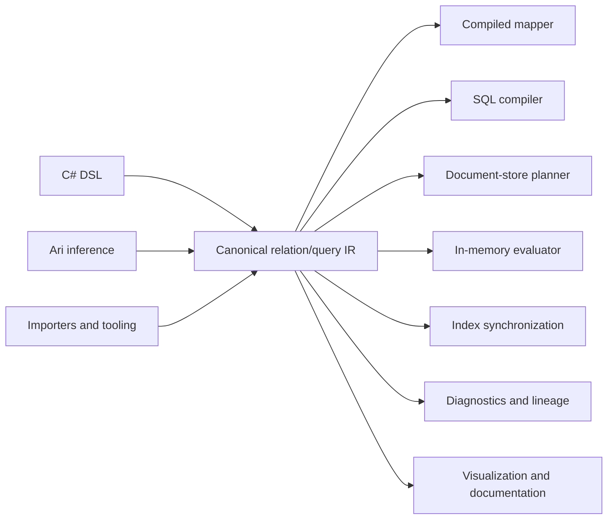

# Cohesive.Relations

Portable relational programming for .NET and heterogeneous data systems.

`Cohesive.Relations` brings the declarative character of database-oriented relational programming into a general-purpose programming environment.

SQL makes it possible to describe facts, relationships, projections, filters, and aggregations without prescribing an execution algorithm. Its usual limitation is that the program is scoped to a particular database catalog, server, dialect, and execution boundary.

Cohesive separates those relational semantics from their physical realization. Facts may come from PostgreSQL, Cosmos DB, a search index, an API, supplied CLR objects, observations, caches, or several sources together. The same semantic definition may be interpreted as SQL, a compiled mapper, a batch hydration plan, an in-memory computation, an index-maintenance plan, a lineage report, or a diagnostic explanation.

The canonical relation/query IR is the source of truth. Authoring DSLs, importers, and inference systems such as Ari produce that IR; compilers and interpreters decide how to realize it.

## Mental Model

Cohesive relational programs are built from several related concepts.

### Facts

Facts are shaped values available to a relational program.

Examples include:

- A `Load` supplied as a CLR object.
- A customer observation read from Cosmos DB.
- Rows from a PostgreSQL table.
- Equipment data returned by an API.
- Previously materialized search documents.

A logical source declares that values of a particular shape are available. It does not prescribe where they live or how they must be acquired.

### Relationships

Relationships describe semantic connections between facts.

For example:

```text
Load.CustomerId → Customer.Id
```

A relationship may be traversed during querying, DTO enrichment, hydration, dependency analysis, or incremental materialization. Its physical realization might be a SQL join, a Cosmos point read, a batched lookup, a cache lookup, or an in-memory hash join.

### Derivations

A derivation declares how new facts can be established from available facts.

A DTO mapping is one form of relational derivation:

```text
LoadSearchDto(loadId, status, customerName) :-
    Load(loadId, customerId, status),
    Customer(customerId, customerName)
```

The output DTO is a derived fact. Its fields retain provenance to the source facts and expressions that establish them.

### Relations

A relation is a reusable, rooted derivation.

It answers a question such as:

> Given a load and the facts related to it, what `LoadSearchDto` values can be derived?

A relation declares:

- The root input binding.
- The logical derivation graph.
- The output shape.
- Output cardinality relative to each root.
- Required and optional related inputs.
- Semantic invariants.

Relations are useful for DTO mapping, enrichment, hydration, denormalization, lineage analysis, and incremental dependency tracking.

### Queries

A query is an independently invoked request over a logical relational graph.

It may declare:

- Runtime parameters.
- Filters.
- Requested projections.
- Ordering and paging.
- Row results.
- Aggregation results.
- Multiple named result branches over shared predicates.

Queries are useful for retrieval, search, reporting, exploration, and aggregation across one or more sources.

## Relations and Queries

Relations and queries use the same logical operators because both describe relational computation:

- Sources
- Filters
- Relationship traversal
- Explicit joins
- Unnesting
- Projection
- Distinctness
- Aggregation
- Ordering
- Paging

They differ in their semantic contract:

| Relation | Query |
|---|---|
| Describes a reusable correspondence or derivation | Describes an invoked request for results |
| Rooted in an input value | Rooted in one or more named result branches |
| Declares output cardinality per root | Declares rows, aggregations, ordering, and paging |
| Supports hydration and dependency analysis | Supports retrieval and reporting |
| Can be evaluated incrementally as facts change | Is normally evaluated in response to an invocation |

The distinction is semantic rather than physical. Neither construct chooses a database, join algorithm, batching strategy, or execution runtime.

A Cohesive relation is also not synonymous with a table in the relational-database sense. A compiler may realize a relation as a SQL expression, view, materialized view, or application-side plan, but the relation itself remains portable.

## DTO Mapping as Relational Programming

Consider a search document containing data from a load and its customer:

```csharp
using Cohesive.Relations.Authoring;

var relation = Relation<LoadSearchDto>
    .From<Load>()
    .Join<Customer>(
        static (load, customer) => load.CustomerId == customer.Id)
    .Select(static (load, customer) => new LoadSearchDto
    {
        LoadId = load.Id,
        Status = load.Status,
        CustomerName = customer.Name
    });
```

This declaration can support several interpretations.

### Compiled mapper

When all inputs are already available, Cohesive can compile the relation into a fast delegate that constructs `LoadSearchDto` values.

### PostgreSQL projection

When both facts live in PostgreSQL, the relation may lower to:

```sql
SELECT
    l.id AS load_id,
    l.status,
    c.name AS customer_name
FROM loads AS l
LEFT JOIN customers AS c
    ON c.id = l.customer_id;
```

### Non-relational hydration plan

When loads and customers live in a document store, a planner may:

```text
Read loads
→ collect distinct CustomerIds
→ batch-read customers
→ hash join in memory
→ project LoadSearchDto
```

### Index maintenance

When the relation defines a search document, it also describes dependencies:

```text
LoadSearchDto
├── depends on Load
└── depends on Customer through Load.CustomerId
```

A load change directly identifies an affected search document. A customer change can be propagated through the reverse relationship to determine which root loads must be re-indexed.

## Diagnostics and Derivability

Because mappings are represented as derivations, missing inputs can be explained rather than reduced to mapper failures.

For example:

```text
Cannot derive LoadSearchDto.CustomerName.

Required premises:
  Load.CustomerId = "customer-123"
  Customer.Id = "customer-123"

Available:
  Load.CustomerId

Missing:
  Customer with Id "customer-123"
```

Cohesive distinguishes conditions that conventional mapping systems often conflate:

- A field is known and non-null.
- A field is known to be null.
- A relationship is known to be absent.
- A required fact has not been supplied or fetched.
- A lookup completed without finding a match.
- A lookup failed.
- A fact was not requested because the output did not require it.

Diagnostics are structured product output. They should be usable by applications, tests, deployment gates, index-management tools, and developer tooling.

## One Semantic Model, Multiple Interpretations



An interpretation does not have to execute the definition. Validation, optimization, visualization, lineage analysis, documentation generation, migration planning, and dependency analysis are interpretations of the same IR.

Derived artifacts should retain provenance to the IR nodes and compiler decisions that produced them.

## Use Cases

### Simple and enriched DTO mapping

Map domain values to DTOs using direct assignments, conversions, nested projections, conventions, and related facts. An enriched DTO can combine a root value with customer, equipment, or other referenced information without requiring all inputs to share one storage engine.

### Relationship hydration

Start with a root entity and resolve required or optional related facts similarly to an ORM query. The same relation can operate over supplied objects, observations, database reads, caches, or composed acquisition plans.

### Portable and federated querying

Declare filters, joins, selected fields, ordering, paging, row results, and aggregations once, then compile them to PostgreSQL, Cosmos SQL, Gremlin, in-memory evaluation, or a composed cross-source plan.

For example:

```text
Loads from Cosmos
+ Customers from PostgreSQL
+ tracking state from an API
→ delayed premium-customer loads
```

A planner can push compatible work into each source, batch intermediate keys, join locally, and diagnose semantics that cannot be preserved.

### Search-index synchronization

Use a relation to define a denormalized index document, rebuild the complete index, process real-time changes, and determine which root documents are affected when related entities change.

Full rebuild and incremental maintenance are interpretations of the same derivation and should converge on equivalent indexed values.

### Application read models

CQRS-style read models are materialized relations:

```text
Order + Customer + Shipments + Payments
    → OrderDetailsView
```

The definition can support synchronous reads, projection rebuilding, incremental event handling, cache population, and dependency analysis.

### API composition

API responses often combine facts from several entities, databases, or services:

```text
Load + Customer + Equipment + CurrentLocation
    → LoadDetailsResponse
```

Interpreters may produce SQL, resolver plans, batched service calls, or mixed-source execution plans while preserving one response derivation.

### EDI and external-schema transformation

Relations can express transformations from complex external schemas into domain models:

```text
EDI 204 document + partner configuration
    → LoadTender
```

This includes structural matching, nested collection mapping, code translation, conditional derivation, conversions, and required-input diagnostics. Ari can propose relations while Cohesive validates, persists, analyzes, and evaluates them.

### Event enrichment

Enrich events with related facts before publishing or processing them:

```text
LoadChanged + Load + Customer
    → EnrichedLoadChanged
```

The relation identifies the additional facts required and allows the runtime to select cached, batched, local, or remote acquisition strategies.

### Data migration and backfills

Express migration as a derivation from old shapes to new shapes:

```text
CustomerV1 + AddressV1
    → CustomerV2
```

Interpretations can include migration SQL, application-side conversion, dry-run validation, missing-data reports, backfills, and before/after reconciliation. Persisted relation versions provide an auditable account of how values were transformed.

### Reconciliation and repair

Declare what should correspond across operational, billing, cache, and search systems:

```text
OperationalLoad
    ↔ BillingLoad
    ↔ LoadSearchDocument
```

An interpreter can identify missing records, stale projections, conflicting fields, duplicate identities, and cardinality violations. The same analysis can drive targeted repair.

### Cache population and invalidation

A cached value is often a materialized derived relation:

```text
Customer + ActiveLoads + AccountBalance
    → CustomerDashboardCacheEntry
```

Dependency analysis determines which entries are affected when an input fact changes. Initial population, targeted invalidation, and recomputation share one semantic definition.

### Reactive and incremental computation

Relations can be interpreted as continuously maintained views:

```text
LoadStatusChanged
    → affected CustomerSummary
    → affected RegionalDashboard
```

This supports subscriptions, live dashboards, reactive UI data, and incremental aggregates without requiring every change to trigger complete recomputation.

### Authorization-aware projection

Resource and caller facts can participate in an explicit derivation:

```text
Load + User + Roles + CustomerAccess
    → AuthorizedLoadDto
```

Interpreters can apply row and field policies while retaining provenance for why information was included or excluded. Authorization should not become an invisible adapter-side mutation of query meaning.

### Privacy, governance, and lineage

Field-level lineage makes it possible to ask:

- Which DTOs expose a customer email address?
- Which indexes contain personal data?
- What derived artifacts depend on a protected field?
- Which relations are affected by a retention-policy change?
- Can a field be removed without breaking downstream derivations?

These are non-execution interpretations of the same relational program.

### Data quality and anomaly detection

A relation can derive expected values and compare them with recorded facts:

```text
Shipment stops
    → expected total distance

expected total distance + recorded distance
    → distance discrepancy
```

This supports completeness checks, invariant validation, discrepancy reports, and explanations of violated expectations.

### Schema-evolution impact analysis

Persisted relation graphs can identify the DTOs, queries, predicates, indexes, API contracts, migrations, and backend plans affected by a field or relationship change. Stable semantic identities make this analysis more reliable than source-text searches.

### Feature engineering

Machine-learning features are derived facts:

```text
Customer + Loads + PaymentHistory
    → CustomerRiskFeatures
```

The same relation can support offline training-set generation, online feature lookup, backfills, drift analysis, feature lineage, and training/serving equivalence checks.

### Report and document generation

Reports are projections and aggregations over facts:

```text
Loads + Customers + Charges
    → CustomerSettlementReport
```

One logical definition can support interactive queries, scheduled exports, spreadsheets, PDFs, and report-completeness validation.

### Offline and edge synchronization

Relations can define the subset and shape of data projected onto a device:

```text
Driver + AssignedLoads + Stops + Instructions
    → DriverOfflineDataset
```

Dependency analysis identifies incremental updates, while another interpretation can assist with reconciliation when the device reconnects.

### Test fixture and scenario generation

Testing tools can inspect a relation's required premises to:

- Generate the minimum facts needed to derive an output.
- Deliberately omit required facts.
- Exercise cardinality and missing-data cases.
- Generate relationship holes.
- Compare backend interpreters.
- Shrink failures to the smallest relevant fact set.

### Query explanation and cost analysis

A non-executing planner can explain why a field or source is required and how a target-specific plan was selected:

```text
Requested CustomerName
→ requires Customer binding
→ requires Load.CustomerId
→ requires customer batch lookup
→ estimated 3 batches and 1 in-memory hash join
```

This makes capability decisions, physical plans, projected costs, and fallback strategies inspectable before execution.

## Architectural Principles

### Semantics before infrastructure

Canonical nodes describe relational meaning. Table names, partition keys, SQL dialects, batch sizes, SDK types, and connection details belong to compiler configuration and adapters.

### Source acquisition is an interpretation

A logical source does not require a database scan. Values may be supplied directly, loaded from storage, produced by another relation, or resolved through a composed execution plan.

### Capability-driven compilation

Adapters describe what their targets can do. Compilers compare semantic requirements with those capabilities and produce native, composed, overridden, or unsupported realizations.

Compilers must not silently weaken semantics.

### Demand-driven field selection

Interpreters should derive and acquire only the fields required by requested outputs, predicates, joins, ordering, aggregation, invariants, and diagnostics.

### Explicit missing-data semantics

Missing, null, absent, unavailable, and failed are not interchangeable states.

### Deterministic and inspectable conventions

Conventions may simplify common mappings and planning decisions, but convention-derived behavior must remain deterministic, explainable, and attributable.

### First-class provenance

Execution plans, generated queries, compiled mappers, diagnostics, and materialized outputs should retain links to their originating semantic definitions.

## Portable Documents

Canonical relation and query definitions can be persisted in the versioned `relation-query/v1` document format.

The format provides:

- Closed relation, query, node, result, and paging discriminators.
- Stable semantic identifiers.
- Binding-qualified field references.
- Strict JSON parsing.
- Structured semantic validation.
- Deterministic definition fingerprints.
- Host-language contract projection.

Document metadata and physical plans do not participate in the semantic definition fingerprint.

## Current Status

`Cohesive.Relations` is in early R&D. API stability is not yet a goal; validating the correct semantic model is.

The current foundation includes:

- Relation, mapping, hydration, query, and aggregation APIs.
- A shared canonical relation/query IR.
- Explicit value bindings and relationship traversal.
- Versioned persisted relation/query documents.
- Structural and semantic diagnostics.
- Deterministic definition fingerprints.
- In-memory execution and mapping components.
- Contract projection for other host languages.

Active areas of development include:

- Lowering existing authoring APIs into the canonical IR.
- First-class relationship catalogs and entity relationship declarations.
- Capability-driven physical planning.
- PostgreSQL, Cosmos SQL, Gremlin, and search-backend compilers.
- Cross-source batching and in-memory joins.
- Incremental dependency and index-maintenance planning.
- Reference interpreters and backend differential testing.
- JSON Schema generation and compatibility tooling.

## Installation

```bash
dotnet add package Cohesive.Relations
```

## Related Packages

- `Cohesive` provides the core shape, expression, observation, and type models.
- `Cohesive.Relations.Contracts` exposes relation/query contracts for code generation.
- `Cohesive.Storage` provides generic storage abstractions.
- `Cohesive.Transitions` defines entity transitions and invariants that can participate in relationship and dependency analysis.
- `Cohesive.Adapters.Cosmos` provides Cosmos-oriented interpretations.
- `Cohesive.Adapters.Elastic` provides search-oriented interpretations.
- `Cohesive.Adapters.TypeScript` projects semantic contracts into TypeScript.

## Direction

The long-term goal is for relational definitions to be authored once and interpreted across storage engines, application memory, APIs, search systems, frontend runtimes, and operational tooling without losing their semantic meaning.

A fast DTO mapper, a SQL query, a non-relational batch plan, an index synchronizer, and a missing-input explanation should be understood as different interpretations of the same relational program.
