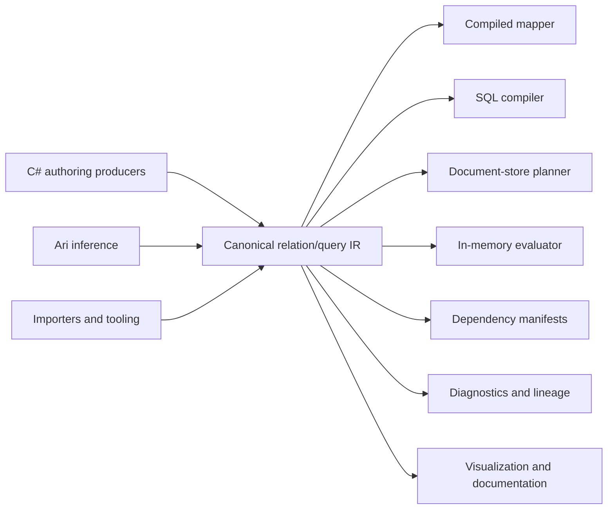

# Cohesive.Relations

Portable relational programming for .NET and heterogeneous data systems.

`Cohesive.Relations` brings the declarative character of database-oriented relational programming into a general-purpose programming environment.

SQL makes it possible to describe facts, relationships, projections, filters, and aggregations without prescribing an execution algorithm. Its usual limitation is that the program is scoped to a particular database catalog, server, dialect, and execution boundary.

Cohesive separates those relational semantics from their physical realization. Facts may come from PostgreSQL, Cosmos DB, a search index, an API, supplied CLR objects, observations, caches, or several sources together. The same semantic definition may be interpreted as a native query, a compiled DTO mapper, an in-memory computation, a dependency manifest, a lineage report, or a diagnostic explanation.

The canonical relationship catalog and relation/query IR are the sources of semantic truth. Authoring DSLs, importers, and inference systems such as Ari produce these IRs; compilers and interpreters decide how to realize them.

## Start Here

Install the semantic core:

```bash
dotnet add package Cohesive.Relations
```

The ordinary C# entry point is the expression authoring surface. A complete `Load -> LoadDto`
relation needs no semantic IDs, names, node or binding arguments, source references, placement, or adapter
configuration:

```csharp
var author = RelationQuery.Expression();
var loads = author.Source<Load>();

var loadDtos = author.Project(
    loads,
    (Load load) => new LoadDto
    {
        Id = load.Id,
        Status = load.Status
    });

var authored = loadDtos.BuildRelation(dto => dto.Id);
var relation = author.CreateRelation(
    authored,
    loads,
    loadDtos,
    new ExecutionRevisionId("1"));
```

`authored` is the validated producer result for the canonical, persistable relation definition. `relation` is an
immutable typed projection for an exactly-one rooted Relation revision. It retains the canonical document and its
captured shape/relationship evidence—not expressions or callbacks—and proves its CLR input and result types against
the canonical root and output shapes. Its invocation and result `ValueContract`s use the portable structural CLR
projection shared by Process authoring and runtime value conversion; graph-qualified named binding types remain in
the Relation document and captured shape evidence rather than leaking into cross-language invocation contracts.
Relations with optional, many, or set cardinality continue to use their
explicit result semantics rather than being represented by this singular handle. From there, add only the capability
your application needs:

1. [Map a Load, then enrich it with Customer and Equipment](docs/GETTING_STARTED.md).
2. [Invoke and execute the definition in memory or through an adapter](docs/EXECUTION_AND_ADAPTERS.md).
3. [Handle missing Customer data and other structured diagnostics](docs/DIAGNOSTICS.md).
4. [Inspect the generated adapter capability reference](docs/CAPABILITIES.md).
5. [Migrate from the deleted legacy relation-query stack](docs/MIGRATION.md).

Adapter-specific construction and override examples live with
[`Cohesive.Adapters.Cosmos`](https://github.com/cohesivesystems/cohesive/blob/main/src/adapters/Cohesive.Adapters.Cosmos/README.md),
[`Cohesive.Adapters.Elastic`](https://github.com/cohesivesystems/cohesive/blob/main/src/adapters/Cohesive.Adapters.Elastic/README.md), and
[`Cohesive.Adapters.Postgres`](https://github.com/cohesivesystems/cohesive/blob/main/src/adapters/Cohesive.Adapters.Postgres/README.md).

The smallest authoring, field-demand, composed-read, and missing-input examples are executable Relations
documentation conformance tests. Longer host and adapter fragments isolate one boundary and link to the exact
conformance coverage. The expression API is the primary application surface; structural authoring and direct
canonical IR construction remain available later for tooling, imports, persistence, and metaprogramming.

## Mental Model

Cohesive relational programs are built from several related concepts.

### Facts

Facts are shaped values available to a relational program.

Examples include:

- A `Load` supplied as a CLR object.
- A customer observation read from Cosmos DB.
- Rows from a PostgreSQL table.
- Equipment data returned by an API.
- Previously materialized search documents.

A logical source declares that values of a particular shape are available. It does not prescribe where they live or how they must be acquired.

### Relationships

Relationships describe semantic connections between facts.

For example:

```text
Load.CustomerId → Customer observation identity
```

A relationship may be traversed during querying, DTO enrichment, compilation, or dependency analysis. Its physical realization might be a SQL join, a bounded lookup, or an in-memory hash join, provided the selected target can preserve the declared semantics.

The canonical `RelationshipDefinition` is an oriented edge from the graph-qualified shape that
holds a reference to the graph-qualified shape it addresses. It stores the source field path,
target-key semantics, and any global uniqueness guarantee. It does not duplicate the source
field's presence, nullability, or cardinality; those remain authoritative on the source
`ShapeGraph`.

For example, a single `Load.CustomerId` yields at most one customer when traversed forward. The
inverse traversal yields many loads by default. Declaring the reference globally unique reduces
the inverse result to at most one load. A required `CustomerId` means the reference key must be
present; it does not claim that the customer observation exists.

Relationships can be authored directly or through the typed producer:

```csharp
var loadCustomer = Relationship
    .From<Load>(loadShape)
    .Reference(static load => load.CustomerId)
    .To(customerShape);
```

Typed selectors are immediately lowered to canonical field paths. CLR reflection and expression
objects are not retained in persisted relationship IR. `Cohesive.Transitions` can compile
`EntityReferenceTypeRef` fields into the same definitions and deterministic IDs.

### Derivations

A derivation declares how new facts can be established from available facts.

A DTO mapping is one form of relational derivation:

```text
LoadSearchDto(loadId, status, customerName) :-
    Load(loadId, customerId, status),
    Customer(customerId, customerName)
```

The output DTO is a derived fact. Its fields retain provenance to the source facts and expressions that establish them.

### Relations

A relation is a reusable, rooted derivation.

It answers a question such as:

> Given a load and the facts related to it, what `LoadSearchDto` values can be derived?

A relation declares:

- The root input binding.
- The logical derivation graph.
- The output shape.
- Output cardinality relative to each root.
- Required and optional related inputs.
- Semantic invariants.

Relations are useful for DTO mapping, enrichment, lineage analysis, and dependency tracking.

### Queries

A query is an independently invoked request over a logical relational graph.

It may declare:

- Runtime parameters.
- Filters.
- Requested projections.
- Ordering and paging.
- Row results.
- Aggregation results.
- Multiple named result branches over shared predicates.

Queries are useful for retrieval, search, reporting, exploration, and aggregation across one or more sources.

### Hosted Queries

A hosted Query is used when invocation semantics include acquisition or policy that cannot be expressed by the
portable logical graph alone. For example, an invocation may select a tenant partition, verify an admitted event
against persisted state, and then evaluate a portable projection Relation over the acquired snapshot.

```csharp
var byEvent = HostedQuery<NormalizationStart, PinnedSource>.Create(
    definitionId: new("query/training/event-source/schema-mapping"),
    revisionId: new("1"),
    implementation: new("training.event-source", "1"),
    configuration: new EventSourcePolicy("schema-mapping", "tenant-and-payload-exact"),
    provenance: provenance,
    dependencies:
    [
        schemaMappingProjection.AsHostedQueryDependency("projection")
    ]);
```

The shared `ExecutionDefinitionDocument` is authoritative for the hosted Query's input/result contracts, exact
implementation family and version, role-named exact dependencies, portable configuration, provenance, and
fingerprint. The typed handle is only an immutable C# projection of that document. Executable handlers,
repositories, credentials, service instances, deployment choices, and ambient configuration are runtime
registration concerns and never enter canonical content.

A hosted Query is not a substitute for a portable Relation or Query. Its dependency can point to the portable
Relation that performs deterministic projection after acquisition, while its own distinct fingerprint truthfully
attests to the external invocation contract and acquisition policy.

## Relations and Queries

Relations and queries use the same logical operators because both describe relational computation:

- Sources
- Filters
- Relationship traversal
- Explicit joins
- Valid-time joins
- Unnesting
- Projection
- Distinctness
- Aggregation
- Ordering
- Paging

They differ in their semantic contract:

| Relation | Query |
|---|---|
| Describes a reusable correspondence or derivation | Describes an invoked request for results |
| Rooted in an input value | Rooted in one or more named result branches |
| Declares output cardinality per root | Declares rows, aggregations, ordering, and paging |
| Supports rooted derivation and dependency analysis | Supports retrieval and reporting |
| Can identify inputs that influence rooted outputs | Is normally evaluated in response to an invocation |

The distinction is semantic rather than physical. Neither construct chooses a database, join algorithm, batching strategy, or execution runtime.

A Cohesive relation is also not synonymous with a table in the relational-database sense. A compiler may realize a relation as a SQL expression, compiled mapper, or application-side plan, but the relation itself remains portable.

## Valid-Time Joins

A `TemporalJoinQueryNode` correlates two independently produced rowsets using both an ordinary
Boolean key predicate and an explicit valid-time condition. It models when row-valued facts were
valid; it does not select a database snapshot, read system-versioned history, or consult an ambient
clock.

For example, an event can be enriched with the customer version that was valid when the event
occurred:

```csharp
var temporalJoin = new TemporalJoinQueryNode(
    id: new("event-customer-version"),
    left: eventSource,
    right: customerVersionSource,
    kind: JoinKind.Left,
    correlation: Expr.Eq(
        Expr.Field(eventBinding, FieldPath.FromField("CustomerId")),
        Expr.Field(versionBinding, FieldPath.FromField("CustomerId"))),
    match: new TemporalPointInIntervalMatch(
        Expr.Field(eventBinding, FieldPath.FromField("OccurredAt")),
        TemporalInterval.HalfOpen(
            Expr.Field(versionBinding, FieldPath.FromField("ValidFrom")),
            Expr.Field(versionBinding, FieldPath.FromField("ValidTo")),
            upperNullBehavior: TemporalNullBoundBehavior.Unbounded)));
```

Point containment reads its point from the left rowset and its interval from the right. Interval
overlap reads its first interval from the left and its second from the right. Only the ordinary
correlation expression sees the combined pre-null-extension binding scope. Swapping the inputs
expresses the inverse point/interval orientation.

The persisted interval records every finite endpoint as inclusive or exclusive. `HalfOpen`
conventionally produces `[lower, upper)`, but canonical semantics never depend on that convention.
Endpoint states remain distinct:

| Endpoint or interval state | Meaning |
|---|---|
| `UnboundedTemporalIntervalBound` | Structural negative or positive infinity |
| Expression evaluates to null with `Invalid` | Invalid operand and incomplete result |
| Expression evaluates to null with `Unbounded` | Explicit source convention for an open end |
| Expression is missing or unavailable | Indeterminate evidence, never an unbounded endpoint |
| Lower follows upper | Invalid interval with an attributable diagnostic |
| Equal inclusive endpoints | A valid singleton interval |
| Equal endpoints with either endpoint exclusive | A valid empty interval |

`Date`, `DateTime`, and `Instant` are exact, non-coercing domains. `DateTime` uses civil or
wall-clock ordering; `Instant` uses absolute ordering, so equivalent instants with different
offsets compare equally. Interval emptiness and overlap use the domain's representable precision:
civil days for `Date`, civil ticks for `DateTime`, and UTC ticks for `Instant`. Every pair satisfying
both correlation and temporal membership is emitted. Overlapping versions therefore produce
multiple rows; the operator never chooses a "latest" winner.

Missing fields, partial source results, and partial traversals make affected candidates
indeterminate. An outer join emits an unmatched row only when the opposite candidate set is
complete and every applicable candidate is a conclusive non-match. Matched rows may still be
returned from incomplete evidence, but the result remains explicitly incomplete.

Backend interpreters may preserve these semantics with SQL range predicates, native range types,
interval indexes, or batched acquisition followed by in-memory evaluation. The temporal execution
capability profile declares which match, boundary, domain, join, and inconclusive-evidence semantics
a target preserves. The compiled input contract lists the exact demand-scoped temporal capabilities
with stable requirement IDs and node/site provenance. A target missing one must reject the plan with
an attributable diagnostic rather than weakening it. System-time acquisition, nearest-predecessor
`ASOF` joins, temporal relationship traversal, and physical interval-index planning are separate
future semantics.

Temporal operands are retained as correlation, membership, cardinality, and validation influences
in the requirement graph, output-oriented lineage, and dependency manifest. Lineage keeps these in
its `Influences` channel while `Contributions` remains intentionally narrow to value, identity, and
aggregation provenance. Consumers performing invalidation or dependency-impact analysis can therefore
walk output-oriented influences or the inverse input-oriented dependency manifest without treating
a membership predicate as a projected value.

## Portable Relation Drafts

A relation draft is a portable, persistable relation under construction. It carries the canonical
logical graph up to the projection boundary, stable output-assignment slots, semantic expression
candidates for those slots, and an explicit resolution for each slot. The draft is separate from
the accepted `RelationDefinition`: unresolved and ambiguous assignments are useful states for
authoring, inference, review, and diagnostics, but they are not executable relation semantics.

Draft producers can be simple conventions, host-language authoring tools, importers, or inference
systems such as Ari. Producer-specific evidence remains outside the semantic draft. For example,
Ari may associate model scores, explanations, review decisions, and run metadata with stable draft
slot and candidate identifiers without placing those concerns in `Cohesive.Relations`.

This is an integration boundary rather than a competing proposal model. Ari's
`MappingInferenceResult` remains its inference and workflow artifact. An Ari adapter can lower its
source/target paths into draft slots and canonical expression candidates, retain confidence,
alternatives, features, model versions, and review state in Ari, and associate that evidence with
the content-derived draft candidate identifiers. A draft document can point back to the Ari
artifact through an opaque producer-artifact reference. Changing Ari evidence does not change the
draft fingerprint; changing a slot, candidate expression, or resolution does.

Acceptance is a shape-aware semantic boundary. It verifies that every output field is explicitly
resolved or, when optional, explicitly omitted; that selected source fields exist; and that type,
cardinality, presence, and nullability are safe. Successful acceptance appends the canonical
projection node and produces a normal `RelationDefinition`. The draft identity remains stable
across revisions, while its content fingerprint changes as candidates and resolutions change.
The result retains the consumed draft fingerprint and relationship-catalog fingerprint as
provenance, separately from the accepted relation's canonical fingerprint.

Three kinds of incomplete information remain distinct:

- A **definition hole** is an unresolved, ambiguous, or unsafe draft assignment and prevents
  acceptance.
- **Inference uncertainty** is producer-owned evidence such as an Ari confidence score; policy may
  turn it into a selected, ambiguous, or unresolved draft state.
- A **runtime requirement gap** occurs after acceptance when required observations are unavailable, such
  as a load whose referenced customer cannot be resolved. Runtime availability is evaluated against
  the compiled input contract and does not make an otherwise complete draft unresolved.

The draft graph may already contain relationship traversals, so a flat DTO projection can select
fields from several visible bindings:

```text
Source(Load as load)
→ TraverseRelationship(load.CustomerId → Customer as customer, join: Left)
→ Project(
    LoadSearchDto.Id           = load.Id,
    LoadSearchDto.CustomerId   = load.CustomerId,
    LoadSearchDto.CustomerName = customer.Name,
    LoadSearchDto.CustomerType = customer.Type)
```

The built-in convention matcher intentionally handles only direct, top-level field matches in its
first version. It applies explicit aliases first, then exact ordinal names, then a unique
ordinal-ignore-case name. An unsafe higher-precedence match remains a diagnosed hole rather than
falling through to a lower-precedence guess. Exact whole-value copies of arrays and inline objects
are allowed when their portable types and field guarantees match; inferring navigation or
restructuring inside those values is not.

More sophisticated producers can propose relationship traversals and cross-binding assignments
using the same draft contract, so flattening `Customer.Name` into `LoadSearchDto.CustomerName` does
not require a second relation model. Automatic traversal discovery, automatic nested structural
mapping, broader structural mappers, backend lowering, and proof that a declared
relation output mode matches row-multiplying or row-dropping graph behavior remain follow-on
interpretations or analyses.

## Relationship to GraphQL

GraphQL and `Cohesive.Relations` both support querying heterogeneous data sources through a
uniform interface, but they operate at different levels of abstraction.

GraphQL defines a remote API contract through which remote clients submit queries and receive
results. `Cohesive.Relations` defines a node-level semantic protocol through which application
components describe relationships, queries, projections, aggregations, and data requirements.
Node-level does not mean that the data or execution must be local: a Relations interpreter may
read from local memory, databases, remote services, or several heterogeneous sources. It describes
the level at which the semantic contract is consumed rather than the placement of its data.

The Relations IR is independent of the remote API used to expose it, but it is itself a protocol
between authoring tools, compilers, planners, repositories, and interpreters. It may also be
persisted, transferred between nodes, and projected into other host languages.

### Resolvers and canonical source acquisition

A GraphQL implementation binds field resolvers to fields in its remote API schema. Canonical
Relations execution instead derives source requirements from a compiled definition and binds them
through explicit source placement. The physical executor issues bounded requests through
`IRelationQuerySourceReader`; target-native compilers can replace compatible work with a native
backend query.

The contracts are different. A GraphQL resolver satisfies a field in a particular client-facing
schema. A Relations source reader supplies evidence for an exact placed semantic input,
independently of whether or how that data is exposed remotely. The compiled plan retains enough
meaning to validate batching, local joins, native pushdown, completeness, and failure behavior.

### Remote API exposure

`Cohesive.Relations` does not itself establish a remote client/server interface or define a remote
invocation protocol. `Cohesive.Api` can expose Relations semantics through GraphQL, REST, gRPC, or
another remote API technology. A GraphQL interpretation could lower a client selection set into
relation/query IR, execute it through selected readers and adapters, and project the
result into the GraphQL response shape.

```text
Remote client
→ Cohesive.Api GraphQL operation
→ Cohesive.Relations query
→ source placement, readers, and backend adapters
→ heterogeneous data sources
```

### Mutations and workflows

`Cohesive.Relations` models data acquisition and computation rather than state mutation. A GraphQL
mutation defines a remote API operation, but not the underlying state-change semantics.
`Cohesive.Api` may expose an operation as a GraphQL mutation, REST action, or gRPC method;
`Cohesive.Transitions` defines its entity state changes and invariants; and `Cohesive.Processes`
coordinates multistep workflows involving transitions, queries, waits, external effects, and
recovery or compensation behavior.

```text
Remote client
→ Cohesive.Api operation
→ Cohesive.Transitions transition or Cohesive.Processes process
→ state changes and external effects
→ Cohesive.Relations result projection
→ remote API response
```

## DTO Mapping as Relational Programming

Consider a search document containing data from a load and its customer:

```text
Source(Load as load)
→ TraverseRelationship(load.CustomerId → Customer as customer)
→ Project(
    LoadSearchDto.LoadId       = load.Id,
    LoadSearchDto.Status       = load.Status,
    LoadSearchDto.CustomerName = customer.Name)
```

This graph is persisted as canonical relation/query IR. The expression-based C# surface is the primary
developer UX and the structural surface is its unbounded escape hatch. Both lower through the same
`RelationQueryAuthoringCore`; neither owns a second query model.

### Expression-based C# authoring

`RelationQuery.Expression()` creates a typed authoring session. CLR expressions are inspected, never
compiled or executed, and immediately lower to canonical `Expr` values and structural operations. The
session discovers deterministic shape documents using the configured attributes and System.Text.Json
metadata. Explicit imported `ShapeGraphDocument` registrations and member-path overrides take precedence.
Each typed shape exposes `IdentityOrigin`, while `ResolveMemberPathWithProvenance` reports the origin of
every path segment as convention-, metadata-, explicit-, or import-derived. Imported documents are checked
against the CLR member type, cardinality, presence, nullability, and reachable named-type structure before
they can participate in a terminal.

A simple DTO relation needs no manually authored shape IDs, field paths, expressions, or node arrays:

```csharp
var author = RelationQuery.Expression();
var loads = author.Source<Load>();
var relation = author
    .Project(
        loads,
        (Load load) => new LoadDto
        {
            Id = load.Id,
            Status = load.Status
        })
    .BuildRelation((LoadDto document) => document.Id);
```

Relationship and terminal identities, display names, and provenance references are convention-derived unless an
explicit overload or optional override is used. The versioned relation convention hashes the root shape, output
shape, and output mode; multiple conceptual relations with the same endpoints use the optional `id` or the explicit
terminal overload. A minimal joined DTO relation is therefore:

```csharp
var author = RelationQuery.Expression();
var loads = author.Source<Load>();
var customers = author.Traverse<Load, Customer>(
    loads,
    load => load.CustomerId);

var relation = author
    .Project(
        customers,
        (Load load, Customer customer) => new LoadSearchDto
        {
            Id = load.Id,
            CustomerId = load.CustomerId,
            CustomerName = customer.Name,
            CustomerType = customer.Type
        })
    .BuildRelation((LoadSearchDto document) => document.Id);

var relationshipCatalog = author.CreateRelationshipCatalogDocument();
```

Inline traversal definitions are retained in the session's deterministic `RelationshipCatalog`; the document above
can be supplied directly to static compilation. A bound node carries its focused binding and, along the unary
`Source → Traverse → Project` path, its originating relation root. A one-parameter projection uses the focused
binding. A two-parameter projection without explicit bindings uses the root first and the focus second. For other
binding layouts, the focused-binding-last overload accepts the earlier bindings explicitly:

```csharp
var loadEquipment = author.Relationship<Load, Equipment>(load => load.EquipmentId);
var equipment = author.Traverse(customers, loads.Binding, loadEquipment);

var documents = author.Project(
    equipment,
    (Load load, Customer customer, Equipment unit) => new LoadSearchDto
    {
        Id = load.Id,
        CustomerId = load.CustomerId,
        CustomerName = customer.Name,
        CustomerType = customer.Type,
        EquipmentNumber = unit.Number
    },
    loads.Binding,
    customers.Binding);
```

Branches assembled through joins or the structural escape hatch do not guess a relation root; pass the intended root
to the existing explicit `BuildRelation` overload. The same session can consequently author multiple enrichments,
correlated collection semantics, a row result, an aggregation, and a target-neutral typed evaluation:

```csharp
var author = RelationQuery.Expression();
var loadCustomer = author.Relationship<Load, Customer>(
    load => load.CustomerId);
var loadEquipment = author.Relationship<Load, Equipment>(
    load => load.EquipmentId);

var loads = author.Source<Load>();
var customers = author.Traverse(loads, loadCustomer);
var equipment = author.Traverse(customers, loads.Binding, loadEquipment);
var location = author.Parameter<string>("location");

var filtered = author.Filter(
    equipment.Node,
    (Load load, Customer customer, Equipment _) =>
        customer.Name == "Acme"
        && load.Stops.Any(stop => stop.Location == location.Value),
    loads.Binding,
    customers.Binding,
    equipment.Binding);

var documents = author.Project(
    filtered,
    (Load load, Customer customer, Equipment unit) => new LoadSearchDto
    {
        Id = load.Id,
        CustomerId = load.CustomerId,
        CustomerName = customer.Name,
        CustomerType = customer.Type,
        EquipmentNumber = unit.Number
    },
    loads.Binding,
    customers.Binding,
    equipment.Binding);

var summary = author.Aggregate(
    filtered,
    author.Clr.Shape<LoadSearchSummary>(),
    aggregate => aggregate
        .Group(
            result => result.CustomerType,
            (Customer customer) => customer.Type,
            customers.Binding)
        .Count(result => result.Count));

var rows = author.Rows(documents, id: "rows");
var aggregation = author.Aggregation(summary, id: "summary");
var query = author.BuildQuery(
    new QueryId("load-search"),
    new QueryName("LoadSearch"),
    rows,
    aggregation);

var evaluation = author.Evaluate(
        query,
        new RelationQueryEvaluationId("request/42"))
    .Set(location, "Seattle")
    .Select(rows, document => document.Id, document => document.CustomerName)
    .Select(aggregation)
    .Build();

var shapeDocuments = author.ShapeDocuments;
```

The `Any` predicate preserves same-element correlation through canonical current-item scope; it is not
flattened into independent collection tests. Typed parameters become declarations in the canonical query
and only receive values in the evaluation. Captured application state is rejected with a
`RelationQueryExpressionAuthoringException` containing stable diagnostics, expression paths, source
references, and suggested alternatives; arbitrary captured getters are never evaluated.

The translator accepts sequence syntax only where its CLR behavior identifies the canonical behavior exactly:
`Select(...).ToArray()` is an eager, order-preserving projection and predicate-free `LongCount()` has the
canonical Int64 count domain. An exact named enum member lowers to a portable typed enum literal, including
equality or inequality against an enum field. Same-type enum fields can also be compared directly. Unnamed flag
combinations and ambiguous enum aliases remain unsupported. A convention-inferred nullable CLR member,
whose semantic field has required presence, may be read inside a branch guarded by `HasValue` or an exact null
comparison. Compiler-synthesized record equality operators retain that null-guard meaning; arbitrary user-defined
operators remain unsupported. `??` over the same kind of member lowers to an explicit canonical conditional.
`DateTimeOffset.EqualsExact(...)` lowers to
canonical representation equality; ordinary `DateTimeOffset` equality remains unsupported because its instant-based
CLR semantics differ from canonical observation equality. Imported mappings remain fail-closed until
they can supply equivalent per-path presence evidence. Unguarded nullable navigation, Int32-returning
`Count`/`Length`, unmaterialized lazy
`Select`, custom constructors or
setters, and collection equality whose CLR contract differs from canonical equality still fail closed. Author
the intended behavior through `author.Structural` when one of those distinctions matters.

Keyed ordering, distinctness, grouping, and relation identity require a fixed carrier-independent scalar
domain. Raw `DateOnly`, `DateTime`, `DateTimeOffset`, `ObservationValue`, and dynamic JSON carriers are
rejected even when hidden inside a conditional or composite key; project them to an explicitly normalized
field first. The expression facade also rejects untyped whole-row distinctness because it cannot prove that
every visible field has portable equality. A rows result or relation terminal must receive a branch exposing
exactly one value binding, since canonical terminals persist the node and output shape rather than a selected
binding. Project joined, traversed, or expanded branches to one output shape before declaring the terminal.

`author.Structural` exposes the exact underlying core. Use it to add a canonical construct outside the
expression translator's supported closure, then continue with the resulting handles. This is an explicit
authoring escape hatch, not a separate semantic model.

```csharp
var structuralFilter = author.Structural.Filter(
    loads.Node,
    Expr.EndsWith(
        loads.Binding.Structural.Field("status"),
        Expr.Const("Ready")));

// Typed expression authoring can resume over the structural node.
var documents = author.Project(
    structuralFilter,
    (Load load) => new LoadDto { Id = load.Id, Status = load.Status },
    loads.Binding);
```

Expression and structural authoring stop at canonical definitions. An evaluation supplies parameters, relation
roots, and output demand; it still does not choose storage. Placement and adapter bindings attach physical
sources and target capabilities to a compiled plan, and an execution integration performs I/O. Those are
separate interpretations of the persisted canonical IR.

### Structural C# authoring

`RelationQuery.Structural()` creates the reusable construction core. It returns typed handles for nodes,
bindings, parameters, and named results; uses deterministic identities when an override is omitted; records
the origin of every identity and producer-attributed decision; and runs the canonical validator at relation
or query terminals. A terminal snapshots the current core, so the same derivation can first produce a rooted
relation and then be extended into an independently evaluated query without changing the earlier result.

The following example flattens customer and equipment data into a load search DTO, exposes the derivation as
a rooted relation, and then adds a status-filtered query and target-neutral evaluation:

```csharp
var domain = new GraphId("example/domain/v1");
var search = new GraphId("example/search/v1");
var loadShape = new QualifiedShapeId(domain, new("Load"));
var customerShape = new QualifiedShapeId(domain, new("Customer"));
var equipmentShape = new QualifiedShapeId(domain, new("Equipment"));
var loadSearchShape = new QualifiedShapeId(search, new("LoadSearchDto"));

var loadCustomer = Relationship
    .From(loadShape)
    .Reference(FieldPath.FromField("CustomerId"))
    .To(customerShape);
var loadEquipment = Relationship
    .From(loadShape)
    .Reference(FieldPath.FromField("EquipmentId"))
    .To(equipmentShape);

var author = RelationQuery.Structural();
var loads = author.Source(loadShape);
var customers = author.Traverse(loads.Node, loads.Binding, loadCustomer.Id);
var equipment = author.Traverse(customers.Node, loads.Binding, loadEquipment.Id);
var documents = author.Project(
    equipment.Node,
    loadSearchShape,
    [
        new(FieldPath.FromField("Id"), loads.Binding.Field("Id")),
        new(FieldPath.FromField("Status"), loads.Binding.Field("Status")),
        new(FieldPath.FromField("CustomerName"), customers.Binding.Field("Name")),
        new(FieldPath.FromField("EquipmentNumber"), equipment.Binding.Field("Number"))
    ]);

var relation = author.BuildRelation(
    new RelationId("load-search-document"),
    new RelationName("LoadSearchDocument"),
    loads.Binding,
    documents.Node,
    loadSearchShape,
    RelationOutputMode.OnePerRoot,
    key: documents.Binding.Field("Id"));

var status = author.Parameter(
    new ScalarTypeRef(ScalarTypeKind.String),
    id: new QueryParameterId("status"));
var filtered = author.Filter(
    documents.Node,
    Expr.Eq(documents.Binding.Field("Status"), status.Expression));
var rows = author.Rows(filtered, id: new QueryResultId("rows"));
var query = author.BuildQuery(
    new QueryId("loads-by-status"),
    new QueryName("LoadsByStatus"),
    [rows]);

var evaluation = query.CreateDocument()
    .Evaluate(new RelationQueryEvaluationId("request/42"))
    .Set(status.Id, ObservationValue.FromString("InTransit"))
    .Select(rows.Id)
    .Build();
```

`relation.Validation` and `query.Validation` contain the authoritative structured diagnostics. The
evaluation retains the exact definition, shape and relationship snapshots, evaluation identity, parameter evidence,
supplied roots, output demand, and optional compiled-plan attribution; it does not select an adapter, placement, or
execution engine. Pass persisted shape and relationship documents to `Evaluate` when using the structural frontend
directly; `RelationQueryExpressionAuthoring.Evaluate` supplies its session snapshots by convention.
The complete executable version is in `RelationQueryStructuralAuthoringExampleTests`.

### Canonical evaluation and host execution

`RelationQueryEvaluation` is the common runtime request for relations and queries. Its canonical definition
determines whether the request evaluates a rooted correspondence or independently acquires query inputs; there is no
second kind enum or parallel execution model. The request carries the exact `RelationQueryCompilationRequest`,
parameter evidence, optional supplied roots, output demand, and optional compiled-plan attribution.
The normalized request is a portable `relation-query-evaluation/v2` document with a deterministic fingerprint over
the complete compilation snapshots, demand and its origin, evaluation identity, parameter and root evidence,
provenance references, and optional plan attribution. Use `RelationQueryEvaluationJsonSerializer` for strict
round trips and `HasSameSemantics` when a host must compare independently reconstructed requests.

For expression-authored relations, the common DTO-enrichment case is concise:

```csharp
var evaluation = author.Evaluate(
        loadSearchRelation,
        new RelationQueryEvaluationId("index/load/load-42"))
    .Supply(
        new[] { load },
        static value => value.Id,
        evidenceReference: "change-feed/9381")
    .Build();
```

`Supply` accepts existing `Observation` values or maps CLR values through the shared `ShapeMappingContext` cache.
Omitted roots mean no root evidence was supplied. `Supply([])` is intentionally different: it is an explicitly known
empty root set, with complete or partial evidence selected by the caller.

Hosts depend on one boundary:

```csharp
IRelationQueryEvaluator evaluator = new RelationQueryEvaluator(
    plan => placementCatalog.Resolve(plan),
    physicalPlanningPolicy,
    sourceReaders);

RelationQueryEvaluationOutcome outcome = await evaluator.EvaluateAsync(
    evaluation,
    cancellationToken);
```

The reference evaluator performs static compilation, capability realization, physical planning, bounded source
acquisition, and canonical interpretation. `RelationQueryEvaluationOutcome` retains those exact phase artifacts and
exposes the existing `RelationQueryExecutionResult`; it does not copy rows, aggregations, requirement gaps,
diagnostics, provenance, or source-read traces into another hierarchy. Compilation, realization, and planning
failures remain inspectable in their respective artifacts. Missing related observations appear through
`outcome.Result.RequirementGapAnalysis` when interpretation runs.

The outcome and physical execution result are in-process composites, not durable wire contracts. API endpoints map
an outcome explicitly to their response contract. Durable process definitions use the `Evaluate(evaluation,
projectResult)` overload, which projects canonical rows, aggregations, gaps, and diagnostics to a declared application
DTO in the same node before checkpoint capture; Process authoring intentionally has no overload that checkpoints the
complete outcome. In-memory host code may inspect the outcome directly at the evaluator boundary.

### Compiled mapper

For a successful static relation plan, `RelationDtoMapperCompiler` compiles its supported canonical output
terminal into a fast CLR materialization kernel. Mapping consumes canonical execution rows and retains their
status, diagnostics, gaps, and provenance; it does not acquire related data or execute a second relation model.

### PostgreSQL projection

When both facts live in one PostgreSQL execution domain, `Cohesive.Adapters.Postgres` can lower the same graph to a
native query such as:

```sql
SELECT
    l.id AS load_id,
    l.status,
    c.name AS customer_name
FROM loads AS l
LEFT JOIN customers AS c
    ON c.id = l.customer_id;
```

PostgreSQL compilation is an adapter interpretation with retained capability evidence and provenance; it is not part
of the core IR contract. See the executable
[PostgreSQL native join versus Cosmos composed reads](docs/EXECUTION_AND_ADAPTERS.md#postgresql-native-join-versus-cosmos-composed-reads)
comparison for the exact placement boundary.

The same adapter binding also drives `PostgresRelationQuerySourceReader` for Npgsql-backed bounded enumeration,
identity batches, and relationship-key predicate batches in composed physical plans. That source-reader path is
distinct from automatic execution of a native compiled artifact. `PostgresMaterializationSource` reuses the reader for
bounded rebuild/reconciliation pages with keyset continuation and explicit per-statement, rather than cross-page,
snapshot semantics.

### Federated acquisition

When loads and customers do not share a native query boundary, the canonical physical planner can select a
bounded acquisition strategy within its supported closure:

```text
Read loads
→ collect distinct CustomerIds
→ batch-read customers
→ hash join in memory
→ project LoadSearchDto
```

This is physical planning and source acquisition, not the removed prototype hydration API. Source readers
return explicit completeness and field evidence; the canonical interpreter determines the semantic result.

### Dependency analysis, not materialization

Static compilation can describe which inputs influence a derived search document:

```text
LoadSearchDto
├── depends on Load
└── depends on Customer through Load.CustomerId
```

`Cohesive.Relations` produces the semantic relation, lineage, requirements, and dependency manifest. It does
not own index rebuilds, real-time synchronization, checkpoints, target writes, or operational scheduling.
Those responsibilities belong to the separate Storage/materialization workstream. Industrial batching,
parallelism, throttling, and retry policy belong to the planned `Cohesive.Control` workstream. Those systems
may consume Relations artifacts without moving their operational semantics into the relation IR.

## Diagnostics and Derivability

Because mappings are represented as derivations, missing inputs can be explained rather than reduced to mapper failures.

For example:

```text
Cannot derive LoadSearchDto.CustomerName.

Required premises:
  Load.CustomerId = "customer-123"
  Customer.Id = "customer-123"

Available:
  Load.CustomerId

Missing:
  Customer with Id "customer-123"
```

Cohesive distinguishes conditions that conventional mapping systems often conflate:

- A field is known and non-null.
- A field is known to be null.
- A relationship is known to be absent.
- A required fact has not been supplied or fetched.
- A lookup completed without finding a match.
- A lookup failed.
- A fact was not requested because the output did not require it.

Diagnostics are structured product output. They should be usable by applications, tests, deployment gates, index-management tools, and developer tooling.

### Runtime evidence and relation requirement gaps

Runtime availability analysis consumes the static plan rather than walking the relation/query
expressions again:

```text
Compiled input contract
+ occurrence-scoped runtime evidence
→ causal relation requirement gaps
+ explicit missing-data policy
→ decisions and diagnostics
```

These stages remain separate. The input contract says what the demanded semantics require.
Evidence says what one evaluation knows. A requirement gap identifies the causal boundary and retains every
affected output, effect, and requirement trace. Policy decides whether an impact remains
unresolved, is suppressed, receives null, or receives an explicit semantic default. Reporting
policy independently decides whether that impact becomes a diagnostic.

Evidence is scoped by both an evaluation ID and a binding-occurrence ID. An occurrence is not an
entity ID: the same observation may participate more than once through different routes or
bindings. This distinction lets one load have a missing customer without making the customer input
appear globally unavailable for every load in a batch.

Every evidence snapshot is also attributed to the compiler profile, definition and relationship
catalog fingerprints, a versioned semantic fingerprint of the shape snapshots, the effective
output-demand fingerprint, and the ordered compiled input identities. Equivalent plans rebuilt
from rehydrated semantic documents match; document metadata and object identity do not participate.
Evidence produced for a different semantic shape, demand, or input contract is rejected with a
structured plan-mismatch diagnostic before requirement-gap analysis.

The evidence model preserves distinctions required for useful diagnostics:

- a source was not provided versus was provided successfully with zero rows;
- a source result was complete versus partial, failed, or explicitly inconclusive;
- a field was not loaded versus was loaded and semantically absent;
- an explicit null versus an absent value;
- a parameter that was not supplied versus one supplied as missing, explicit null, or a concrete value;
- relationship resolution was inapplicable, not attempted, failed, rejected, inconclusive, or completed;
- a completed result is partial versus authoritative and complete;
- an authoritative lookup found no row versus no lookup evidence being available.

For example, a caller can describe a load whose reference is available but whose customer lookup
has not run:

```csharp
using Cohesive.Model;
using Cohesive.Relations.Compilation;
using Cohesive.Relations.Diagnostics;

var root = plan.InputContract.Sources.Single(
    source => source.Role == RelationQuerySourceInputRole.RelationRoot);
var traversal = plan.InputContract.Traversals.Single();
var loadId = root.Fields.Single(field => field.Input.Field.Path == FieldPath.FromField("Id"));
var customerId = root.Fields.Single(
    field => field.Input.Field.Path == traversal.Definition.SourceReference);
var load = new RelationQueryObservationOccurrence(
    new("load/L1"), root.Binding, root.Shape, observationIdentity: "L1");

var evidence = new RelationQueryRuntimeEvidence(
    evaluation: new("index-load/L1"),
    plan: plan,
    sources:
    [
        new(root.Input.Id, RelationQuerySourceEvidenceState.Provided, [load])
    ],
    fields:
    [
        new(loadId.Input.Id, load.Id, RelationQueryFieldEvidenceState.Value,
            ObservationValue.FromString("L1")),
        new(customerId.Input.Id, load.Id, RelationQueryFieldEvidenceState.Value,
            ObservationValue.FromString("C7"))
    ],
    traversals:
    [
        new(traversal.Input.Id, load.Id, RelationQueryTraversalEvidenceState.NotAttempted)
    ]);

var analysis = RelationRequirementGapAnalyzer.Analyze(plan, evidence);
```

The result contains one causal `ResolutionNotAttempted` requirement gap anchored to the traversal. It carries
the customer-derived output impacts and original compiler traces; it does not also emit noisy
Customer identity and Customer.Name gaps. The conventional policy reports required impacts and
retains optional impacts without reporting them. Suppression, null substitution, and default
substitution are explicit alternatives, and invalid substitution is diagnosed against the output
shape contract. A semantic default must be a concrete non-null, non-missing value; explicit null
uses the distinct null-substitution disposition so persisted policy decisions retain their meaning.

A complete evidence snapshot gives omission closed-world meaning inside its declared boundary.
Partial evidence does not: it may establish an explicit requirement gap, but an omitted entry cannot prove
not-loaded or not-found. If a source occurrence did not reach a traversal because of filtering or
another logical operation, evidence marks that traversal occurrence `NotApplicable` rather than
allowing omission to be mistaken for `NotAttempted`.

`RelationRequirementGapAnalyzer` is analysis only. It does not read sources, resolve relationships, execute
expressions, construct output rows, or apply suppression/substitution decisions. Those are later
execution or acquisition consumers of the same compiled contract.

### Canonical in-memory reference execution

`RelationQueryInMemoryInterpreter` executes a successful static plan over materialized runtime evidence.
It consumes the plan's explicit demand-scoped `ExecutionSlice`; it does not rediscover assignments or
expression sites by scanning the persisted definition, acquire external data, or choose a physical join
or batching strategy.

The reference interpreter currently executes every canonical logical node: source, filter, relationship
traversal, explicit join, valid-time join, collection expansion, projection, distinct, aggregation, ordering,
and offset or keyset paging. Relation terminals enforce per-root cardinality, keys, and invariants. Query terminals retain
their named row or aggregation branches. Results carry exact root attribution, contributing occurrence
provenance, requirement gaps, policy effects, and deterministic diagnostics. Partial evidence remains
explicitly incomplete; it is never converted into semantic null or absence. Expression input availability
is checked when a field, parameter, or capability is actually read, preserving short-circuit and conditional
evaluation semantics. Causal structural gaps are enforced through their compiled `BlockedInputs`, so nominal
source or traversal evidence is never consumed after an upstream conversion or relationship boundary failed.

The evaluator intentionally has a bounded first-version surface. It supports canonical unary and binary
operators plus the pure collection, object, string, and aggregate functions covered by the reference tests.
This includes direct current-element field reads inside scoped collection functions such as two-argument `Any`
when the structured collection is present in runtime evidence. Ambient functions (`entityId`, `key`, and
`sourceRows`) and the pure `groupBy`, `groupByRows`, and expression-level `join` functions are not yet interpreted.
Explicit element-path evidence records and deeper nested collection-element paths also remain outside this
closure. The interpreter publishes this narrower expression surface through
`RelationQueryInMemoryInterpreter.ExpressionCapabilities`, publishes valid-time semantics through
`DefaultTemporalCapabilities`, and rejects unsupported demanded semantics during preflight with an attributable
`REL3209` diagnostic rather than falling back to a different or weakened meaning.

Valid-time join support is declared independently through
`RelationQueryInMemoryInterpreter.DefaultTemporalCapabilities`. The conventional interpreter supports the
complete canonical temporal surface, including both match forms, explicit boundary and null policies, exact
temporal domains, outer-join absence semantics, all-match multiplicity, interval validation, and inconclusive
evidence propagation. An interpreter instance may instead receive a narrower
`RelationQueryTemporalExecutionCapabilityProfile`; preflight rejects each unsupported demanded temporal semantic
with `REL3209` attributed to the temporal node and exact expression or structural match site.

Runtime value semantics are likewise explicit. Equality is structural and ordinal, distinguishes null from
undefined, and compares integers with floating-point values only when they represent the same exact integer.
Ordering accepts only a shared comparable domain and applies the query's declared null placement; arithmetic
uses finite values in a checked decimal execution domain and reports divide-by-zero, overflow, and unsupported
numeric representations as structured expression failures.

## One Semantic Model, Multiple Interpretations



An interpretation does not have to execute the definition. Validation, optimization, visualization, lineage analysis, documentation generation, migration planning, and dependency analysis are interpretations of the same IR.

Derived artifacts should retain provenance to the IR nodes and compiler decisions that produced them.

Operational consumers may use those artifacts to maintain indexes, caches, or read models, but their
lifecycle and control policies remain outside `Cohesive.Relations`.

## Use Cases

### Simple and enriched DTO mapping

Map canonical relation output rows to DTOs using direct assignments, supported conversions, conventions,
and related facts. An enriched DTO can combine a root value with customer, equipment, or other referenced
information without requiring all inputs to share one storage engine. Richer nested structural output and
its typed C# authoring surface remain planned capabilities.

### Relationship traversal and acquisition

Start with a root observation and traverse required or optional related facts. Canonical execution can use
supplied evidence or a validated physical plan with bounded source readers. This is not a general ORM
hydration facade: unsupported placement, completeness, or traversal guarantees fail with structured diagnostics.

### Portable and federated querying

Declare filters, joins, selected fields, ordering, paging, row results, and aggregations once, then interpret
them in memory or compile supported subsets through target adapters. Cosmos SQL, PostgreSQL, and Elasticsearch
adapters exist today, while Gremlin remains deferred.

For example:

```text
Loads from Cosmos
+ Customers from PostgreSQL
+ tracking state from an API
→ delayed premium-customer loads
```

The current v1 physical planner supports bounded enumeration and lookup requests plus eligible local
relationship correlation. It emits diagnostics when a definition exceeds that closure. Broader predicate
pushdown, source partitioning, and cross-source optimization remain planned capabilities.

### Search-index dependency analysis

Use a relation to define a denormalized index document and compile the inputs that influence it. A
Storage/materialization service can consume that manifest to plan rebuilds and real-time updates. Relations
does not implement rebuild orchestration, change-stream consumption, index writes, or convergence control.

### Application read models

CQRS-style read models can derive their semantic shape from relations:

```text
Order + Customer + Shipments + Payments
    → OrderDetailsView
```

The definition supports query, projection, and dependency analysis. Persisting, rebuilding, and incrementally
maintaining the read model belong to the Storage/materialization workstream.

### API composition

API responses often combine facts from several entities, databases, or services:

```text
Load + Customer + Equipment + CurrentLocation
    → LoadDetailsResponse
```

Interpreters may produce SQL, resolver plans, batched service calls, or mixed-source execution plans while preserving one response derivation.

### EDI and external-schema transformation

Relations can express transformations from complex external schemas into domain models:

```text
EDI 204 document + partner configuration
    → LoadTender
```

This use case ultimately requires structural matching, nested collection mapping, code translation,
conditional derivation, conversions, and required-input diagnostics. Cohesive currently provides canonical
drafts, direct-field conventions, relationship traversals, validation, persistence, and static analysis;
richer nested structural mapping and evaluation remain planned. Ari can retain its inference evidence while
proposing portable Cohesive relation drafts.

### Event enrichment

Enrich events with related facts before publishing or processing them:

```text
LoadChanged + Load + Customer
    → EnrichedLoadChanged
```

The relation identifies the additional facts required. A physical execution integration may select supported
local, batched, or remote acquisition strategies.

### Data migration and backfills

Express migration as a derivation from old shapes to new shapes:

```text
CustomerV1 + AddressV1
    → CustomerV2
```

Interpretations can include migration SQL, application-side conversion, dry-run validation, missing-data reports, backfills, and before/after reconciliation. Persisted relation versions provide an auditable account of how values were transformed.

### Reconciliation and repair

Declare what should correspond across operational, billing, cache, and search systems:

```text
OperationalLoad
    ↔ BillingLoad
    ↔ LoadSearchDocument
```

An interpreter can identify missing records, stale projections, conflicting fields, duplicate identities, and cardinality violations. The same analysis can drive targeted repair.

### Cache dependency analysis

A cached value is often derived from several facts:

```text
Customer + ActiveLoads + AccountBalance
    → CustomerDashboardCacheEntry
```

Relations dependency analysis can identify which inputs influence an entry. Initial population, targeted
invalidation, recomputation, and their control policies are responsibilities of the consuming storage/runtime layer.

### Reactive and incremental computation

Relations can provide dependency semantics to a continuously maintained view:

```text
LoadStatusChanged
    → affected CustomerSummary
    → affected RegionalDashboard
```

A separate runtime may use those semantics for subscriptions, live dashboards, reactive UI data, or
incremental aggregates. Continuous execution is not provided by the Relations core library.

### Authorization-aware projection

Resource and caller facts can participate in an explicit derivation:

```text
Load + User + Roles + CustomerAccess
    → AuthorizedLoadDto
```

Interpreters can apply row and field policies while retaining provenance for why information was included or excluded. Authorization should not become an invisible adapter-side mutation of query meaning.

### Privacy, governance, and lineage

Field-level lineage makes it possible to ask:

- Which DTOs expose a customer email address?
- Which indexes contain personal data?
- What derived artifacts depend on a protected field?
- Which relations are affected by a retention-policy change?
- Can a field be removed without breaking downstream derivations?

These are non-execution interpretations of the same relational program.

### Data quality and anomaly detection

A relation can derive expected values and compare them with recorded facts:

```text
Shipment stops
    → expected total distance

expected total distance + recorded distance
    → distance discrepancy
```

This supports completeness checks, invariant validation, discrepancy reports, and explanations of violated expectations.

### Schema-evolution impact analysis

Persisted relation graphs can identify the DTOs, queries, predicates, indexes, API contracts, migrations, and backend plans affected by a field or relationship change. Stable semantic identities make this analysis more reliable than source-text searches.

### Feature engineering

Machine-learning features are derived facts:

```text
Customer + Loads + PaymentHistory
    → CustomerRiskFeatures
```

The same relation can support offline training-set generation, online feature lookup, backfills, drift analysis, feature lineage, and training/serving equivalence checks.

### Report and document generation

Reports are projections and aggregations over facts:

```text
Loads + Customers + Charges
    → CustomerSettlementReport
```

One logical definition can support interactive queries, scheduled exports, spreadsheets, PDFs, and report-completeness validation.

### Offline and edge synchronization

Relations can define the subset and shape of data projected onto a device:

```text
Driver + AssignedLoads + Stops + Instructions
    → DriverOfflineDataset
```

Dependency analysis identifies incremental updates, while another interpretation can assist with reconciliation when the device reconnects.

### Test fixture and scenario generation

Testing tools can inspect a relation's required premises to:

- Generate the minimum facts needed to derive an output.
- Deliberately omit required facts.
- Exercise cardinality and missing-data cases.
- Generate relation requirement gaps.
- Compare backend interpreters.
- Shrink failures to the smallest relevant fact set.

### Query explanation and cost analysis

A non-executing planner can explain why a field or source is required and how a target-specific plan was selected:

```text
Requested CustomerName
→ requires Customer binding
→ requires Load.CustomerId
→ requires customer batch lookup
→ estimated 3 batches and 1 in-memory hash join
```

This makes capability decisions, physical plans, projected costs, and fallback strategies inspectable before execution.

## Architectural Principles

### Semantics before infrastructure

Canonical nodes describe relational meaning. Table names, partition keys, SQL dialects, batch sizes, SDK types, and connection details belong to compiler configuration and adapters.

### Source acquisition is an interpretation

A logical source does not require a database scan. Values may be supplied directly, loaded from storage, produced by another relation, or resolved through a composed execution plan.

### Capability-driven compilation

Adapters describe what their targets can do. Compilers compare semantic requirements with those capabilities and produce native, composed, constrained, overridden, or unavailable realizations.

Compilers must not silently weaken semantics.

### Demand-driven field selection

Interpreters should derive and acquire only the fields required by requested outputs, predicates, joins, ordering, aggregation, invariants, and diagnostics.

### Explicit expression sites

Every expression in canonical relation/query IR is analyzed at its semantic site. Filters see
their input bindings, joins see the combined left and right environments before outer-join absence
is applied, projections and aggregates see their input environments, and relation output keys and
invariants see the shaped output environment. Keyset continuation expressions see query
parameters but no row bindings or row-dependent ambient capabilities.

The shared `Cohesive.Model` expression analyzer derives requirements from these scopes. Relations
adds topology-derived binding shape and availability, target-field expectations, and stable site
identity; it does not maintain a separate expression language. This analysis is a compiler-front
end rather than an execution plan. SQL, document, graph, search, and in-memory compilers can match
the resulting requirements against their own capability profiles and retain diagnostics and
provenance to the originating site.

Two-argument `Any` gives structured collections portable existential semantics. Its predicate is
evaluated once per element with `item` as the current-element field root, and every field read in one
evaluation refers to that same element:

```csharp
Expr pickupInSeattle = Expr.Any(
    Expr.Field(load, FieldPath.FromField("Stops")),
    Expr.And(
        Expr.Eq(Expr.Field("item.Location"), Expr.Param(location.Value)),
        Expr.Eq(Expr.Field("item.Type"), Expr.Const("Pickup"))));
```

The expression is true when at least one element satisfies the complete predicate. It is false for an
empty collection. A missing, null, or non-collection operand and a non-Boolean predicate result are invalid
operands rather than alternate meanings for false. This differs from `Contains`, which tests membership in
a scalar collection and has no structured-element correlation requirement.

Static analysis resolves direct current-element fields from inline structural types and named structural
collection element types. It projects the outer collection input, current-item reads, and the portable
`CollectionElementCorrelation` guarantee with provenance to the originating expression site. The reference
interpreter realizes this direct-field closure over structured runtime values. Elasticsearch realizes it only
when binding evidence proves a `nested` mapping and same-document correlation; a flattened object array is not
semantically equivalent. Deeper current-element paths and nested collection scopes remain deferred.

Supplied shape-graph snapshots are retained exactly for provenance. Snapshots with semantic
errors are diagnosed and quarantined from scope and target resolution, so invalid schema data
cannot silently influence inferred contracts.

This front-end intentionally stops short of full cross-expression type inference. Exact selector-to-
aggregate-result correlation, keyset-boundary-to-order-key correlation, arbitrary deep graph resolution for
named structural source paths, and a common-domain/coercion model for mixed comparison operands belong to the
subsequent inference layer. Current analysis reports what it can prove and does not silently invent conversion
semantics for those cases.

### Demand-driven static compilation

`RelationQueryStaticCompiler` turns a persisted relation or query into a deterministic,
target-independent plan. A compilation request supplies the exact `relation-query/v1` document,
the shape-graph snapshots used to interpret its fields, an optional relationship-catalog snapshot,
and an output demand. Omitting the demand applies the all-declared-output convention: required
declared fields must have producers, while optional unassigned fields are treated as intentionally
absent. The plan records whether this demand was convention-derived or explicit. Callers can
instead make a strict request for selected relation fields or selected fields of named query results:

```csharp
using Cohesive.Model;
using Cohesive.Relations.Compilation;

var demand = RelationQueryCompilationDemand.ForRelationFields(
[
    new(outputShape, FieldPath.FromField("CustomerName"))
]);

var result = RelationQueryStaticCompiler.Compile(
    new(
        relationDocument,
        [loadShapes, customerShapes, searchDtoShapes],
        relationshipCatalogDocument,
        demand));

if (!result.IsSuccessful)
    throw new InvalidOperationException(string.Join(Environment.NewLine, result.Diagnostics));

var plan = result.Plan!;
```

The plan exposes several immutable views of one canonical requirement graph:

- `InputContract` describes the source sets, selected fields, observation identities,
  relationship traversals, runtime parameters, expression capabilities that must be supplied,
  and target temporal capabilities that must be preserved.
- `Lineage` has one entry per demanded output. Its `Contributions` contain only value-, identity-,
  and aggregate-producing provenance, while `Influences` retain non-value effects such as
  membership, cardinality, ordering, and validation without misclassifying them as output values.
- `DependencyManifest` includes every semantic influence, including membership, correlation,
  acquisition, cardinality, ordering, grouping, aggregation, pagination, validation, and
  evaluation capabilities. It is the appropriate input to downstream impact analysis and index-synchronization planning.
- `LogicalPlan` retains the demanded canonical nodes and their dependency-first evaluation order.
  A safely pruned optional, at-most-one left traversal is represented by typed bypass evidence;
  pruning is never an invisible graph rewrite.
- `Provenance` retains the exact definition, shape, and catalog documents, their available
  fingerprints, and the static compiler profile that produced the plan.

Every requirement edge carries one or more ordered traces from the demanded output through the
typed expression sites, aggregate operations, and logical nodes that caused the requirement.
Backend compilers should consume this plan as the semantic input to physical planning, match its
requirements against their declared capabilities, and preserve those traces in target artifacts
and diagnostics. Static compilation does not select a database, source placement, batching policy,
join algorithm, or runtime missing-data behavior.

### Capability-driven realization reports

`RelationQueryRealizationCompiler` projects the exact demanded semantics from the compiled
execution slice and input contract. It does not rescan the complete definition, so pruned nodes,
assignments, sites, and terminals cannot reappear. Each projected requirement identifies its
logical, expression, temporal, structural, or guarantee capability together with its originating
input, binding, node, semantic site, field or expression path, and demanded-output traces.

A target supplies a versioned `RelationQueryTargetCapabilityProfile`; compiler configuration
supplies an explicit `RelationQueryRealizationPolicy`:

```csharp
var report = RelationQueryRealizationCompiler.Compile(plan, targetProfile, policy);

if (!report.IsRealizable)
{
    foreach (var diagnostic in report.Diagnostics)
        Console.Error.WriteLine($"{diagnostic.Code}: {diagnostic.Message}");
}
```

The matcher produces exactly one final decision per demanded requirement:

- **Native** uses direct target capability evidence.
- **Composed** proves exact support through versioned composition rules and names every primitive
  capability assertion in the proof closure. The root rule must explicitly preserve every guarantee
  attached to the demanded operation; an unrelated target-wide guarantee cannot repair a lossy composition.
- **Constrained** is exact only inside declared operating boundaries. A boundary narrows where a
  realization is valid; it does not permit weaker semantics inside that boundary. Every boundary is
  accompanied either by an immutable measured plan fact (such as page size, expression depth, or field-path
  depth) or by target evidence that enforces that exact boundary at execution.
- **Override** uses an explicit local implementation with attributable evidence, boundaries,
  preserved guarantees, and justification.
- **Unavailable** prevents target execution and identifies the missing capabilities and exact
  semantic site.

Five plan-wide fidelity guarantees are unconditional: missing/null distinction, availability-state
distinction, determinism, evidence completeness, and inconclusive-evidence propagation. They are attached
to every non-guarantee requirement. Native proofs must carry evidence for them, and a composed rule must
explicitly preserve them; a separate global assertion cannot mask a locally lossy operator.

Contributing-occurrence lineage is an explicit result-observability requirement rather than an unconditional
value-semantics guarantee. The compatibility overload uses
`RelationQueryResultObservability.ExactContributors`, which requires every result row to retain its complete
contributor set and relation root. A value-oriented target can instead compile with
`RelationQueryResultObservability.NotRequested`:

```csharp
var report = RelationQueryRealizationCompiler.Compile(
    plan,
    targetProfile,
    policy,
    RelationQueryResultObservability.NotRequested);
```

This suppresses independent contributor-occurrence requirements for query row and aggregation results; it
does not relax their value, membership, cardinality, ordering, grouping, or evidence semantics. A rooted
relation still requires root-occurrence correlation because the root is part of that relation's semantic
output contract. Result observability is also distinct from compiler provenance: every derived artifact must
retain attribution to its plan and lowering decisions even when runtime contributor lineage is not requested.

Target profiles are compiler inputs. Their constructors validate basic object shape while retaining
semantically malformed declarations such as unknown numeric capability kinds, invalid limits, repeated
boundary references, and conflicting evidence identities. The matcher diagnoses these with stable
`REL2003`, `REL2004`, or `REL2008` codes and fails closed: every requirement becomes unavailable and the
report status is `Invalid`. Numeric boundary limits must be positive `Int64` values; static facts and measured
values may also be zero. The portable JSON contract encodes these fields as canonical base-10 strings, which
preserves the full non-negative `Int64` range and gives fingerprint-significant values one exact representation
through JavaScript and other runtimes whose JSON number type cannot represent every 64-bit integer. Generated
TypeScript contracts therefore expose these fields as `string`. Consumers should retain that form for transport
and fingerprinting and parse a validated value with `BigInt` when arithmetic is required; converting it to
`number` can lose precision.

Known realization declaration enums retain their canonical string encoding. Undefined 32-bit values retained
for diagnostics use JSON numbers; generated TypeScript widens only those declaration fields to the known enum
union plus `number`, so an invalid report remains a truthful portable artifact.

The report is a portable derived artifact, not canonical relation/query IR. Its fingerprint covers
the compiled-plan reference, relevant target evidence, policy and convention decisions, explicit
overrides, requirements, decisions, and diagnostics. Human descriptions do not affect identity,
and target configuration never changes the canonical definition fingerprint.

The projected static facts live on the requirement itself, so the derived report contains all measurements
used to justify constrained decisions. The public v1 compiler accepts the complete compiled plan and owns
requirement projection, preventing callers from presenting a stale or incomplete synthetic requirement set.
Boundary validation in the resulting portable report is therefore inspectable without access to runtime-only
compiler objects.

Target realization and runtime evidence completeness answer different questions. An unavailable
decision means the target cannot preserve demanded semantics even with complete data. A relation
requirement gap means the target can interpret the plan but an input needed for one evaluation is
missing, unavailable, failed, or inconclusive. The in-memory reference interpreter performs the
runtime gap analysis first, then consumes this same shared realization contract before execution.

Compiled DTO mappers, composed acquisition runtimes, SQL/document/graph/search adapters, explain
tools, and deployment gates can consume the same report contract.

### Profile feasibility and bound realization

Profile feasibility and contextual realization are deliberately separate interpretations. A
`RelationQueryRealizationReport` proves that a target family advertises an exact strategy for the
demanded semantic requirements. It does not claim that a particular table, container, index,
field mapping, source placement, or adapter configuration supplies the evidence needed by that
strategy.

An adapter's `Realize(...)` operation binds that family-level report to the exact plan, selected
result branches, source placement, and persisted adapter binding. The resulting
`RelationQueryBoundRealizationReport` records the exact configuration decisions, adapter evidence,
validated operating boundaries, preserved guarantees, failed settings, and any prerequisite-blocked
requirements. Only a realizable bound report can authorize target-native artifacts:

```csharp
var profileFeasibility = RelationQueryRealizationCompiler.Compile(
    plan,
    targetProfile,
    policy,
    RelationQueryResultObservability.NotRequested);

var contextualRequest = new RelationQueryBoundRealizationRequest(
    plan,
    profileFeasibility,
    placement);
var boundRealization = adapterCompiler.Realize(contextualRequest, adapterBinding);

if (!boundRealization.IsRealizable)
    throw new InvalidOperationException(string.Join(Environment.NewLine, boundRealization.Diagnostics));

var nativeRequest = new RelationQueryNativeCompilationRequest(
    plan,
    boundRealization,
    placement);
var nativeCompilation = adapterCompiler.Compile(nativeRequest, adapterBinding);
```

This split makes planning predictive: a host can inspect exactly which branch, physical fact,
configuration authority, capability, or boundary would prevent execution before the adapter emits
SQL, SDK objects, or another native artifact. Fingerprints connect the profile report, binding,
placement, contextual proof, and generated artifact without turning any of them into canonical
relation/query semantics.

### Explain artifacts and runtime telemetry

`RelationQueryExplainArtifact` is the portable, deterministic explanation of the lifecycle evidence
that is available for one relation/query. Its ordered, `$stage`-discriminated union keeps each phase's
authoritative artifact intact instead of collapsing different questions into one status:

- `staticCompilation` explains the target-independent plan and requirement graph, or the diagnostics
  that prevented a valid plan.
- `profileFeasibility` explains whether a target family advertises exact strategies for the demanded
  capabilities. It does not prove that a concrete source is configured correctly.
- `sourcePlacement` and `boundRealization` explain the selected sources and whether their exact adapter
  bindings provide the evidence and operating-boundary validation required by the profile strategy.
- `physicalPlanning` explains the deterministic acquisition and evaluation plan selected for those
  sources.
- `nativeCompilation` retains target-neutral provenance and fingerprint references for backend-native
  artifacts. Backend SQL, SDK objects, and other mutable native representations remain adapter-owned.
- `evaluation` retains result counts, evidence completeness, requirement-gap summaries, and sanitized
  diagnostics for one runtime observation. It deliberately excludes row values, keys, exception messages,
  and other sensitive or high-cardinality runtime data. Its observation fingerprint is separate from the
  deterministic lifecycle fingerprint.

Stages may be absent when their lifecycle phase was not attempted or its inputs were unavailable. A retained
stage always carries a status consistent with its source artifact, and stage order, affinity, diagnostics, and
the artifact fingerprint are validated by `RelationQueryExplainJsonSerializer`. Explain documents are derived
interpretations; they do not replace the canonical definition, plan, profile, placement, realization report,
or native artifact to which their IDs and fingerprints refer.

When profile or bound evidence is present, the explain artifact's `RelationQueryCapabilitySummary` is a
machine-readable index over the canonical `RelationQueryCapability` union. Each entry links a demanded or
missing capability to requirement IDs and to resolvable target-profile evidence, operating-boundary, and
contextual-evidence IDs. Detailed declarations and
decisions remain authoritative in the target profile and profile/bound realization stages; the summary does not
introduce a second capability or status model. Use it for capability matrices, missing-support views, deployment
gates, and links from a compact overview into the full evidence trail.

Runtime telemetry serves a different purpose. `RelationQueryTelemetry` exposes stable activity, metric, and tag
names for operational monitoring, while explain artifacts are persistable, fingerprinted evidence. The core
`ActivitySource` and `Meter` are both named `Cohesive.Relations`; each adapter owns a correspondingly named source
and meter. The principal activity hierarchy is:

```text
cohesive.relations.evaluate
  cohesive.relations.compile
  cohesive.relations.profile.evaluate
  cohesive.relations.physical.plan
  cohesive.relations.physical.execute
    cohesive.relations.source.read
      adapter source acquisition
    cohesive.relations.interpret

cohesive.relations.native.compile
  cohesive.relations.realize (when compilation performs contextual realization)
cohesive.relations.native.execute
cohesive.relations.dto.compile
cohesive.relations.dto.map
```

Contextual realization may also run as a standalone `cohesive.relations.realize` activity. Compilation from an
already-bound native request does not repeat that child phase.

Operation-duration histograms use only bounded operation, status, and terminal-phase dimensions. Source-row,
DTO-row, and requirement-gap counters likewise use bounded read-kind, row-outcome, policy, status, and gap-cause
dimensions. Evaluation and artifact fingerprints are high-cardinality correlation attributes on traces only; they
are never metric tags. Sampled activities retain structured diagnostic events containing only stable code and
severity. Telemetry does not embed full explain documents, result values, source keys, physical resource names,
diagnostic prose, resolutions, or arbitrary exception text. A trace fingerprint can therefore find separately
retained explain evidence without making sampling, timing, or runtime identities part of deterministic explain
identity.

Instrumentation is best effort. With no listener, the shared emission path does not allocate. Synchronous listener
failures during registration, sampling, recording, or completion are contained and cannot replace a compiler or
evaluation result. Core physical source reads own row measurements, so nested adapter acquisition activities do not
double-count the same work.

### Target-native compilation boundary

`RelationQueryNativeCompilationRequest` is the target-neutral handoff from semantic planning to a backend
compiler. It carries one exact `CompiledRelationQueryPlan`, its exact bound realization report, its plan-scoped
source placement, and the demanded terminal branches authorized by that report. `ValidateInputs()` rejects stale
plan, profile-feasibility, placement, binding, branch-selection, or bound-realization affinity before lowering.

Each selected branch identifies whether it produces relation rows, named query rows, or named query
aggregation rows, together with its retained logical node, result binding and shape, demanded outputs, and
selected fields. Adapters remain responsible for declaring a truthful target capability profile, binding
semantic inputs to physical selectors, validating target-specific operating boundaries, and failing closed
when exact lowering is unavailable.

A successful backend artifact carries `RelationQueryNativeCompilationProvenance`: the exact compiled-plan,
profile-feasibility, bound-realization, placement, adapter-binding, target-profile, compiler-profile, and
convention identities; covered nodes and assignments; physical input fields; contextual evidence; and the final
realization decisions, capability evidence, and validated boundaries that authorized lowering. This is derived
interpretation metadata, not canonical relation/query IR.
It lets execution, diagnostics, explain tooling, and artifact fingerprints attribute target SQL or another
native representation to the semantic requirements that produced it without rescanning or redefining those
semantics.

### Typed source-placement authoring

`RelationQueryPlacement` authors the physical placement for one exact compiled plan without requiring callers to
copy its input, node, binding, or shape identities into low-level constructors. The builder reads the plan's exact
input contract, derives safe acquisition modes and stable plan-scoped identities, and lowers typed CLR selectors or
structural `FieldPath` selectors into the persisted `RelationQuerySourcePlacement` artifact:

```csharp
var placementBuilder = RelationQueryPlacement.For(plan);
var source = placementBuilder.Source(
    sourceKey: "loads-read",
    targetProfile: targetProfile);

var loads = placementBuilder.PlaceSource(source, loadShape)
    .Identity(load => load.Id)
    .FieldsBySemanticPath();

var authoredPlacement = placementBuilder.Build().RequireValue();
RelationQueryPlacedInput<LoadSearchDocument> placedLoads =
    authoredPlacement.GetInput(loads);
```

The `sourceKey` is a deterministic authoring key used to derive convention identities. It is not a database,
container, index, or endpoint name; adapter-owned binding builders declare those physical target facts. Imported
or non-CLR shapes use the same builder through exact compiled contracts and structural paths. A typed shape handle
must match the plan's complete shape-graph snapshot, so rehydrated equivalent documents are accepted while stale
same-ID documents are diagnosed. Missing, duplicate, foreign, stale, or incompatible declarations return stable
structured diagnostics rather than partially populated artifacts.

Placement schema v2 retains one normalized configuration decision for each effective setting. Each decision records
whether the value came from an explicit local declaration, a scoped profile, an adapter convention, or a framework
default, together with the responsible versioned authority. Effective values remain in their dedicated artifact
properties, so provenance is inspectable without creating another source of truth. These decisions participate in
the placement fingerprint and survive serialization.

### Deterministic federated physical planning

`RelationQueryPhysicalPlanner` turns one exact `CompiledRelationQueryPlan`, its canonical reference-interpreter
realization report, plan-scoped `RelationQuerySourcePlacement`, and bounded `RelationQueryPhysicalPlanningPolicy`
into `relation-query-physical-plan/v1`. Placement remains outside canonical relation/query IR: it binds
each compiled source or traversal input to a source instance, execution domain, capability-profile
snapshot, semantic-to-source selectors, and explicit limits. Explicit and convention-derived placement
remain distinguishable and fingerprint-significant.

Policy limits independently bound lookup batches, cumulative retained rows, plan-wide local rows,
per-owner result fan-out, relationship-reference keys extracted from one observation, and concurrency.
Source capability evidence is usable only when every condition attached to that evidence is enforced by
these physical bounds or by attributable target-enforcement evidence; the selected evidence and boundary
identities remain in stage provenance.

The v1 physical stage graph makes acquisition mechanics inspectable:

```text
supplied input or bounded source read
→ exact field projection
→ relationship key extraction
→ key deduplication
→ bounded identity or predicate batches
→ local occurrence correlation
→ runtime evidence assembly
→ canonical reference interpretation
```

Forward at-most-one observation-identity relationships lower to batched identity reads. Forward-many
acquisition remains unavailable in v1 until mixed successful and failed batch outcomes can be represented
without discarding attributable rows. Inverse relationships
lower to batched predicates over the canonical source-reference field. Both paths retain the exact
compiled input IDs and realization, placement, capability, boundary, lowering, and policy provenance
that authorized each stage. An optional traversal removed by demand pruning never reappears in the
physical plan. A statically proven field-equality join can use bounded local correlation over placed
source sets when at least one string identity field is tied to the reader's unique observation identity.
Multiple left, at-most-one sibling enrichments from the same owner binding are sequenced in semantic order;
each downstream read is restricted to owner occurrences that conclusively reached it, and non-reaching owners
receive `NotApplicable` evidence without I/O. A traversal separated from its declared source binding by a filter,
ordering, distinctness, or another cardinality-changing operator may instead use conservative binding
over-acquisition. That strategy reads every already-bounded occurrence of the declared binding, retains `REL2113`
in the physical plan, and leaves logical reachability entirely to the canonical interpreter; it may therefore do
more physical work or reach a declared boundary earlier, but it does not weaken result semantics. Predeclared
conversion failures that can alter an exact sibling reachability chain still fail preflight rather than guessing.
Arbitrary predicates, unbounded collection expansion, and temporal cross-source acquisition fail with structured
`REL21xx` diagnostics rather than falling back to unbounded enumeration or weakened semantics.

`IRelationQuerySourceReader` is the narrow provider port. Every request carries an exact physical-plan
and stage identity, source placement, graph-qualified shape, identity selector, selected semantic fields,
physical-only correlation fields where required, and one closed bounded constraint: enumeration,
identity batch, or relationship-key batch. Results distinguish complete, partial, authoritative
not-found, failed, and inconclusive acquisition, including per-field null, missing, failure, and
inconclusive states. An inconclusive request carries no rows because the runtime evidence contract
cannot attribute provisional rows without overstating their meaning; a provider that has attributable
rows but cannot prove the result set complete returns `Partial`. Providers return expected failures as
evidence; cancellation propagates.

The composed physical executor validates the semantic plan, realization, physical fingerprint, source
instance, execution domain, and capability profile before I/O. It deduplicates keys, chunks them to the
smaller of placement and policy bounds, restores a distinct occurrence for every semantic participation,
assembles `RelationQueryRuntimeEvidence`, and then delegates filters, joins, projections, aggregations,
ordering, paging, gap policy, and output shaping to the evaluator's configured canonical interpreter (the shared
`RelationQueryInMemoryInterpreter.Default` when none is supplied). Realization and terminal execution therefore use
the same interpreter instance; acquisition does not become a second semantic evaluator, and the physical proof
target cannot drift from the interpreter that executes the terminal stage. The v1
reference executor uses a deterministic serial stage schedule, which obeys every positive source and policy
concurrency limit; target runtimes may introduce bounded parallel scheduling without changing stage or evidence
semantics.

### Runtime-compiled DTO materialization

Canonical relation output rows can be specialized into CLR DTO construction kernels without introducing a
second relation/query evaluator. A DTO mapper compiles against one exact `CompiledRelationQueryPlan`, relation
terminal, output shape, CLR target contract, mapper profile, and compilation-options identity. It consumes the
object-shaped `RelationQueryOutputRow.Value` instances produced by canonical interpretation; traversal, join,
filter, projection, temporal, invariant, and requirement-gap semantics remain the responsibility of the
interpreter.

The conventional v1 mapper supports top-level scalar relation fields, immutable constructor or record targets,
and writable or init-only properties. Explicit member bindings take precedence over approved serialized-name
metadata and exact CLR member names. Unsupported structures, ambiguous construction, incompatible conversions,
and stale execution results fail closed with structured `REL33xx` diagnostics. There is no reflection, member-name
discovery, legacy-mapper fallback, or per-field JSON conversion after a kernel has compiled.

Mapping results retain the exact canonical execution and source row objects. Execution status, terminal state,
runtime evidence, requirement-gap analysis, output identity, root and contributing occurrences, and unresolved
row gaps therefore remain inspectable without copying or weakening their meaning. Strict, diagnostic-collection,
and skip-invalid-row policies govern only CLR conversion failures; they do not change canonical row membership or
missing-input policy.

Compiled kernels are derived, process-local artifacts. Cache identity includes the exact plan reference, output
type, mapper profile, and compilation options, while weak plan ownership prevents the cache from extending plan
lifetime. Runtime delegates, reflection metadata, and CLR types are never persisted as canonical IR.

```csharp
var compilation = RelationDtoMapperCompiler.Default.Compile<LoadSearchDto>(plan);
if (!compilation.IsSuccessful)
    return compilation.Diagnostics;

var mapped = compilation.Mapper!.Map(
    canonicalExecution,
    RelationDtoMappingFailurePolicy.Strict);
var dtos = mapped.Rows.Select(static row => row.Value);
```

Use `CollectDiagnostics` when valid rows and every failed source row should be retained for inspection, or
`SkipInvalidRows` when explicitly dropping invalid rows is acceptable. In every mode, inspect `Execution`,
`FailedRows`, and `Diagnostics` rather than treating DTO construction as a replacement for canonical status and
requirement-gap analysis.

### Explicit missing-data semantics

Missing, null, absent, unavailable, and failed are not interchangeable states.

### Deterministic and inspectable conventions

Conventions may simplify common mappings and planning decisions, but convention-derived behavior must remain deterministic, explainable, and attributable.

### First-class provenance

Execution plans, generated queries, compiled mappers, diagnostics, and downstream derived outputs should retain links to their originating semantic definitions.

## Portable Documents

Canonical relationships are persisted independently in `relationship-catalog/v1`; relation and
query definitions reference them by stable `RelationshipId` from `relation-query/v1`. A catalog
can therefore serve many definitions and evolve as its own explicitly versioned semantic model.

The format provides:

- Closed relationship-target, relation, query, node, result, and paging discriminators.
- Stable semantic identifiers.
- Graph-qualified relationship and query shapes.
- Explicit forward and inverse relationship traversal.
- Binding-qualified field references.
- Strict JSON parsing.
- Structured semantic validation.
- Deterministic catalog and definition fingerprints.
- Host-language contract projection.

Document metadata and physical plans do not participate in the semantic definition fingerprint.

The current definition fingerprint profile is `relation-query/v1-c14n/v4`. Canonical query parameter
documents explicitly emit `defaultKind` (`None` or `Value`) so an absent fallback cannot collide with
an explicit null fallback. The v1 reader remains compatible with legacy parameters that omit the
discriminator: a concrete `defaultValue` implies `Value`, while an omitted or JSON-null value implies
`None`. Legacy JSON null was ambiguous and therefore cannot be recovered as an explicit null default;
producers that intend an explicit null must emit `defaultKind: "Value"`. Documents produced with the
prior fingerprint profile must be regenerated or migrated before validation under this profile.

The prototype ambient `relatedField(...)` expression has been removed. Related values must be introduced
through an explicit canonical relationship traversal that references the persisted relationship catalog;
expressions then read fields from the traversal's visible binding.

## Canonical Query Authority

`relation-query/v1` is the sole semantic model for relations and queries. Authoring surfaces lower into that
canonical IR; hosts invoke it through `RelationQueryEvaluation`; and interpreters, source readers, physical
planners, and attributable native artifacts realize it. Storage integrations, API endpoints, Identity, and
`Cohesive.Processes` consume those canonical contracts rather than maintaining parallel query models.

New query semantics must be introduced in the canonical IR, its capability profiles, and the adapters that
interpret it. Backend-specific construction utilities may remain independently useful without becoming another
semantic authority. For example, the standalone Cosmos SQL construction layer is an adapter utility whose
statements may be hand-authored or emitted from canonical relation/query compilation.

The former parallel query model and compatibility facade were removed as an intentional breaking change. There
is no automatic translation shim; consumers migrate by authoring canonical definitions and invoking the canonical
evaluation or target-compilation surfaces described above.

## Adjacent Execution Workstreams

Relations owns portable relational meaning, static requirements, lineage, dependency manifests,
realization decisions, physical-plan contracts, reference interpretation, and target compilation.

The Storage/materialization workstream will own durable projections and indexes: rebuild lifecycle, change
capture, affected-root resolution, checkpoints, target generations, writes, and convergence between rebuild
and real-time updates. The planned `Cohesive.Control` workstream will own reusable industrial execution policy such as
batching, parallelism, throttling, backpressure, retry, and cancellation. These workstreams consume attributable
Relations artifacts; their operational state and policies do not belong in canonical relation/query IR.

## Current Status

`Cohesive.Relations` is in early R&D. API stability is not yet a goal; validating the correct semantic model is.

The current foundation includes:

- A shared canonical relation/query IR.
- A portable, fingerprinted canonical evaluation document and one target-neutral host evaluator.
- Explicit value bindings and directional relationship traversal.
- Canonical relationship catalogs and deterministic relationship IDs.
- Standalone typed/semantic relationship authoring and entity-reference compilation.
- Versioned persisted relationship-catalog and relation/query documents.
- Structural and semantic diagnostics.
- Deterministic definition fingerprints.
- Demand-driven static compilation into input contracts, lineage, dependency manifests, and explicit logical pruning.
- Explicit demand-scoped execution slices containing canonical nodes, bindings, assignments, expression sites, and terminals.
- Capability-driven realization with explicit result observability and a target-neutral native-compilation handoff.
- Plan-attributed runtime evidence, causal requirement-gap analysis, and explicit missing-data policy decisions.
- A deterministic physical planner, bounded source-reader contracts, and canonical physical executor.
- Deterministic Storage source registration and an in-memory entity source reader for production-style canonical
  host evaluation.
- Affinity-validated Cosmos SDK artifact execution plus bounded Cosmos entity-source acquisition with explicit
  partition, cross-partition, selector, envelope, chunk, and buffering policy.
- Npgsql-backed PostgreSQL bounded enumeration, batched point/predicate acquisition, and rebuild/reconciliation
  materialization paging over the exact canonical storage binding.
- A canonical in-memory relation/query reference interpreter over supplied evidence.
- Same-element structured collection existentials with direct-field reference execution and exact Elasticsearch
  nested-query lowering when physical correlation evidence is available.
- Object/observation mapping and runtime-compiled DTO kernels for supported canonical relation terminals.
- Structural and typed expression-based C# authoring with deterministic CLR shape snapshots.
- Plan-bound typed and structural source-placement authoring with deterministic conventions, per-setting
  configuration provenance, and adapter-ready placed-input handles.
- Contract projection for other host languages.

Active areas of development include:

- Broader Cosmos SQL, Elasticsearch, and PostgreSQL compiler coverage; Gremlin is deferred.
- Broader nested collection traversal, additional scoped collection operators, and target lowering.
- Broader cross-source placement optimization, batching policies, and native/local join strategy selection.
- Backend differential and reference-interpreter conformance testing.
- JSON Schema generation and compatibility tooling.

## Installation

```bash
dotnet add package Cohesive.Relations
```

## Related Packages

- `Cohesive` provides the core shape, expression, observation, and type models.
- `Cohesive.Relations.Contracts` exposes relation/query contracts for canonical JSON wire projection and other code generation.
- `Cohesive.Storage` provides generic storage abstractions.
- `Cohesive.Transitions` defines entity transitions and invariants that can participate in relationship and dependency analysis.
- `Cohesive.Adapters.CSharp` projects canonical catalogs into deterministic, collision-checked relationship identifiers.
- `Cohesive.Adapters.Cosmos` provides Cosmos-oriented interpretations.
- `Cohesive.Adapters.Elastic` provides search-oriented interpretations.
- `Cohesive.Adapters.Postgres` provides provider-neutral PostgreSQL SQL compilation plus Npgsql-backed bounded
  Relations acquisition and rebuild/reconciliation materialization sources.
- `Cohesive.Adapters.TypeScript` projects semantic contracts into TypeScript.

## Direction

The long-term goal is for relational definitions to be authored once and interpreted across storage engines, application memory, APIs, search systems, frontend runtimes, and operational tooling without losing their semantic meaning.

A fast DTO mapper, a SQL query, a non-relational batch plan, a dependency manifest consumed by an
index synchronizer, and a missing-input explanation should be understood as interpretations or downstream
uses of the same relational program.
