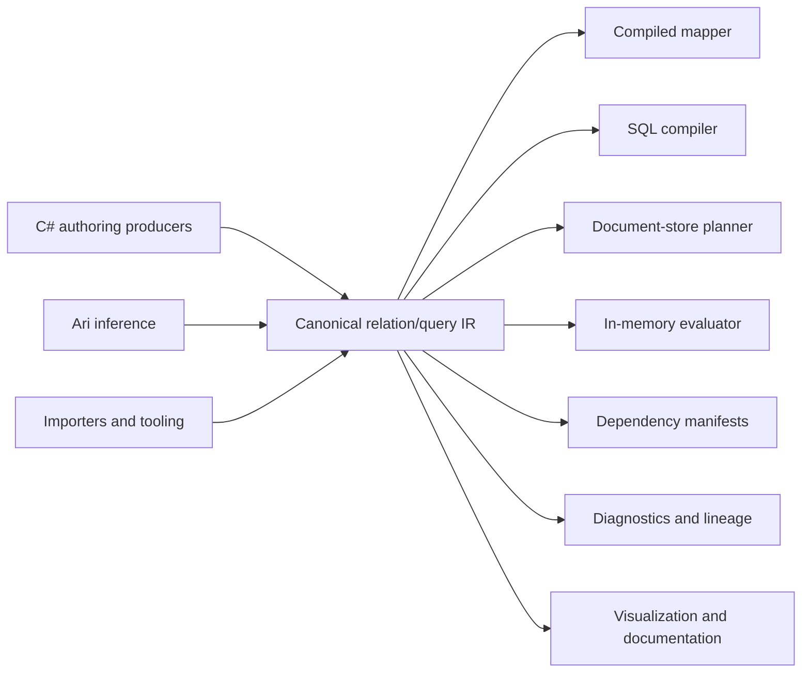

# Cohesive.Relations internals: interpretations and use cases

## One Semantic Model, Multiple Interpretations



An interpretation does not have to execute the definition. Validation, optimization, visualization, lineage analysis, documentation generation, migration planning, and dependency analysis are interpretations of the same IR.

Derived artifacts should retain provenance to the IR nodes and compiler decisions that produced them.

Operational consumers may use those artifacts to maintain indexes, caches, or read models, but their
lifecycle and control policies remain outside `Cohesive.Relations`.

## Use Cases

### Simple and enriched DTO mapping

Map canonical relation output rows to DTOs using direct assignments, supported conversions, conventions,
and related facts. An enriched DTO can combine a root value with customer, equipment, or other referenced
information without requiring all inputs to share one storage engine. Richer nested structural output and
its typed C# authoring surface remain planned capabilities.

### Relationship traversal and acquisition

Start with a root observation and traverse required or optional related facts. Canonical execution can use
supplied evidence or a validated physical plan with bounded source readers. This is not a general ORM
hydration facade: unsupported placement, completeness, or traversal guarantees fail with structured diagnostics.

### Portable and federated querying

Declare filters, joins, selected fields, ordering, paging, row results, and aggregations once, then interpret
them in memory or compile supported subsets through target adapters. Cosmos SQL, PostgreSQL, and Elasticsearch
adapters exist today, while Gremlin remains deferred.

For example:

```text
Loads from Cosmos
+ Customers from PostgreSQL
+ tracking state from an API
→ delayed premium-customer loads
```

The current v1 physical planner supports bounded enumeration and lookup requests plus eligible local
relationship correlation. It emits diagnostics when a definition exceeds that closure. Broader predicate
pushdown, source partitioning, and cross-source optimization remain planned capabilities.

### Search-index dependency analysis

Use a relation to define a denormalized index document and compile the inputs that influence it. A
Storage/materialization service can consume that manifest to plan rebuilds and real-time updates. Relations
does not implement rebuild orchestration, change-stream consumption, index writes, or convergence control.

### Application read models

CQRS-style read models can derive their semantic shape from relations:

```text
Order + Customer + Shipments + Payments
    → OrderDetailsView
```

The definition supports query, projection, and dependency analysis. Persisting, rebuilding, and incrementally
maintaining the read model belong to the Storage/materialization workstream.

### API composition

API responses often combine facts from several entities, databases, or services:

```text
Load + Customer + Equipment + CurrentLocation
    → LoadDetailsResponse
```

Interpreters may produce SQL, resolver plans, batched service calls, or mixed-source execution plans while preserving one response derivation.

### EDI and external-schema transformation

Relations can express transformations from complex external schemas into domain models:

```text
EDI 204 document + partner configuration
    → LoadTender
```

This use case ultimately requires structural matching, nested collection mapping, code translation,
conditional derivation, conversions, and required-input diagnostics. Cohesive currently provides canonical
drafts, direct-field conventions, relationship traversals, validation, persistence, and static analysis;
richer nested structural mapping and evaluation remain planned. Ari can retain its inference evidence while
proposing portable Cohesive relation drafts.

### Event enrichment

Enrich events with related facts before publishing or processing them:

```text
LoadChanged + Load + Customer
    → EnrichedLoadChanged
```

The relation identifies the additional facts required. A physical execution integration may select supported
local, batched, or remote acquisition strategies.

### Data migration and backfills

Express migration as a derivation from old shapes to new shapes:

```text
CustomerV1 + AddressV1
    → CustomerV2
```

Interpretations can include migration SQL, application-side conversion, dry-run validation, missing-data reports, backfills, and before/after reconciliation. Persisted relation versions provide an auditable account of how values were transformed.

### Reconciliation and repair

Declare what should correspond across operational, billing, cache, and search systems:

```text
OperationalLoad
    ↔ BillingLoad
    ↔ LoadSearchDocument
```

An interpreter can identify missing records, stale projections, conflicting fields, duplicate identities, and cardinality violations. The same analysis can drive targeted repair.

### Cache dependency analysis

A cached value is often derived from several facts:

```text
Customer + ActiveLoads + AccountBalance
    → CustomerDashboardCacheEntry
```

Relations dependency analysis can identify which inputs influence an entry. Initial population, targeted
invalidation, recomputation, and their control policies are responsibilities of the consuming storage/runtime layer.

### Reactive and incremental computation

Relations can provide dependency semantics to a continuously maintained view:

```text
LoadStatusChanged
    → affected CustomerSummary
    → affected RegionalDashboard
```

A separate runtime may use those semantics for subscriptions, live dashboards, reactive UI data, or
incremental aggregates. Continuous execution is not provided by the Relations core library.

### Authorization-aware projection

Resource and caller facts can participate in an explicit derivation:

```text
Load + User + Roles + CustomerAccess
    → AuthorizedLoadDto
```

Interpreters can apply row and field policies while retaining provenance for why information was included or excluded. Authorization should not become an invisible adapter-side mutation of query meaning.

### Privacy, governance, and lineage

Field-level lineage makes it possible to ask:

- Which DTOs expose a customer email address?
- Which indexes contain personal data?
- What derived artifacts depend on a protected field?
- Which relations are affected by a retention-policy change?
- Can a field be removed without breaking downstream derivations?

These are non-execution interpretations of the same relational program.

### Data quality and anomaly detection

A relation can derive expected values and compare them with recorded facts:

```text
Shipment stops
    → expected total distance

expected total distance + recorded distance
    → distance discrepancy
```

This supports completeness checks, invariant validation, discrepancy reports, and explanations of violated expectations.

### Schema-evolution impact analysis

Persisted relation graphs can identify the DTOs, queries, predicates, indexes, API contracts, migrations, and backend plans affected by a field or relationship change. Stable semantic identities make this analysis more reliable than source-text searches.

### Feature engineering

Machine-learning features are derived facts:

```text
Customer + Loads + PaymentHistory
    → CustomerRiskFeatures
```

The same relation can support offline training-set generation, online feature lookup, backfills, drift analysis, feature lineage, and training/serving equivalence checks.

### Report and document generation

Reports are projections and aggregations over facts:

```text
Loads + Customers + Charges
    → CustomerSettlementReport
```

One logical definition can support interactive queries, scheduled exports, spreadsheets, PDFs, and report-completeness validation.

### Offline and edge synchronization

Relations can define the subset and shape of data projected onto a device:

```text
Driver + AssignedLoads + Stops + Instructions
    → DriverOfflineDataset
```

Dependency analysis identifies incremental updates, while another interpretation can assist with reconciliation when the device reconnects.

### Test fixture and scenario generation

Testing tools can inspect a relation's required premises to:

- Generate the minimum facts needed to derive an output.
- Deliberately omit required facts.
- Exercise cardinality and missing-data cases.
- Generate relation requirement gaps.
- Compare backend interpreters.
- Shrink failures to the smallest relevant fact set.

### Query explanation and cost analysis

A non-executing planner can explain why a field or source is required and how a target-specific plan was selected:

```text
Requested CustomerName
→ requires Customer binding
→ requires Load.CustomerId
→ requires customer batch lookup
→ estimated 3 batches and 1 in-memory hash join
```

This makes capability decisions, physical plans, projected costs, and fallback strategies inspectable before execution.
